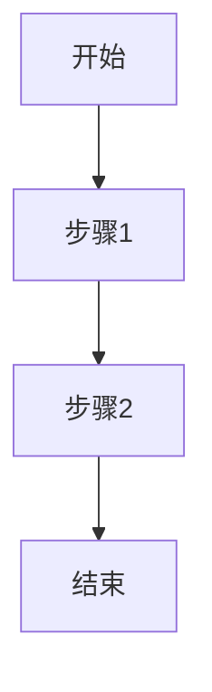

# {{title}}

## 流程概述
<!-- 一句话描述该流程的目的 -->

## 触发条件
- **触发者**：
- **触发事件**：
- **前置条件**：

## 流程图

## 节点详细说明
| 节点ID | 角色 | 动作 | 输入 | 输出 | 检查清单 | 超时 |
|--------|------|------|------|------|----------|------|
| | | | | | | |

## 条件边说明
| 来源 | 目标 | 条件 |
|------|------|------|
| | | |

## 异常处理
<!-- 超时、阻塞、异常情况下的回退/升级策略 -->

## 关联工作类型
<!-- 哪些工作类型使用此流程 -->
