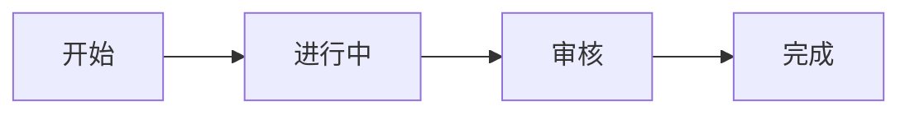

# {{title}}

## 概述
<!-- 一句话描述此类工作的本质 -->

## 生命周期
<!-- 此类工作从开始到结束经历的状态序列 -->

## 典型子任务结构
<!-- 此类工作通常如何拆解为子任务 -->

## 必需角色与职责 (RACI)
| 角色 | 参与方式 | 职责说明 |
|------|----------|----------|
| | R | |

## 输入物清单
| 输入物 | 提供方 | 必需/可选 |
|--------|--------|-----------|
| | | |

## 输出物清单
| 输出物 | 接收方 | 完成标准 |
|--------|--------|----------|
| | | |

## 质量门禁 (Quality Gates)
<!-- 完成前必须通过的检查点 -->
1.
2.
3.

## 关联流程
- 默认流程：[[{{default_process}}]]
- 相关流程：

## 常见风险与应对
| 风险 | 概率 | 影响 | 应对策略 |
|------|------|------|----------|
| | | | |
