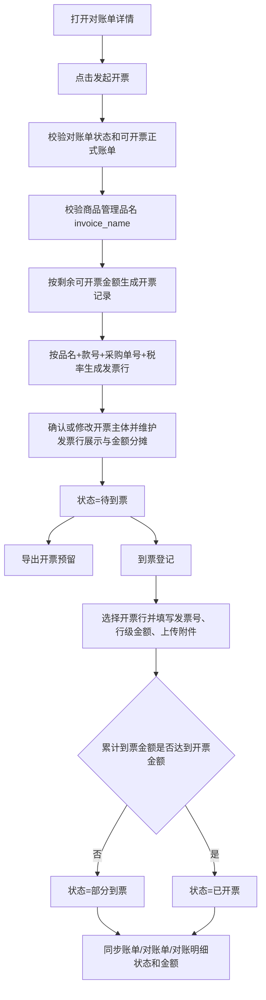

# 对账单开票需求分析

## 1. 模块定位

对账单开票用于承接对账管理后的票据维护流程。用户只能从对账单发起开票，不允许从正式账单列表、正式账单详情或对账单明细勾选发起开票。

系统基于整张对账单自动识别其下已生成正式账单且未全额开票的数据，生成开票记录、发票行、发票行关联明细、到票记录，并将开票金额、到票金额和状态回传到正式账单、对账单和对账明细。

发票行中的“品名”必须从商品管理新增的品名字段获取，即 `fc_material.invoice_name`。该字段由商品管理维护或同步，不再使用物料名称 `materialName` 作为开票品名。

## 2. 当前代码现状

| 模块 | 当前能力 | 与本需求关系 |
| --- | --- | --- |
| 对账单详情 | 展示对账单头、对账明细、账单身份和金额 | 本期唯一开票入口 |
| 正式账单列表/详情 | 查询正式账单、开票状态、到票状态和剩余可开票金额 | 只作为开票状态展示和回传对象，不作为开票入口 |
| 正式账单 `cs_bill` | 已有 `invoiceStatus`、`ticketStatus`、对账金额字段 | 开票后需要回传状态与金额 |
| 对账单 `cs_reconciliation` | 已有对账总金额、总数量、状态 | 需要展示已开票、已到票聚合金额 |
| 对账明细 `cs_reconciliation_dt` | 已有业务键、账单类型、派生序号、对账金额 | 需要从开票事实汇总已开票金额 |
| 商品管理 `fc_material` | 计划新增 `invoice_name` 品名字段 | 发票行品名来源 |
| 文件上传 | 已有 `infra/file` 上传能力 | 到票附件可复用该能力 |

关键代码事实：

- 正式账单以 `businessKey + billType + deriveSeq` 精确定位。
- `BusinessKey` 格式为 `mapType|mapBillNumber|materialId|qty`。
- 对账单明细中保留 `businessKey`、`billType`、`deriveSeq`，可反查对应正式账单。
- 当前不存在实际开票记录表、发票行表、到票记录表。
- 当前不存在真实发票导出模板实现，本期只预留导出能力。

## 3. 用户角色

| 角色 | 目标/痛点 | 权限/限制 |
| --- | --- | --- |
| 财务开票人员 | 从已确认对账单发起开票、维护发票行、预留导出 | 只能从对账单整单发起 |
| 财务到票人员 | 登记实际到票金额并归档附件 | 到票时必须填写金额并上传附件 |
| 财务复核人员 | 查看发票行与正式账单明细的对应关系 | 需要可追溯到对账单、正式账单和物料品名 |
| 业务/运营人员 | 辅助核对 SPU、订单、采购单、品名和金额 | 通常只查看，不负责状态流转 |
| 研发/实施 | 维护开票事实与账单状态一致性 | 需遵守现有对账、账单领域边界 |

## 4. 功能范围

### 4.1 本期范围

| 功能 | 说明 | 优先级 |
| --- | --- | --- |
| 从对账单整单发起开票 | 在对账单详情点击“发起开票”，系统自动纳入整张对账单下所有可开票正式账单 | P0 |
| 禁止明细勾选开票 | 对账单详情不提供按明细选择开票能力 | P0 |
| 禁止正式账单发起开票 | 正式账单列表和详情不提供“发起开票”入口 | P0 |
| 自动生成发票行 | 按 `品名 + 款号 + 采购单号 + 税率` 汇总明细为发票行 | P0 |
| 品名取值 | 发票行品名从 `fc_material.invoice_name` 获取 | P0 |
| 维护发票行展示 | 可调整发票行展示名称、展示金额、备注等票据展示信息 | P0 |
| 查看行关联明细 | 每条发票行可查看关联哪些正式账单及本次开票金额 | P0 |
| 发票行金额分摊 | 支持把一行金额分摊到其他行展示，不改变明细归属 | P0 |
| 导出开票预留 | 预留面辅料、全卖、半卖三个导出模板入口，本期不生成真实文件 | P1 |
| 开票主体选择 | 从对账单发起后默认使用对账单主体，允许改选任意有效我方主体作为实际开票主体 | P0 |
| 到票登记 | 选择开票行，填写发票号、行级到票金额并上传附件 | P0 |
| 状态与金额回传 | 回传账单、对账单、对账明细的已开票金额和状态 | P0 |

### 4.2 暂不包含

| 功能 | 暂不包含原因 |
| --- | --- |
| 正式账单发起开票 | 当前业务要求只能从对账单发起 |
| 对账明细勾选开票 | 当前业务要求整张对账单发起，不支持选择部分明细 |
| 真实发票文件导出 | 面辅料、全卖、半卖模板先预留，模板字段和样式后续确认 |
| 发票 OCR 识别 | 当前没有 OCR 接口，附件只做存档 |
| 自动验真 | 当前无税务验真接口 |
| 费用类来源建模 | 当前代码只有库存来源稳定落地，费用类需后续补来源和映射规则 |
| 审批流 | 本次只定义开票和到票业务状态，不引入审批 |
| 自动结算 | 结算计划是后续流程，不在本期范围 |

## 5. 页面与入口

### 5.1 对账单详情页入口

入口位置：`fms-ui/src/views/fms/reconciliation/recon/ReconciliationDetail.vue`

用户在对账单详情点击“发起开票”。系统基于整张对账单生成开票草稿，并进入开票维护页面或弹窗。

规则：

- 只能从对账单详情发起开票。
- 不展示开票勾选列。
- 不支持只选择部分对账明细发起开票。
- 对账单必须处于已审批/已生效状态。
- 已作废、已取消、草稿、审批中、驳回的对账单不可发起开票。
- 对账单下未生成正式账单的明细不参与开票；如整张对账单没有任何可开票正式账单，则阻断发起。
- 已全额开票的正式账单自动排除。
- 已部分开票的正式账单按剩余可开票金额继续参与。
- 任一参与开票的物料缺少 `invoice_name` 时阻断开票，并提示缺失品名的物料信息。

### 5.2 正式账单页面限制

入口位置：`fms-ui/src/views/fms/reconciliation/bill/index.vue`、`fms-ui/src/views/fms/reconciliation/bill/BillDetail.vue`

正式账单列表和详情只展示账单、开票状态、到票状态和剩余可开票金额，不提供“发起开票”按钮。

正式账单仍是开票金额、到票金额和状态回传的最小对象，但不作为用户发起入口。

### 5.3 开票记录页面

建议新增开票记录列表和详情：

| 页面 | 用途 |
| --- | --- |
| 开票记录列表 | 查询开票记录、状态、金额、来源对账单、对手方、到票情况 |
| 开票详情/维护页 | 查看和维护开票主体、发票行、关联明细、分摊、导出预留、到票 |
| 到票弹窗 | 选择开票行，填写发票号、行级到票金额、上传发票附件、备注 |

## 6. 业务流程

## 7. 业务规则

### 7.1 发起开票

| 规则 | 说明 |
| --- | --- |
| 来源限制 | 只支持从对账单详情整单发起 |
| 禁止正式账单入口 | 正式账单列表和详情不允许发起开票 |
| 禁止明细勾选 | 对账单详情不允许勾选部分明细发起开票 |
| 账单限制 | 必须能关联正式账单，正式账单是回传状态的最小对象 |
| 开票范围 | 自动纳入整张对账单下所有未全额开票的正式账单 |
| 部分开票 | 仅由账单历史开票状态导致，系统按剩余可开票金额生成；用户不在发起时选择部分明细 |
| 可开票金额 | 等于账单对账含税金额减累计已开票金额 |
| 红冲处理 | 红冲账单保留负数金额，不转正展示 |
| 来源主体限制 | 单张对账单天然限定同一对账单主体、对手方、业务类型；发起时仍需校验来源一致性 |
| 开票主体选择 | 开票记录需保存来源对账单主体和实际开票主体；实际开票主体默认等于对账单主体，允许改选任意有效我方主体 |
| 主体回传 | 开票和到票金额仍按来源对账单、正式账单和对账明细回传；实际开票主体只表达发票抬头主体，不改变来源单据归属 |
| 品名校验 | 参与开票的物料必须维护 `fc_material.invoice_name` |

### 7.2 发票行生成

| 规则 | 说明 |
| --- | --- |
| 品名来源 | 从 `fc_material.invoice_name` 获取 |
| 品名缺失 | 不使用 `materialName` 兜底，阻断开票创建 |
| 默认汇总维度 | `品名 invoiceName + 款号 ztStyleNo + 采购单号 + 税率` |
| 采购单号优先级 | 优先使用 `ztSkuPoNo`，为空时使用 `ztMaterialPoNo` |
| 发票行展示名称 | 默认使用品名，可由财务在开票维护页调整展示名称 |
| 发票行金额 | 默认等于该行关联明细本次开票金额合计 |
| 行关联明细 | 每个发票行必须保留关联正式账单、业务键、账单类型、派生序号、本次开票金额 |
| 空字段处理 | 款号或采购单号为空时仍可生成行，但需要以“未识别款号/未识别采购单”展示 |
| 混合税率处理 | 不同税率不能合并到同一发票行 |

### 7.3 发票行分摊

本期分摊采用“金额重分配”语义：

- 不改变账单明细归属。
- 不移动发票行与明细账单的关联关系。
- 只改变发票展示和后续导出时各行的展示金额。
- 分摊后所有发票行展示金额合计必须等于开票记录总金额。
- 分摊金额允许为正或负，用于处理红冲或费用摊入展示。

### 7.4 导出开票

本期只预留导出能力，不生成真实文件。

预留三个模板类型：

| 模板类型 | 说明 |
| --- | --- |
| 面辅料 | 面料、辅料开票导出模板 |
| 全卖 | 全卖业务开票导出模板 |
| 半卖 | 半卖业务开票导出模板 |

规则：

- 开票记录生成后才允许点击导出。
- 前端提供模板类型选择。
- 后端保留导出接口和模板枚举。
- 本期调用导出接口时返回“开票导出模板暂未开放”。

### 7.5 到票

| 规则 | 说明 |
| --- | --- |
| 到票信息 | 必须填写发票号、选择开票行、填写行级到票金额并上传发票附件 |
| 附件处理 | 暂无 OCR，仅存档附件 URL、文件名、文件类型等信息 |
| 到票金额 | 普通正向开票必须大于 0；红冲场景允许负数 |
| 多行到票 | 一张实际发票可覆盖多条开票行，每条开票行需填写本张发票对应金额 |
| 多次到票 | 支持多次到票登记；同一开票行可分属多张发票，累计到票金额用于状态判断 |
| 发票号追溯 | 到票记录必须保存发票号，并通过到票行关联关系追溯到开票行及其底层正式账单明细 |
| 部分到票 | 累计到票金额大于 0 且小于开票金额 |
| 已开票 | 累计到票金额达到开票金额 |
| 超额到票 | 默认禁止超过开票金额 |

### 7.6 状态流转

| 对象 | 状态 | 触发条件 |
| --- | --- | --- |
| 开票记录 | 待到票 | 成功发起开票 |
| 开票记录 | 部分到票 | 累计到票金额大于 0 且小于开票金额 |
| 开票记录 | 已开票 | 累计到票金额达到开票金额 |
| 正式账单开票状态 | 未开票 | 累计已开票金额为 0 |
| 正式账单开票状态 | 部分开票 | 累计已开票金额大于 0 且小于账单对账金额 |
| 正式账单开票状态 | 已开票 | 累计已开票金额达到账单对账金额 |
| 正式账单到票状态 | 未到票 | 累计到票金额为 0 |
| 正式账单到票状态 | 部分到票 | 累计到票金额大于 0 且小于账单已开票金额 |
| 正式账单到票状态 | 已到票 | 累计到票金额达到账单已开票金额 |

## 8. 数据对象建议

### 8.1 开票记录

| 字段 | 说明 |
| --- | --- |
| 开票记录 ID | 主键 |
| 开票编号 | 业务编号 |
| 来源类型 | 固定为对账单 |
| 来源对账单 ID/编号 | 从对账单发起时记录 |
| 对账单主体 | 来源对账单主体，作为来源单据归属 |
| 开票主体 | 实际开票主体，默认等于对账单主体，可改为任意有效我方主体 |
| 对手方类型/ID | `customerType`、`customerId` |
| 业务类型 | `bizType` |
| 应收付类型 | AP / AP_RED / AR / AR_RED |
| 开票金额 | 发起开票金额合计 |
| 到票金额 | 累计到票金额 |
| 状态 | 待到票 / 部分到票 / 已开票 |
| 备注 | 用户备注 |

### 8.2 发票行

| 字段 | 说明 |
| --- | --- |
| 发票行 ID | 主键 |
| 开票记录 ID | 所属开票记录 |
| 品名 | 来源于 `fc_material.invoice_name` |
| 款号 | `ztStyleNo` |
| 采购单号 | `ztSkuPoNo / ztMaterialPoNo` |
| 行展示名称 | 默认使用品名，导出开票时展示 |
| 原始汇总金额 | 关联明细本次开票金额合计 |
| 分摊调整金额 | 用户分摊调整金额 |
| 最终展示金额 | 原始汇总金额 + 分摊调整金额 |
| 税率 | 不同税率拆分发票行 |
| 备注 | 行备注 |

### 8.3 发票行关联明细

| 字段 | 说明 |
| --- | --- |
| 发票行 ID | 所属发票行 |
| 正式账单编号 | `cs_bill.billNumber` |
| 业务键 | `businessKey` |
| 账单类型 | NORMAL / DERIVED |
| 派生序号 | `deriveSeq` |
| 对账单明细 ID | 从对账单明细关联 |
| 本次开票金额 | 自动按剩余可开票金额生成 |

### 8.4 到票记录

| 字段 | 说明 |
| --- | --- |
| 到票记录 ID | 主键 |
| 开票记录 ID | 所属开票记录 |
| 发票号 | 实际发票号码，必填 |
| 到票金额 | 本张发票登记金额，等于到票行明细金额合计 |
| 附件 URL | 发票附件地址 |
| 附件名称 | 原始文件名 |
| 备注 | 到票备注 |
| 操作人/时间 | 审计字段 |

### 8.5 到票行关联

| 字段 | 说明 |
| --- | --- |
| 到票记录 ID | 所属到票记录 |
| 开票记录 ID | 所属开票记录 |
| 发票行 ID | 本张发票覆盖的开票行 |
| 发票号 | 冗余保存，便于查询和展示 |
| 行级到票金额 | 本张发票在该开票行上的到票金额 |

## 9. 异常场景

| 场景 | 处理建议 |
| --- | --- |
| 从正式账单发起开票 | 不提供入口；后端如收到类似请求则拒绝 |
| 对账单明细勾选开票 | 不提供勾选能力；后端不接收明细选择列表 |
| 对账单状态不可开票 | 阻断提交 |
| 对账单无可开票正式账单 | 阻断提交 |
| 对账单下存在未生成正式账单的数据 | 该部分不参与；如全部未生成则阻断 |
| 选择已全额开票账单 | 自动排除；如全部已开票则阻断 |
| 物料缺少品名 | 阻断开票，提示先到商品管理维护品名 |
| 款号或采购单号为空 | 允许生成异常分组行，并提示用户确认 |
| 税率混合进入同一行 | 按税率拆行 |
| 分摊后总金额不平 | 阻断保存 |
| 开票主体为空或无效 | 阻断保存开票记录 |
| 到票未选择开票行 | 阻断提交 |
| 到票未填写发票号 | 阻断提交 |
| 到票未上传附件 | 阻断提交 |
| 到票行金额超过开票行未到票金额 | 默认阻断 |
| 导出模板未实现 | 返回“开票导出模板暂未开放” |
| OCR 不可用 | 不影响流程，仅附件存档 |

## 10. 验收标准

| 编号 | 验收项 |
| --- | --- |
| AC-01 | 正式账单列表和详情不展示“发起开票”入口 |
| AC-02 | 对账单详情展示“发起开票”入口 |
| AC-03 | 对账单详情不支持勾选明细发起开票 |
| AC-04 | 用户从对账单发起开票后，系统自动纳入整张对账单下所有可开票正式账单 |
| AC-05 | 已全额开票的正式账单不会重复进入本次开票 |
| AC-06 | 参与开票的任一物料缺少品名时，系统阻断并提示缺失清单 |
| AC-07 | 系统按品名+款号+采购单号+税率自动生成发票行 |
| AC-08 | 每条发票行可查看关联的正式账单明细 |
| AC-09 | 支持发票行金额分摊，分摊后总金额保持一致 |
| AC-10 | 开票详情预留面辅料、全卖、半卖三个导出模板入口 |
| AC-11 | 导出开票本期返回未开放提示，不生成真实文件 |
| AC-12 | 发起开票后记录状态为待到票 |
| AC-13 | 到票时必须填写发票号、选择开票行、填写行级金额并上传附件 |
| AC-14 | 到票后同步更新正式账单开票状态、到票状态和累计金额 |
| AC-15 | 到票后对账单可展示已开票金额 |
| AC-16 | 红冲账单以负数金额参与开票、到票和展示 |
| AC-17 | 开票记录可修改实际开票主体，且不改变来源对账单主体 |
| AC-18 | 同一发票可覆盖多条开票行，同一开票行可被多张发票拆分覆盖 |
| AC-19 | 系统可展示底层每条对账明细归属的发票号和到票金额 |

## 11. 待确认问题

| 问题 | 影响范围 | 建议 |
| --- | --- | --- |
| 三类导出模板字段 | 决定面辅料、全卖、半卖 Excel 列、税额字段和样式 | 由财务提供样例后实现 |
| 全卖/半卖判定字段 | 决定导出模板自动推荐或校验 | 本期先由用户手工选择模板类型 |
| AR 场景文案 | AR 更偏“出票”，AP 更偏“到票” | 本期可先统一为到票/出票状态，页面按应收付类型显示 |
| 红冲到票金额方向 | 影响到票金额是否允许负数 | 建议红冲金额保留负数 |
| 费用类来源 | 影响费用发票行生成 | 待费用类账单来源稳定后单独扩展 |

## 12. 代码资料依据

- `fms-ui/src/views/fms/reconciliation/recon/ReconciliationDetail.vue`
- `fms-ui/src/views/fms/reconciliation/bill/index.vue`（只展示状态，不作为开票入口）
- `fms-ui/src/views/fms/reconciliation/bill/BillDetail.vue`（只展示状态，不作为开票入口）
- `fms-ui/src/views/fms/reconciliation/arap/index.vue`（上游正式账单与对账关联来源参考，不作为本期开票入口）
- `fms-ui/src/views/fms/reconciliation/arap/ArapAggregateDetail.vue`（上游正式账单与对账关联来源参考，不作为本期开票入口）
- `fms-ui/src/types/reconciliation.d.ts`
- `fms-rear/.../controller/admin/reconciliation/ReconciliationController.java`
- `fms-rear/.../controller/admin/bill/BillController.java`
- `fms-rear/.../dal/dataobject/reconciliation/ReconciliationDO.java`
- `fms-rear/.../dal/dataobject/reconciliation/ReconciliationDtDO.java`
- `fms-rear/.../dal/dataobject/bill/BillDO.java`
- `fms-rear/.../dal/dataobject/material/MaterialDO.java`
- `fms-rear/.../service/domain/bill/aggregate/BillAggregate.java`
- `fms-rear/.../service/bill/BillStatusHealthAppServiceImpl.java`
- `fms-rear/.../service/domain/bill/valueobject/BusinessKey.java`
