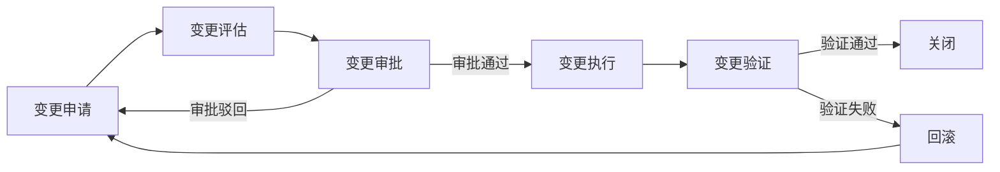

# 变更管理

## 概述

变更管理是对生产环境的配置、代码、基础设施等任何修改进行规范化控制的过程。核心目标是在变更带来的价值与风险之间取得平衡——既要支持业务所需的快速变更，又要通过审批、验证、回滚等机制控制变更风险。

## 生命周期



## 典型子任务结构

**按变更类型拆解：**
1. 标准变更（Standard Change）：低风险、常规操作，预授权，走简化流程
2. 正常变更（Normal Change）：需要评估和审批的常规变更
3. 紧急变更（Emergency Change）：响应故障或安全漏洞，走快速通道，事后补审批

**按变更范围拆解：**
1. 代码变更：应用代码新版本部署
2. 配置变更：配置中心配置项修改、环境变量调整
3. 基础设施变更：K8s资源调整、网络策略修改、安全组变更
4. 数据变更：DDL/DML脚本执行、数据迁移

## 必需角色与职责 (RACI)

| 角色 | 参与方式 | 职责说明 |
|------|----------|----------|
| 开发工程师 | R | 负责变更申请、影响评估、变更实施和验证 |
| SRE工程师 | C | 提供风险评估、变更窗口建议 |
| 技术负责人 | A | 负责变更审批、风险评估确认 |
| 产品经理 | C | 确认变更对用户体验的影响 |

## 输入物清单

| 输入物 | 提供方 | 必需/可选 |
|--------|--------|-----------|
| 变更请求（含变更内容、目的、影响范围） | 开发工程师 | 必需 |
| 影响评估报告（用户/性能/依赖/安全） | 开发工程师 | 必需 |
| 回滚方案（含回滚步骤和预计时间） | 开发工程师 | 必需 |
| 测试验证结果（预发布/灰度验证） | 测试工程师/开发工程师 | 必需 |
| 关联的故障单/问题单（如有） | SRE工程师 | 可选 |

## 输出物清单

| 输出物 | 接收方 | 完成标准 |
|--------|--------|----------|
| 变更记录单（含审批链） | 变更管理系统 | 完整记录变更全流程 |
| 审批记录 | 审计 | 审批人和审批时间可追溯 |
| 实施结果（含验证数据） | 技术负责人 | 变更成功且无负面影响 |
| 回滚记录（如发生回滚） | SRE团队 | 记录回滚原因、步骤和影响时间 |

## 质量门禁 (Quality Gates)

1. **影响评估完整**：覆盖用户影响、性能影响、依赖影响、安全影响四个维度
2. **回滚方案可用**：回滚步骤已验证、回滚时间在可接受范围内
3. **审批合规**：常规变更至少一级审批，重大变更需二级审批
4. **变更窗口内完成**：变更和验证在预定窗口时间内完成

## 关联流程

- 默认流程：[[PROC-变更管理流程]]
- 紧急流程：[[PROC-紧急变更流程]]
- 相关流程：[[PROC-部署发布流程]]、[[PROC-故障响应流程]]

## 常见风险与应对

| 风险 | 概率 | 影响 | 应对策略 |
|------|------|------|----------|
| 紧急变更绕过审批流程 | 中 | 高 | 紧急变更事后24小时内补全，定期审计合规性 |
| 变更影响评估不充分 | 中 | 高 | 使用标准化的影响评估模板，强制覆盖用户/性能/依赖/安全 |
| 回滚方案不可执行 | 中 | 高 | 关键变更回滚方案必须在测试环境验证过 |
| 变更窗口外应急变更 | 低 | 中 | 紧急变更不限制窗口，但需要升级审批 |
| 变更积压集中在同一窗口 | 中 | 中 | 变更管理日历可视化，协调避免多个变更同时进行 |

## Agent 上下文包 (Agent Context Pack)

当AI Agent执行此类工作时，按此清单加载上下文：

```yaml
context_pack:
  work_type: "WT-INC-003"
  required:
    roles:
      - "1.角色体系/架构类/ROLE-技术负责人.md"
      - "1.角色体系/运维类/ROLE-SRE工程师.md"
    processes:
      - "4.流程引擎/事件类/PROC-变更管理流程.md"
      - "4.流程引擎/事件类/PROC-紧急变更流程.md"
    checklists:
      - "通用能力层/检查清单/CHK-变更影响评估清单.md"
  optional:
    knowledge:
      - "5.知识沉淀/变更管理最佳实践.md"
      - "5.知识沉淀/系统依赖图谱.md"
    tools:
      - "通用能力层/工具集/UTIL-CICD操作手册.md"
```

### Agent 执行提示

1. 任何生产环境变更都必须在变更系统建单，口头变更是不被允许的
2. 影响评估四要素：谁受影响、多严重、多久恢复、有无替代方案
3. 回滚方案不是写写而已——实际操作步骤要能在5分钟内执行完
4. 高风险变更尽量安排在工作日白天执行，避免在夜间/周末单独操作
5. 变更完成后务必监控核心指标至少15分钟，确认稳定再离开
