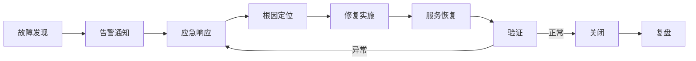

# 故障响应

## 概述

故障响应是对生产环境中发生的服务中断、性能降级、数据异常等事件进行快速发现、应急处理和恢复的运维活动。故障响应是运维保障体系的第一道防线，核心目标是快速恢复服务、最小化用户影响，并为事后复盘和改进提供基础数据。

## 生命周期



## 典型子任务结构

**按故障严重级别拆解：**
1. P0-重大故障：核心业务完全不可用，全体用户受影响
   - 升级策略：立即通知技术总监、启动战时指挥
2. P1-重要故障：核心功能降级，部分用户受影响
   - 升级策略：15分钟内通知技术负责人
3. P2-一般故障：非核心功能异常，少量用户受影响
   - 处理策略：2小时内响应，纳入常规处理流程
4. P3-轻微故障：不影响使用的Bug或体验问题
   - 处理策略：纳入迭代Backlog排期修复

**按响应阶段拆解：**
1. 发现与确认：告警触发、人工确认故障范围和影响
2. 应急止血：限流、降级、切换、重启等快速恢复手段
3. 根因定位：结合日志、监控、链路追踪定位问题源头
4. 彻底修复：实施根本性修复，验证修复效果
5. 复盘改进：故障复盘，推动改进措施落地

## 必需角色与职责 (RACI)

| 角色 | 参与方式 | 职责说明 |
|------|----------|----------|
| 值班工程师 | R | 负责第一时间响应告警、初步排查和应急操作 |
| SRE工程师 | C | 提供深度排查支持和应急指导 |
| 开发工程师 | C | 协助代码层面的根因定位和修复 |
| 技术负责人 | A | 负责故障指挥、关键决策、对外沟通 |
| 产品经理 | I | 知会故障影响范围和处理进展 |

## 输入物清单

| 输入物 | 提供方 | 必需/可选 |
|--------|--------|-----------|
| 告警通知（含告警指标和阈值） | 监控系统 | 必需 |
| 实时监控大盘和指标趋势 | 监控系统 | 必需 |
| 应用/系统日志 | 日志平台 | 必需 |
| 用户反馈/工单 | 客服/用户 | 可选 |
| 最近发布的变更记录 | DevOps工程师 | 必需 |

## 输出物清单

| 输出物 | 接收方 | 完成标准 |
|--------|--------|----------|
| 故障处理记录（时间线） | SRE团队 | 记录每一步操作的时间点和结果 |
| 根因分析记录 | 技术负责人 | 定位到具体模块/代码/配置 |
| 修复记录（含代码变更/配置变更） | 开发团队 | 修复已部署并验证生效 |

## 质量门禁 (Quality Gates)

1. **服务已恢复**：核心监控指标（错误率/延迟/QPS）恢复至正常水平
2. **根因已定位**：明确到代码行/配置项/基础设施组件的级别
3. **响应SLA达标**：P0故障5分钟响应、P1故障15分钟响应
4. **处理记录完整**：包含完整时间线、关键操作、参与人员、影响范围

## 关联流程

- 默认流程：[[PROC-故障响应流程]]
- 紧急流程：[[PROC-重大故障应急流程]]
- 相关流程：[[PROC-故障复盘流程]]

## 常见风险与应对

| 风险 | 概率 | 影响 | 应对策略 |
|------|------|------|----------|
| 多个告警同时触发难以判断优先级 | 中 | 高 | 建立告警关联分析，识别根因告警而非表象告警 |
| 应急操作导致二次故障 | 中 | 高 | 应急操作前评估影响面，关键操作双人确认 |
| 故障定位耗时过长 | 中 | 高 | 先恢复服务再深挖根因（止损优先于定位） |
| 通信混乱信息不同步 | 高 | 中 | 指定唯一对外发言人，使用专用故障沟通渠道 |
| 故障处理中多个团队操作冲突 | 中 | 中 | 明确指挥链，所有变更需故障指挥官批准 |

## Agent 上下文包 (Agent Context Pack)

当AI Agent执行此类工作时，按此清单加载上下文：

```yaml
context_pack:
  work_type: "WT-INC-001"
  required:
    roles:
      - "1.角色体系/运维类/ROLE-值班工程师.md"
      - "1.角色体系/运维类/ROLE-SRE工程师.md"
      - "1.角色体系/架构类/ROLE-技术负责人.md"
    processes:
      - "4.流程引擎/事件类/PROC-故障响应流程.md"
      - "4.流程引擎/事件类/PROC-重大故障应急流程.md"
    checklists:
      - "通用能力层/检查清单/CHK-故障响应检查清单.md"
  optional:
    knowledge:
      - "5.知识沉淀/常见故障Runbook.md"
      - "5.知识沉淀/系统架构和依赖图.md"
    tools:
      - "通用能力层/工具集/UTIL-日志查询手册.md"
      - "通用能力层/工具集/UTIL-Prometheus操作手册.md"
      - "通用能力层/工具集/UTIL-Kubernetes操作手册.md"
```

### Agent 执行提示

1. 故障响应的第一原则是「止损优先」——先恢复服务，再找根因
2. 确认故障后第一时间通知相关方，不要在通知上犹豫
3. 应急操作前想清楚回滚方案，能回退的操作大胆做，不可逆的操作谨慎做
4. 故障处理全程记录时间线，每步操作记下时间和结果
5. 故障恢复后不要马上关闭，至少观察15分钟确认指标稳定
