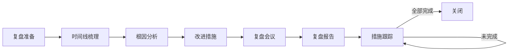

# 故障复盘

## 概述

故障复盘是在故障恢复后，对故障的全过程进行系统性回顾和分析的活动。通过复盘，团队可以深入理解故障的根本原因，识别流程和技术中的薄弱环节，制定并跟踪改进措施，防止同类故障再次发生。复盘的核心理念是「对事不对人」，关注系统性改进而非个人追责。

## 生命周期



## 典型子任务结构

**按复盘深度拆解：**
1. 快速复盘（30分钟）：P2/P3级别故障，简要回顾时间线和根因，记录改进项
2. 正式复盘（1-2小时）：P1/P0级别故障，全面分析、跨团队参与
3. 深度复盘（半天）：重大故障，包含故障模拟重现、系统性改进方案

**按分析框架拆解：**
1. 时间线梳理：从故障触发到完全恢复的每一步操作和决策
2. 5-Why分析：追问至少5层，从表象到根本原因
3. 鱼骨图分析：从人、机、料、法、环五个维度系统分析
4. 改进措施：短期（止血）、中期（防复发）、长期（系统提升）

## 必需角色与职责 (RACI)

| 角色 | 参与方式 | 职责说明 |
|------|----------|----------|
| SRE工程师 | R | 负责数据收集、时间线整理、复盘会议组织、报告编写 |
| 开发工程师 | C | 提供代码层面根因和修复方案 |
| 技术负责人 | A | 负责复盘结论审批、改进措施优先级决策 |
| 值班工程师 | I | 提供故障一线处理的第一手信息 |
| 产品经理 | I | 了解故障对用户的影响 |

## 输入物清单

| 输入物 | 提供方 | 必需/可选 |
|--------|--------|-----------|
| 故障处理记录/时间线 | 值班工程师/SRE | 必需 |
| 监控数据截图和趋势图 | 监控系统 | 必需 |
| 相关系统日志 | 日志平台 | 必需 |
| 故障期间的变更记录 | DevOps工程师 | 必需 |
| 故障期间的沟通记录 | 值班工程师 | 必需 |
| 同类历史故障的复盘报告 | SRE | 可选 |

## 输出物清单

| 输出物 | 接收方 | 完成标准 |
|--------|--------|----------|
| 复盘报告（含时间线、根因、改进措施） | 技术总监/全团队 | 内容完整、无遗漏关键信息 |
| 改进措施清单（含责任人/DDL/优先级） | 相关责任人 | 每项SMART、可追踪 |
| 故障时间线图 | 团队全员 | 清晰展示关键节点和持续时间 |

## 质量门禁 (Quality Gates)

1. **根因深度达标**：5-Why分析至少追问到系统层面原因，不停止在「人为失误」层
2. **改进措施可执行**：每条措施SMART，分配责任人和截止日期
3. **复盘时效达标**：P0故障3个工作日内完成复盘，P1故障5个工作日内
4. **改进措施纳入跟踪**：所有改进项进入任务系统，定期回顾关闭率

## 关联流程

- 默认流程：[[PROC-故障复盘流程]]
- 相关流程：[[PROC-故障响应流程]]、[[PROC-问题管理流程]]

## 常见风险与应对

| 风险 | 概率 | 影响 | 应对策略 |
|------|------|------|----------|
| 复盘演变为追责大会 | 中 | 高 | 设立复盘基本规则：对事不对人，关注流程而非个人 |
| 改进措施过于笼统无法落地 | 高 | 中 | 强制使用SMART格式，模糊的改进项必须打回重新定义 |
| 复盘时间过长无法坚持 | 中 | 高 | P2/P3故障使用快速复盘模板，30分钟内完成 |
| 改进措施无人跟踪 | 高 | 高 | 纳入任务系统分配DDL，定期在迭代回顾中检查关闭率 |
| 同一故障反复出现 | 中 | 高 | 复盘时专门回顾历史类似故障，追问为什么上次没修彻底 |

## Agent 上下文包 (Agent Context Pack)

当AI Agent执行此类工作时，按此清单加载上下文：

```yaml
context_pack:
  work_type: "WT-INC-004"
  required:
    roles:
      - "1.角色体系/运维类/ROLE-SRE工程师.md"
      - "1.角色体系/架构类/ROLE-技术负责人.md"
    processes:
      - "4.流程引擎/事件类/PROC-故障复盘流程.md"
    checklists:
      - "通用能力层/检查清单/CHK-故障复盘检查清单.md"
  optional:
    knowledge:
      - "5.知识沉淀/故障复盘模板.md"
      - "5.知识沉淀/根因分析方法.md"
      - "5.知识沉淀/常见故障模式与改进.md"
    tools:
      - "通用能力层/工具集/UTIL-文档协作工具手册.md"
```

### Agent 执行提示

1. 复盘的第一原则是「无指责文化」——关注发生了什么、为什么发生，而非谁的错
2. 时间线的颗粒度要够细，从故障触发到恢复，每一步谁做了什么，产生了什么效果
3. 至少追问5个「为什么」，触及流程或系统设计的缺陷才算是深度根因
4. 改进措施区分短期（止血）、中期（防复发）、长期（系统提升），分期分批推进
5. 复盘报告写完后发给全团队，不只是参与者——知识要分享给所有人
