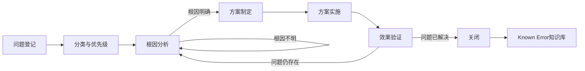

# 问题管理

## 概述

问题管理是从已发生的故障或潜在风险中识别出深层次的「问题」，通过根因分析找到永久性解决方案，防止同类故障再次发生的系统性工作。它与故障响应的区别在于：故障响应关注「快速恢复服务」，问题管理关注「永久消除根因」。

## 生命周期



## 典型子任务结构

**按问题来源拆解：**
1. 故障驱动：从已发生的P0/P1故障中提取问题
2. 趋势驱动：从监控趋势中发现逐步恶化的指标
3. 主动发现：从技术债盘点、架构评审中发现潜在问题

**按分析深度拆解：**
1. 简单问题：直接原因明确，修复方案简单（如配置修正）
2. 复杂问题：涉及多系统交互，需跨团队协作分析
3. 深层问题：根因涉及架构设计或流程缺陷，需要架构级改进

## 必需角色与职责 (RACI)

| 角色 | 参与方式 | 职责说明 |
|------|----------|----------|
| SRE工程师 | R | 负责问题登记、根因分析、方案推动 |
| 开发工程师 | C | 协助代码级根因分析和修复实施 |
| 技术负责人 | A | 负责问题优先级决策、方案审批 |
| 值班工程师 | C | 提供第一手故障处理信息 |
| 产品经理 | I | 知会问题影响和解决时间线 |

## 输入物清单

| 输入物 | 提供方 | 必需/可选 |
|--------|--------|-----------|
| 故障记录/事件单（含时间线和处理过程） | 值班工程师/SRE | 必需 |
| 监控数据和告警历史 | 监控系统 | 必需 |
| 相关系统日志 | 日志平台 | 必需 |
| 历史同类问题/故障记录 | SRE | 可选 |
| 最近变更记录 | DevOps工程师 | 必需 |

## 输出物清单

| 输出物 | 接收方 | 完成标准 |
|--------|--------|----------|
| 问题单（含描述/优先级/状态） | SRE团队 | 信息完整、可追踪 |
| 根因分析报告（含分析方法和结论） | 技术负责人 | 根因定位到系统层面 |
| 永久解决方案 | 开发团队/SRE | 方案可执行、有风险识别 |
| Known Error记录 | SRE团队/值班团队 | 下次同类故障能快速匹配Known Error |

## 质量门禁 (Quality Gates)

1. **根因分析深度达标**：使用5-Why或鱼骨图等结构化分析方法，定位到系统级根因
2. **方案不引入新风险**：永久解决方案经过Code Review或架构评审，不引入新的已知风险
3. **效果验证通过**：解决方案上线后，通过监控和日志确认问题不再复发
4. **Known Error已入库**：根因和解决方案录入Known Error知识库，可被检索

## 关联流程

- 默认流程：[[PROC-问题管理流程]]
- 相关流程：[[PROC-故障响应流程]]、[[PROC-故障复盘流程]]

## 常见风险与应对

| 风险 | 概率 | 影响 | 应对策略 |
|------|------|------|----------|
| 根因分析停留在表象 | 中 | 高 | 强制使用5-Why分析，至少追问5层；复杂问题用鱼骨图 |
| 临时方案代替永久方案 | 高 | 高 | 区分Workaround和Permanent Fix，前者有有效期 |
| 问题积压不处理 | 中 | 中 | 每月回顾Open Problem，按优先级排入迭代计划 |
| 解决方案产生新问题 | 中 | 中 | 方案实施前充分测试和Review，关注影响面 |
| Known Error无人维护 | 中 | 低 | 指定Known Error库维护人，定期清理过期记录 |

## Agent 上下文包 (Agent Context Pack)

当AI Agent执行此类工作时，按此清单加载上下文：

```yaml
context_pack:
  work_type: "WT-INC-002"
  required:
    roles:
      - "1.角色体系/运维类/ROLE-SRE工程师.md"
      - "1.角色体系/架构类/ROLE-技术负责人.md"
    processes:
      - "4.流程引擎/事件类/PROC-问题管理流程.md"
    checklists:
      - "通用能力层/检查清单/CHK-根因分析检查清单.md"
  optional:
    knowledge:
      - "5.知识沉淀/根因分析方法.md"
      - "5.知识沉淀/系统故障模式库.md"
    tools:
      - "通用能力层/工具集/UTIL-日志查询手册.md"
      - "通用能力层/工具集/UTIL-监控分析工具手册.md"
```

### Agent 执行提示

1. 区分事件（Incident）和问题（Problem）：事件是「发生了什么」，问题是「为什么发生」
2. 根因分析要多问「为什么」，每个原因后面再问一个「为什么」，直到触及系统级原因
3. 不要满足于「人为操作失误」这个根因——继续追问为什么这个人会操作失误
4. 永久方案三要素：修复根因、可自动化（减少人因）、不引入新技术债
5. 将根因和方案录入Known Error库，帮助下次同类事件快速定位
