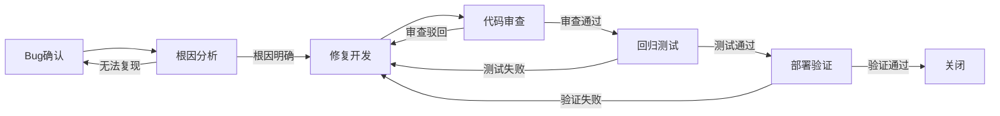

# Bug修复

## 概述

Bug修复是针对已上线或测试中发现的软件缺陷进行诊断、修复和验证的工作。要求快速准确地定位根因，实施最小化、安全的修复方案，并通过回归测试确保不影响现有功能。

## 生命周期



## 典型子任务结构

**按严重级别拆解：**
1. P0-紧急Bug：影响核心业务，走紧急修复流程，可跳过部分常规审查
2. P1-高优Bug：影响重要功能，48小时内修复，完整流程
3. P2-普通Bug：标准修复流程，纳入下个迭代
4. P3-低优Bug：视情况排期修复或标记为Known Issue

**按修复范围拆解：**
1. 代码层修复（逻辑错误、边界条件、异常处理）
2. 配置层修复（错误配置、环境差异）
3. 数据层修复（脏数据清理、数据迁移脚本）

## 必需角色与职责 (RACI)

| 角色 | 参与方式 | 职责说明 |
|------|----------|----------|
| 开发工程师 | R | 负责Bug定位、编写修复代码、根因分析 |
| 测试工程师 | R | 负责复现Bug、执行回归测试 |
| 技术负责人 | A | 确认修复方案、把控发布风险 |
| 代码审核员 | C | 审查修复代码的正确性和安全性 |
| 产品经理 | I | 知会Bug影响范围和修复计划 |
| DevOps工程师 | I | 知会紧急部署需求 |

## 输入物清单

| 输入物 | 提供方 | 必需/可选 |
|--------|--------|-----------|
| Bug报告/工单（含复现步骤） | 测试工程师/用户 | 必需 |
| 错误日志与堆栈信息 | 监控系统/日志平台 | 必需 |
| 相关代码仓库和分支 | 开发工程师 | 必需 |
| 数据库快照（涉及数据Bug时） | DBA/DevOps | 可选 |

## 输出物清单

| 输出物 | 接收方 | 完成标准 |
|--------|--------|----------|
| 修复代码（含单元测试） | 代码审核员 | 通过代码审查 |
| 根因分析记录 | 技术负责人 | 明确指出根本原因，非表象修复 |
| 回归测试结果 | 测试工程师 | 原有功能不受影响 |

## 质量门禁 (Quality Gates)

1. **根因已明确定位**：修复方案针对的是根本原因，而非仅仅消除表面现象
2. **回归测试通过**：关联功能模块的回归测试用例全部通过
3. **代码审查通过**：修复改动经过Reviewer确认，无引入新风险
4. **P0级Bug SLA达标**：核心业务Bug 2小时内完成紧急修复并验证

## 关联流程

- 默认流程：[[PROC-需求到上线]]
- 紧急流程：[[PROC-紧急修复流程]]
- 相关流程：[[PROC-代码审查流程]]

## 常见风险与应对

| 风险 | 概率 | 影响 | 应对策略 |
|------|------|------|----------|
| 无法复现Bug | 中 | 中 | 增强日志级别，添加监控埋点等待复现 |
| 修复引入新Bug | 中 | 高 | 充分回归测试，修复代码review关注影响面 |
| 根因定位错误 | 低 | 高 | 在测试环境反复验证，必要时让同事复核 |
| 紧急修复跳过流程 | 中 | 中 | 紧急修复后补全文档和审查，问题复盘改进 |
| 修复方案需要数据迁移 | 低 | 高 | 数据脚本必须先在测试环境执行验证，再上生产 |

## Agent 上下文包 (Agent Context Pack)

当AI Agent执行此类工作时，按此清单加载上下文：

```yaml
context_pack:
  work_type: "WT-DEV-002"
  required:
    roles:
      - "1.角色体系/研发类/ROLE-后端开发工程师.md"
      - "1.角色体系/质量类/ROLE-测试工程师.md"
      - "1.角色体系/架构类/ROLE-技术负责人.md"
    processes:
      - "4.流程引擎/开发类/PROC-紧急修复流程.md"
      - "4.流程引擎/开发类/PROC-代码审查流程.md"
    checklists:
      - "通用能力层/检查清单/CHK-Bug修复检查清单.md"
  optional:
    knowledge:
      - "5.知识沉淀/常见Bug模式与解决方案.md"
    tools:
      - "通用能力层/工具集/UTIL-日志查询手册.md"
      - "通用能力层/工具集/UTIL-Git操作手册.md"
```

### Agent 执行提示

1. 修复前务必在本地/测试环境复现Bug，确认理解问题全貌
2. 分析根因时要追溯完整调用链，不止看报错行本身
3. 修复代码尽量保持最小改动，不要顺手重构无关代码
4. 修复完成后自测关联功能，防止回归
5. 记录根因到知识库，避免同类型Bug重复出现
