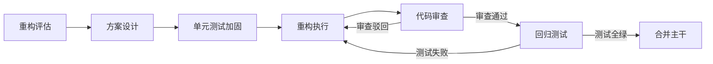

# 代码重构

## 概述

代码重构是在不改变软件外部行为的前提下，改善代码内部结构、提高可读性和可维护性的工作。重构的目标是降低代码复杂度、消除重复、提升设计质量，为后续功能开发奠定更好的基础。

## 生命周期



## 典型子任务结构

**按重构粒度拆解：**
1. 小重构（局部）：提取方法、重命名变量、消除魔法数字
2. 中重构（模块级）：拆分大类、引入设计模式、优化类层次结构
3. 大重构（架构级）：模块拆分、依赖倒置、数据流重整

**按技术维度拆解：**
1. 结构重构：类/方法的拆分与合并，包结构整理
2. 逻辑重构：条件简化、循环优化、重复代码消除
3. 数据重构：数据模型优化、DTO/VO整理、序列化方案统一

## 必需角色与职责 (RACI)

| 角色 | 参与方式 | 职责说明 |
|------|----------|----------|
| 开发工程师 | R | 负责重构方案执行、代码修改 |
| 技术负责人 | A | 审批重构方案、把控风险、确认验收 |
| 代码审核员 | C | 审查重构代码质量和规范性 |
| 测试工程师 | C | 提供回归测试支持、确认用例覆盖 |
| 系统架构师 | C | 确认重构方向符合架构演进方向 |

## 输入物清单

| 输入物 | 提供方 | 必需/可选 |
|--------|--------|-----------|
| 待重构代码仓库及分支 | 开发工程师 | 必需 |
| 现有测试用例集 | 测试工程师 | 必需 |
| 重构方案文档 | 开发工程师 | 必需（中型以上重构） |
| 代码坏味清单/技术债记录 | 技术负责人 | 可选 |

## 输出物清单

| 输出物 | 接收方 | 完成标准 |
|--------|--------|----------|
| 重构后代码 | 代码审核员 | 通过代码审查 |
| 更新后的单元测试 | 测试工程师 | 覆盖率不降低 |
| 重构说明文档 | 团队全员 | 记录改动范围和迁移指南 |

## 质量门禁 (Quality Gates)

1. **行为一致性验证**：所有现有回归测试用例通过，重构前后外部行为无变化
2. **代码圈复杂度下降**：重构后目标模块的圈复杂度有可测量的降低
3. **无新增技术债**：重构不产生新的代码坏味或未处理的TODO
4. **架构合规性确认**：架构师对重构方向和结果进行确认
5. **覆盖率不降低**：重构后单元测试覆盖率不低于重构前

## 关联流程

- 默认流程：[[PROC-需求到上线]]
- 相关流程：[[PROC-代码审查流程]]

## 常见风险与应对

| 风险 | 概率 | 影响 | 应对策略 |
|------|------|------|----------|
| 重构范围蔓延 | 高 | 高 | 明确重构边界，禁止顺手加新功能 |
| 引入行为变化 | 中 | 高 | 先补测试再重构，安全网先行 |
| 合并冲突过多 | 中 | 中 | 小步提交、频繁合并主干 |
| 测试覆盖不足 | 中 | 高 | 重构前先补齐关键路径测试 |
| 重构耗时超预期 | 中 | 中 | 拆分可独立交付的子任务，分批次合并 |

## Agent 上下文包 (Agent Context Pack)

当AI Agent执行此类工作时，按此清单加载上下文：

```yaml
context_pack:
  work_type: "WT-DEV-003"
  required:
    roles:
      - "1.角色体系/研发类/ROLE-后端开发工程师.md"
      - "1.角色体系/架构类/ROLE-技术负责人.md"
      - "1.角色体系/架构类/ROLE-系统架构师.md"
    processes:
      - "4.流程引擎/开发类/PROC-代码审查流程.md"
    checklists:
      - "通用能力层/检查清单/CHK-代码审查检查清单.md"
  optional:
    knowledge:
      - "5.知识沉淀/重构手法目录.md"
      - "5.知识沉淀/设计模式实践.md"
    tools:
      - "通用能力层/工具集/UTIL-代码质量分析手册.md"
      - "通用能力层/工具集/UTIL-Git操作手册.md"
```

### Agent 执行提示

1. 重构前先跑一遍全部测试，确认全绿后再动手
2. 遵循「测试→小改→测试→小改」的节奏，每一步都可回退
3. 每完成一个独立重构单元就提交，不要攒着大量改动一次性PR
4. 用IDE的自动重构工具减少低级错误，不要手工做批量重命名
5. 重构期间关注主干分支的变化，及时合并避免冲突
