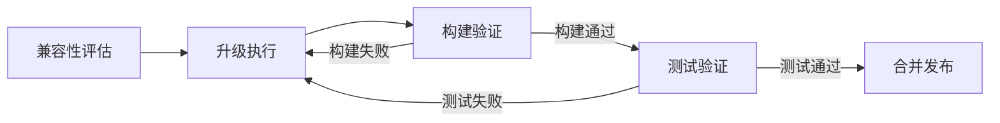

# 依赖升级

## 概述

依赖升级是指对项目使用的外部库、框架、运行时版本进行版本更新。这类工作通常由安全漏洞修复、新特性需要、或版本EOL（End of Life）驱动。核心挑战在于评估兼容性影响，确保升级后系统功能不受影响。

## 生命周期



## 典型子任务结构

**按升级驱动因素拆解：**
1. 安全驱动升级：响应CVE漏洞通告，紧急升级有漏洞的依赖
2. 功能驱动升级：新版本提供所需特性，评估后主动升级
3. 维护驱动升级：旧版本即将EOL，被动升级保持支持

**按依赖范围拆解：**
1. 补丁版本升级（Patch）：仅修复Bug，兼容性风险最低，优先处理
2. 次版本升级（Minor）：新增向后兼容的功能，需关注弃用API
3. 主版本升级（Major）：包含Breaking Change，需全面评估和适配

## 必需角色与职责 (RACI)

| 角色 | 参与方式 | 职责说明 |
|------|----------|----------|
| 开发工程师 | R | 负责依赖版本变更、兼容性适配、构建修复 |
| 技术负责人 | A | 负责升级决策审批、风险评估 |
| 测试工程师 | R | 负责回归测试执行 |
| DevOps工程师 | C | 协助构建流水线问题排查 |
| 系统架构师 | C | 对关键基础库升级提供兼容性建议 |
| 代码审核员 | I | 知会升级范围 |

## 输入物清单

| 输入物 | 提供方 | 必需/可选 |
|--------|--------|-----------|
| 升级需求（安全通告/功能需求/EOL通知） | 安全工程师/技术负责人 | 必需 |
| 当前依赖清单（package.json/pom.xml等） | 项目仓库 | 必需 |
| 目标版本CHANGELOG/Release Notes | 官方文档 | 必需 |
| CVE详情（安全驱动升级时） | 安全工程师 | 可选 |

## 输出物清单

| 输出物 | 接收方 | 完成标准 |
|--------|--------|----------|
| 更新后的依赖配置文件 | CI系统 | 构建通过 |
| 兼容性适配代码（如有Breaking Change） | 代码审核员 | 通过代码审查 |
| 升级验证报告 | 技术负责人 | 测试通过且无性能退化 |

## 质量门禁 (Quality Gates)

1. **CI构建通过**：升级后项目在各环境构建成功，无编译错误
2. **无Breaking Change遗漏**：CHANGELOG中的所有Breaking条目均已完成适配
3. **回归测试通过**：全量回归测试套件通过，无新增失败用例
4. **安全扫描通过**：升级后依赖安全扫描无已知高危漏洞

## 关联流程

- 默认流程：[[PROC-需求到上线]]
- 紧急流程：[[PROC-紧急修复流程]]
- 相关流程：[[PROC-代码审查流程]]

## 常见风险与应对

| 风险 | 概率 | 影响 | 应对策略 |
|------|------|------|----------|
| Breaking Change遗漏 | 中 | 高 | 仔细阅读CHANGELOG，使用自动化兼容性检测工具 |
| 传递依赖版本冲突 | 中 | 中 | 使用依赖分析工具排查，必要时显式声明版本 |
| 性能回退 | 低 | 中 | 升级前后对比性能基准测试 |
| 升级后构建失败 | 中 | 中 | 先在独立分支验证，再合并主干 |
| 紧急安全升级影响业务 | 低 | 高 | 评估是否可通过WAF等外部手段临时缓解，再从容升级 |

## Agent 上下文包 (Agent Context Pack)

当AI Agent执行此类工作时，按此清单加载上下文：

```yaml
context_pack:
  work_type: "WT-DEV-005"
  required:
    roles:
      - "1.角色体系/研发类/ROLE-后端开发工程师.md"
      - "1.角色体系/架构类/ROLE-技术负责人.md"
      - "1.角色体系/质量类/ROLE-测试工程师.md"
    processes:
      - "4.流程引擎/开发类/PROC-紧急修复流程.md"
    checklists:
      - "通用能力层/检查清单/CHK-依赖升级检查清单.md"
  optional:
    knowledge:
      - "5.知识沉淀/依赖管理最佳实践.md"
      - "5.知识沉淀/安全漏洞响应手册.md"
    tools:
      - "通用能力层/工具集/UTIL-依赖分析工具手册.md"
      - "通用能力层/工具集/UTIL-CICD操作手册.md"
```

### Agent 执行提示

1. 升级前先在独立分支操作，完整跑通CI后再提PR
2. 阅读目标版本的CHANGELOG，重点关注Breaking Changes和Deprecations
3. 使用`npm audit`/`pip audit`/`mvn versions:display-dependency-updates`等工具辅助分析
4. 一次升级一个依赖（或一组关联依赖），不要多个不相关升级混在一起
5. 安全紧急升级优先评估是否有变通缓解方案，避免匆忙引入新问题
