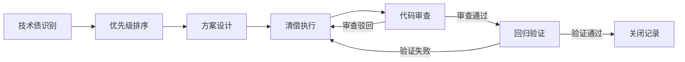

# 技术债清偿

## 概述

技术债清偿是指有计划、有节奏地偿还过去因赶进度、妥协方案等原因积累的技术债务。与代码重构不同，技术债清偿更强调系统性的盘点、优先级排序和投入产出比的考量，是一种项目化、持续化的改进活动。

## 生命周期



## 典型子任务结构

**按技术债类型拆解：**
1. 代码级债务：重复代码消除、命名规范统一、注释补全
2. 架构级债务：模块耦合解耦、过时技术栈替换、API版本清理
3. 基础设施债务：CI/CD流水线优化、环境配置标准化、监控覆盖补全
4. 文档级债务：缺失文档补写、过时文档更新、API文档同步

**按迭代周期拆解：**
1. 每迭代固定投入（如20%人力用于偿债）
2. 偿债Sprint（每季度一个专项迭代）
3. 随需求搭车偿还（在开发关联模块时顺手清理）

## 必需角色与职责 (RACI)

| 角色 | 参与方式 | 职责说明 |
|------|----------|----------|
| 开发工程师 | R | 负责技术债清理、代码修改和测试 |
| 技术负责人 | A | 负责偿债优先级决策、方案审批、风险把控 |
| 代码审核员 | C | 审查清偿代码质量 |
| 产品经理 | C | 确认偿债工作对产品功能无负面影响 |
| 系统架构师 | C | 对架构级债务的清偿方案进行指导 |
| 测试工程师 | I | 知会偿债范围，必要时支持回归测试 |

## 输入物清单

| 输入物 | 提供方 | 必需/可选 |
|--------|--------|-----------|
| 技术债清单/Backlog | 技术负责人 | 必需 |
| 静态代码分析报告（SonarQube等） | CI系统 | 必需 |
| 代码审查历史反馈汇总 | 代码审核员 | 可选 |
| 线上故障/问题关联记录 | SRE | 可选 |

## 输出物清单

| 输出物 | 接收方 | 完成标准 |
|--------|--------|----------|
| 清偿后代码 | 代码审核员 | 通过代码审查 |
| 技术债关闭记录 | 技术负责人 | 关联债项标记为已清偿 |
| 技术债指标变化报告 | 技术总监 | 可量化的质量指标改善 |

## 质量门禁 (Quality Gates)

1. **目标指标改善**：静态分析指标（圈复杂度/重复率/技术债比率）有明显改善
2. **回归测试通过**：涉及模块的回归测试全部通过
3. **方案审批**：清偿方案经技术负责人书面审批
4. **无新债引入**：清偿代码不违反现有编码规范和架构约束

## 关联流程

- 默认流程：[[PROC-需求到上线]]
- 相关流程：[[PROC-代码审查流程]]

## 常见风险与应对

| 风险 | 概率 | 影响 | 应对策略 |
|------|------|------|----------|
| 产品方不理解偿债价值 | 高 | 中 | 用数据和案例说明偿债对交付速度的正向影响 |
| 偿债范围过大 | 中 | 高 | 切割为小批次，每批次独立交付验证 |
| 偿债影响线上功能 | 低 | 高 | 充分回归测试，灰度发布验证 |
| 业务需求挤压偿债时间 | 高 | 中 | 在迭代计划中固定偿债配额，不可挪用 |
| 偿债方向与重构重叠 | 中 | 低 | 与重构工作统一规划，避免重复劳动 |

## Agent 上下文包 (Agent Context Pack)

当AI Agent执行此类工作时，按此清单加载上下文：

```yaml
context_pack:
  work_type: "WT-DEV-004"
  required:
    roles:
      - "1.角色体系/研发类/ROLE-后端开发工程师.md"
      - "1.角色体系/架构类/ROLE-技术负责人.md"
      - "1.角色体系/架构类/ROLE-系统架构师.md"
    processes:
      - "4.流程引擎/开发类/PROC-代码审查流程.md"
    checklists:
      - "通用能力层/检查清单/CHK-技术债盘点清单.md"
  optional:
    knowledge:
      - "5.知识沉淀/技术债管理策略.md"
      - "5.知识沉淀/编码规范.md"
    tools:
      - "通用能力层/工具集/UTIL-代码质量分析手册.md"
      - "通用能力层/工具集/UTIL-SonarQube操作手册.md"
```

### Agent 执行提示

1. 优先清偿「高利息」技术债——即那些频繁修改、每次改动都受阻的模块
2. 清偿代码要遵循童子军原则：让代码比你发现它时更干净
3. 大型偿债任务务必拆分，每个子任务能独立测试和合并
4. 偿债完成后更新技术债登记表，标记已关闭
5. 关注偿债是否产生回归问题，测试覆盖不足的模块先补测试
