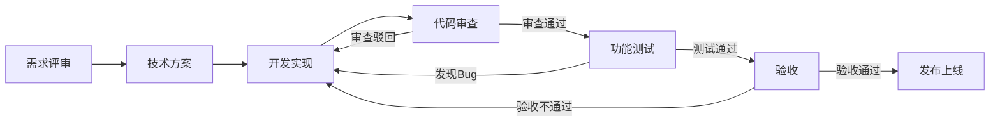

# 新功能开发

## 概述

新功能开发是指根据产品需求，从零开始实现一个全新的功能模块或特性。这是IT研发部门最核心和最高频的工作类型，涉及从需求理解、技术方案设计、编码实现到测试发布的完整软件开发生命周期。

## 生命周期



## 典型子任务结构

**按技术分层拆解：**
1. 数据层实现（数据库表结构、DAO/Repository、数据模型）
2. 业务逻辑层实现（Service层、领域模型、业务规则）
3. 接口层实现（Controller/API、请求参数校验、响应封装）
4. 前端/客户端实现（页面组件、交互逻辑、状态管理）

**按功能模块拆解：**
1. 核心功能实现（最小可用单元MVP）
2. 辅助功能实现（配置管理、日志、异常处理）
3. 集成与联调（上下游系统对接、端到端流程验证）

**按任务性质拆解：**
1. 主交付任务：`task_nature: delivery`，只按阶段里程碑和验收标准推进。
2. 持续集成修订：`task_nature: integration_revision`，用于记录联调小修、字段补齐、测试数据修正，不自动推进主任务完成度。
3. 审核任务：`task_nature: review`，由代码审核员或系统架构师提供独立视角。
4. 测试数据任务：`task_nature: test_data`，用于构造验证数据；必须说明服务的验证目标。

## 必需角色与职责 (RACI)

| 角色 | 参与方式 | 职责说明 |
|------|----------|----------|
| 开发工程师 | R | 负责技术方案执行、编码实现、单元测试 |
| 测试工程师 | R | 负责功能测试用例执行、缺陷跟踪 |
| 技术负责人 | A | 技术方案审批、最终交付质量负责 |
| 产品经理 | C | 提供需求澄清和验收标准确认 |
| 代码审核员 | C | 对代码质量和规范进行审查 |
| 系统架构师 | C | 对技术方案和架构合规性进行指导 |
| DevOps工程师 | I | 知会发布计划，准备部署环境 |

## 输入物清单

| 输入物 | 提供方 | 必需/可选 |
|--------|--------|-----------|
| PRD/需求文档 | 产品经理 | 必需 |
| UI/UX设计稿 | UX设计师 | 可选（前端功能必需） |
| 技术方案文档 | 技术负责人 | 必需 |
| 接口定义文档（API Spec） | 技术负责人/架构师 | 必需 |
| 数据库设计文档 | 开发工程师 | 可选（新表创建时必需） |

## 输出物清单

| 输出物 | 接收方 | 完成标准 |
|--------|--------|----------|
| 功能代码（含单元测试） | 代码审核员 | 通过代码审查 |
| 测试报告 | 测试工程师/技术负责人 | 所有用例通过，无阻塞级Bug |
| 部署说明/发布手册 | DevOps工程师 | 包含配置变更、依赖变更、回滚方案 |
| API文档更新 | 前端/客户端开发 | 与实际实现一致 |
| 技术方案实现总结 | 技术负责人 | 记录偏离项和原因 |

## 质量门禁 (Quality Gates)

1. **代码审查通过**：至少1名同级或以上Reviewer批准，无未解决的严重评审意见
2. **单元测试覆盖率 >= 80%**：核心业务逻辑覆盖率 >= 90%
3. **所有验收用例通过**：产品经理确认功能符合PRD描述的验收标准
4. **无P0/P1级别Bug未关闭**：上线前所有高优先级缺陷已修复并验证
5. **性能测试不劣化**：核心接口响应时间不劣于现有基线
6. **持续修订可追溯**：TL/asNormal 直接修订必须写入任务记录；只有明确满足验收标准、解除阻塞、通过独立审核或通过测试验证时，才可更新阶段进度。

## 关联流程

- 默认流程：[[PROC-需求到上线]]
- 相关流程：[[PROC-代码审查流程]]、[[PROC-需求到上线]]

## 常见风险与应对

| 风险 | 概率 | 影响 | 应对策略 |
|------|------|------|----------|
| 需求中途变更 | 高 | 高 | 开发前完成需求冻结，变更走CR流程评估影响 |
| 技术方案设计不足 | 中 | 高 | 复杂功能强制编写技术方案并评审 |
| 依赖方接口延期 | 中 | 中 | 提前确认接口契约，使用Mock先行开发 |
| 测试环境不稳定 | 中 | 中 | 推动环境标准化，预留联调buffer时间 |
| 跨团队协作阻塞 | 低 | 中 | 明确接口人和SLA，每日站会同步进度 |

## Agent 上下文包 (Agent Context Pack)

当AI Agent执行此类工作时，按此清单加载上下文：

```yaml
context_pack:
  work_type: "WT-DEV-001"
  required:
    roles:
      - "1.角色体系/研发类/ROLE-后端开发工程师.md"
      - "1.角色体系/研发类/ROLE-前端开发工程师.md"
      - "1.角色体系/质量类/ROLE-测试工程师.md"
      - "1.角色体系/架构类/ROLE-技术负责人.md"
    processes:
      - "4.流程引擎/开发类/PROC-需求到上线.md"
      - "4.流程引擎/开发类/PROC-代码审查流程.md"
    checklists:
      - "通用能力层/检查清单/CHK-上线前检查清单.md"
      - "通用能力层/检查清单/CHK-代码审查检查清单.md"
  optional:
    knowledge:
      - "5.知识沉淀/技术方案模板.md"
      - "5.知识沉淀/编码规范.md"
    tools:
      - "通用能力层/工具集/UTIL-Git操作手册.md"
      - "通用能力层/工具集/UTIL-CICD操作手册.md"
```

### Agent 执行提示

1. 开发前务必完成技术方案评审，避免返工
2. 每天至少提交一次代码，保持分支活跃
3. 遇到阻塞问题立即升级给技术负责人，不要自行等待
4. 单元测试随代码同步提交，不要最后集中补充
5. 上线前确认所有配置项和数据库变更已在部署说明中记录
