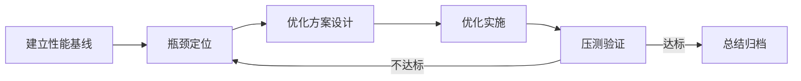

# 性能优化

## 概述

性能优化是通过系统化的方法定位系统性能瓶颈，并通过代码优化、架构调整、资源配置等方式提升系统性能指标的工作。性能优化的关键在于「先测量，再优化」——必须基于数据而非直觉进行决策，避免过早优化和不必要的复杂度。

## 生命周期



## 典型子任务结构

**按优化层面拆解：**
1. 代码层优化：算法优化、数据结构选择、缓存策略、N+1查询消除
2. 架构层优化：引入缓存层、异步化处理、读写分离、数据分片
3. 基础设施层优化：JVM参数调优、连接池配置、K8s资源限制调整
4. 数据库层优化：索引优化、SQL重写、查询计划分析、连接池调优

**按优化目标拆解：**
1. 响应时间优化：降低P50/P99延迟
2. 吞吐量优化：提升QPS/TPS上限
3. 资源利用率优化：降低CPU/内存/IO消耗
4. 启动时间优化：减少冷启动耗时

## 必需角色与职责 (RACI)

| 角色 | 参与方式 | 职责说明 |
|------|----------|----------|
| 开发工程师 | R | 负责性能分析、瓶颈定位、优化代码实现 |
| 技术负责人 | A | 负责优化方案审批、把控优化方向 |
| 系统架构师 | C | 对架构层面的优化提供指导 |

## 输入物清单

| 输入物 | 提供方 | 必需/可选 |
|--------|--------|-----------|
| 性能问题报告/优化需求 | 测试工程师/产品方 | 必需 |
| 性能监控数据/APM数据 | 监控系统 | 必需 |
| Profiling数据（CPU/内存/IO热点） | 开发工程师 | 必需 |
| 系统架构图和调用拓扑 | 架构师 | 必需 |
| 当前性能基线数据 | 性能测试工程师 | 必需 |

## 输出物清单

| 输出物 | 接收方 | 完成标准 |
|--------|--------|----------|
| 优化后代码 | 代码审核员 | 通过代码审查 |
| 性能对比报告（优化前后对比） | 技术负责人 | 关键指标有可量化的改善 |
| 性能优化总结文档 | 团队全员 | 记录瓶颈、方案、效果和后续建议 |

## 质量门禁 (Quality Gates)

1. **性能指标达标**：优化后的P50/P99延迟/QPS等关键指标达到目标值
2. **无性能回退**：非优化范围的核心接口响应时间不恶化
3. **压测报告证明**：压测结果支撑优化有效性的结论
4. **代码审查通过**：优化代码经过审查，避免引入新的性能反模式

## 关联流程

- 默认流程：[[PROC-性能优化流程]]
- 相关流程：[[PROC-系统设计流程]]、[[PROC-代码审查流程]]

## 常见风险与应对

| 风险 | 概率 | 影响 | 应对策略 |
|------|------|------|----------|
| 瓶颈定位错误 | 中 | 高 | 基于APM和Profiling数据多维度交叉验证 |
| 优化破坏功能 | 中 | 高 | 优化后进行全量回归测试 |
| 过早优化非瓶颈代码 | 中 | 中 | 遵循「先测量再优化」原则，聚焦Top瓶颈 |
| 优化效果无法持久 | 中 | 中 | 建立性能基线持续监控，设置性能回归告警 |
| 性能优化引入安全风险 | 低 | 高 | 缓存、异步等优化手段需评估安全性影响 |

## Agent 上下文包 (Agent Context Pack)

当AI Agent执行此类工作时，按此清单加载上下文：

```yaml
context_pack:
  work_type: "WT-ARCH-004"
  required:
    roles:
      - "1.角色体系/架构类/ROLE-系统架构师.md"
      - "1.角色体系/架构类/ROLE-技术负责人.md"
      - "1.角色体系/研发类/ROLE-后端开发工程师.md"
    processes:
      - "4.流程引擎/架构类/PROC-性能优化流程.md"
    checklists:
      - "通用能力层/检查清单/CHK-性能优化检查清单.md"
  optional:
    knowledge:
      - "5.知识沉淀/性能优化方法论.md"
      - "5.知识沉淀/数据库性能优化实践.md"
      - "5.知识沉淀/JVM调优参考.md"
    tools:
      - "通用能力层/工具集/UTIL-性能测试工具手册.md"
      - "通用能力层/工具集/UTIL-APM工具手册.md"
```

### Agent 执行提示

1. 优化第一步永远是建立性能基线——不知道现在多慢，就无法证明优化有效
2. 借助APM和Profiling工具找到真正的瓶颈，不要凭经验猜测
3. 每次只改一个变量，验证效果后再改下一个，否则无法判断哪个改动有效
4. 关注P99延迟而非仅看平均值，长尾问题往往是用户体验差的主因
5. 优化完成后将性能指标加入监控，设置告警防止回退
