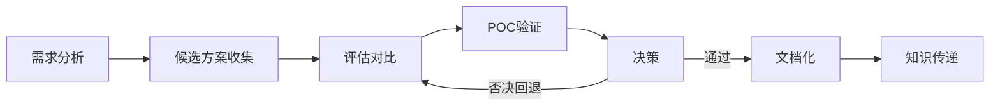

# 技术选型

## 概述

技术选型是在多种候选技术方案中，通过系统化的评估和对比，选择最适合项目需求的技术栈或工具。这是一项影响深远的工作——选型结果决定了团队未来数月甚至数年的技术方向。需要平衡功能匹配度、性能、社区活跃度、团队能力和长期维护成本等多个维度。

## 生命周期



## 典型子任务结构

**按选型范围拆解：**
1. 框架选型：如Web框架、ORM框架、消息队列
2. 基础设施选型：如数据库、缓存、搜索引擎、API网关
3. 工具链选型：如CI/CD工具、监控系统、日志平台
4. 第三方服务选型：如短信服务、支付服务、CDN

**按评估维度拆解：**
1. 功能匹配度分析
2. 性能基准测试
3. 社区生态评估
4. 安全性与合规性
5. 团队学习成本
6. 许可证和商业风险

## 必需角色与职责 (RACI)

| 角色 | 参与方式 | 职责说明 |
|------|----------|----------|
| 系统架构师 | R | 负责技术调研、方案对比、POC验证、撰写选型报告 |
| 技术负责人 | A | 负责选型决策审批、最终拍板 |
| 开发工程师 | C | 提供使用体验反馈、开发效率评估 |
| 安全工程师 | C | 审查安全性和许可证合规性 |

## 输入物清单

| 输入物 | 提供方 | 必需/可选 |
|--------|--------|-----------|
| 技术需求文档（功能、性能、集成需求） | 技术负责人/产品经理 | 必需 |
| 技术约束（语言限制、部署环境限制等） | 技术负责人 | 必需 |
| 现有技术栈清单和交互关系 | 架构师 | 必需 |
| 预算限制 | 技术总监 | 可选（涉及付费产品时必需） |

## 输出物清单

| 输出物 | 接收方 | 完成标准 |
|--------|--------|----------|
| 技术选型报告（含对比矩阵） | 技术负责人 | 各维度有量化评分和结论 |
| POC验证结果（代码和测试数据） | 架构师 | 能复现，支撑选型结论 |
| 技术决策记录（ADR） | 团队全员 | 记录决策上下文、选项、理由和后果 |
| 迁移/集成方案 | 开发工程师 | 如果替换已有方案，提供迁移路径 |

## 质量门禁 (Quality Gates)

1. **评估维度完整**：至少覆盖功能、性能、社区活跃度、许可证、学习曲线5个维度
2. **POC结果支撑决策**：关键决策有POC代码和性能数据支撑，非凭感觉决策
3. **决策审批通过**：TechLead和架构师双重审批
4. **ADR文档完备**：每个关键决策都有对应的ADR记录

## 关联流程

- 默认流程：[[PROC-技术选型流程]]
- 相关流程：[[PROC-系统设计流程]]

## 常见风险与应对

| 风险 | 概率 | 影响 | 应对策略 |
|------|------|------|----------|
| 追求新技术忽略稳定性 | 中 | 高 | 评估指标中稳定性权重高于新特性吸引力 |
| 评估维度不完整 | 中 | 中 | 使用标准化的评估模板，强制覆盖所有维度 |
| 团队技能不匹配 | 中 | 中 | 评估中包含学习曲线和培训成本，提前安排技能储备 |
| 选型后技术方停止维护 | 低 | 高 | 关注社区活跃度和商业公司背景，优先选择有持续投入的方案 |
| 决策周期过长导致项目延期 | 中 | 中 | 设定决策时间盒，采用限时POC |

## Agent 上下文包 (Agent Context Pack)

当AI Agent执行此类工作时，按此清单加载上下文：

```yaml
context_pack:
  work_type: "WT-ARCH-002"
  required:
    roles:
      - "1.角色体系/架构类/ROLE-系统架构师.md"
      - "1.角色体系/架构类/ROLE-技术负责人.md"
    processes:
      - "4.流程引擎/架构类/PROC-技术选型流程.md"
    checklists:
      - "通用能力层/检查清单/CHK-技术选型检查清单.md"
  optional:
    knowledge:
      - "5.知识沉淀/技术选型评估模板.md"
      - "5.知识沉淀/常用技术栈对比参考.md"
    tools:
      - "通用能力层/工具集/UTIL-性能测试工具手册.md"
```

### Agent 执行提示

1. 先明确「必须满足」和「锦上添花」的需求，避免面面俱到导致决策困难
2. 建立标准化的评分矩阵，每个维度有权重和评分标准
3. POC要聚焦在关键的差异化特性上，不要试图做完整体验
4. 关注社区健康度：Star趋势、Issue响应速度、Release频率
5. 决策记录要写清楚为什么「没选」其他方案，这往往比为什么选更重要
