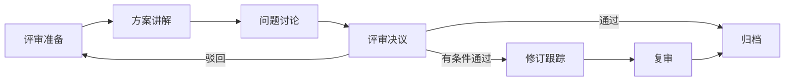

# 架构评审

## 概述

架构评审是对系统设计方案进行系统性审查的正式活动。其核心目的是在设计阶段早期发现潜在问题，确保设计方案满足功能和非功能需求，符合组织架构规范，避免在开发后期才发现重大设计缺陷导致大面积返工。

## 生命周期



## 典型子任务结构

**按评审阶段拆解：**
1. 评审前：设计方提前1-2天发出材料，评审者提前阅读并准备问题
2. 评审中：设计方讲解方案，评审者提问和讨论，形成决议
3. 评审后：设计方根据决议修改方案，跟踪项逐步关闭

**按评审内容拆解：**
1. 架构合规性：是否符合组织的架构规范和设计原则
2. 技术可行性：方案在现有技术栈和团队能力下能否实现
3. 非功能需求覆盖：性能、安全、可用性、可扩展性考量
4. 运维可落地性：部署、监控、灾备方案是否完备

## 必需角色与职责 (RACI)

| 角色 | 参与方式 | 职责说明 |
|------|----------|----------|
| 系统架构师 | R | 负责主持评审会议、评估架构质量、形成评审决议 |
| 技术负责人 | C | 提供技术判断、把关业务对齐度 |
| 开发工程师 | I | 了解设计方案，提供实现视角反馈 |
| 安全工程师 | C | 审查安全架构合规性 |

## 输入物清单

| 输入物 | 提供方 | 必需/可选 |
|--------|--------|-----------|
| 系统设计文档 | 设计方（架构师/开发） | 必需 |
| 架构图（C4/部署图/时序图） | 设计方 | 必需 |
| 技术决策记录（ADR） | 设计方 | 必需 |
| 非功能性需求指标 | 产品经理/技术负责人 | 必需 |
| 上次评审的跟踪项（如有） | 评审组织者 | 可选 |

## 输出物清单

| 输出物 | 接收方 | 完成标准 |
|--------|--------|----------|
| 评审会议纪要 | 全体参与者 | 记录关键讨论点和结论 |
| 评审意见清单（含处置方式） | 设计方 | 每条意见有明确的采纳/延期/驳回及理由 |
| 评审决议 | 设计方 | 明确通过/有条件通过/驳回 |
| 跟踪项清单（含责任人和截止日期） | 设计方 | 可追踪可验收 |

## 质量门禁 (Quality Gates)

1. **评审法定人数达标**：至少1名架构师 + 1名TechLead + 1名资深开发参与
2. **评审意见闭环**：所有意见有明确答复，无悬而未决的问题
3. **跟踪项可执行**：每个跟踪项有明确的责任人、截止日期和验收标准
4. **关键风险已识别**：评审对性能、安全、可用性等关键维度有明确评估

## 关联流程

- 默认流程：[[PROC-架构评审流程]]
- 相关流程：[[PROC-系统设计流程]]

## 常见风险与应对

| 风险 | 概率 | 影响 | 应对策略 |
|------|------|------|----------|
| 评审前材料准备不充分 | 中 | 中 | 提前1天发送材料，规定材料清单，不满足不召开 |
| 评审会变成方案说明会而非评审 | 高 | 中 | 限制讲解时间（不超过30分钟），大部分时间用于讨论 |
| 关键评审者缺席 | 中 | 中 | 提前确认日历，核心角色缺席则改期 |
| 评审意见过多无法消化 | 中 | 中 | 区分阻塞性问题和改进建议，阻塞性问题优先 |
| 跟踪项石沉大海 | 高 | 高 | 纳入任务系统跟踪，下次评审首先回顾上次跟踪项 |

## Agent 上下文包 (Agent Context Pack)

当AI Agent执行此类工作时，按此清单加载上下文：

```yaml
context_pack:
  work_type: "WT-ARCH-003"
  required:
    roles:
      - "1.角色体系/架构类/ROLE-系统架构师.md"
      - "1.角色体系/架构类/ROLE-技术负责人.md"
    processes:
      - "4.流程引擎/架构类/PROC-架构评审流程.md"
    checklists:
      - "通用能力层/检查清单/CHK-架构评审检查清单.md"
  optional:
    knowledge:
      - "5.知识沉淀/架构评审常见问题集.md"
      - "5.知识沉淀/架构设计原则.md"
    tools:
      - "通用能力层/工具集/UTIL-会议管理工具手册.md"
```

### Agent 执行提示

1. 评审的核心是「发现设计盲区」，不是挑战设计者
2. 把评审意见分为三类：阻塞性问题（不改不行）、改进建议（改了更好）、笔记（仅供参考）
3. 不要在评审会上现场讨论解决方案，记录问题会后处理
4. 关注跨系统影响——设计方容易只关注自己负责的部分
5. 决议明确记录为：通过 / 有条件通过（列出条件）/ 驳回
