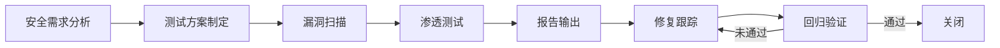

# 安全测试

## 概述

安全测试是通过系统化的方法发现系统中安全漏洞和风险的工作。它包括静态应用安全测试（SAST）、动态应用安全测试（DAST）、渗透测试、依赖项安全扫描等多种手段，目标是确保系统在上线前达到可接受的安全水平，防止数据泄露、权限绕过、注入攻击等安全事件。

## 生命周期



## 典型子任务结构

**按测试手段拆解：**
1. SAST（静态应用安全测试）：代码层面扫描SQL注入、XSS、硬编码密钥等
2. DAST（动态应用安全测试）：运行时扫描，模拟攻击请求发现漏洞
3. SCA（软件组成分析）：扫描第三方依赖的已知CVE漏洞
4. 渗透测试：人工模拟攻击者行为，深入测试认证、授权、数据保护等
5. 安全配置审查：检查服务器、中间件、云服务的安全配置

**按OWASP Top 10拆解：**
1. Broken Access Control（访问控制失效）
2. Cryptographic Failures（加密失败）
3. Injection（注入攻击）
4. Insecure Design（不安全设计）
5. Security Misconfiguration（安全配置错误）

## 必需角色与职责 (RACI)

| 角色 | 参与方式 | 职责说明 |
|------|----------|----------|
| DevOps工程师 | R | 负责安全扫描工具集成和执行（DAST/SCA） |
| 安全工程师 | A | 负责安全测试方案制定、渗透测试、漏洞定级和修复指导 |
| 测试工程师 | C | 协助安全测试用例设计 |
| 开发工程师 | I | 接收漏洞报告、执行修复 |
| 技术负责人 | I | 知会安全测试结果和风险状态 |

## 输入物清单

| 输入物 | 提供方 | 必需/可选 |
|--------|--------|-----------|
| 安全需求文档/威胁模型 | 安全工程师 | 必需 |
| 系统架构图和数据流图 | 架构师 | 必需 |
| 代码仓库访问权限 | 开发工程师 | 必需 |
| 测试环境URL和凭证 | DevOps工程师 | 必需 |
| 上次安全测试报告（如有） | 安全工程师 | 可选 |

## 输出物清单

| 输出物 | 接收方 | 完成标准 |
|--------|--------|----------|
| 安全测试报告 | 技术负责人/安全工程师 | 漏洞清单完整，含严重等级、复现步骤、修复建议 |
| 漏洞清单（按严重等级排序） | 开发工程师 | 每项有明确状态：待修复/已修复/风险接受 |
| 安全扫描工具配置 | DevOps工程师 | 已集成到CI流水线，自动触发 |

## 质量门禁 (Quality Gates)

1. **无高危/严重漏洞**：所有Critical和High级别的漏洞必须在发布前修复
2. **OWASP Top 10覆盖**：测试方案覆盖OWASP Top 10（2021）全部检查项
3. **中危漏洞有处理计划**：每个Medium级别漏洞有明确的修复计划或风险接受记录
4. **SAST集成CI**：静态扫描已集成到CI流水线，新增代码的严重问题阻断构建

## 关联流程

- 默认流程：[[PROC-测试流程]]
- 相关流程：[[PROC-需求到上线]]

## 常见风险与应对

| 风险 | 概率 | 影响 | 应对策略 |
|------|------|------|----------|
| 高危漏洞发现太晚影响发布 | 中 | 高 | 安全测试左移，SAST在开发阶段就集成执行 |
| 扫描工具误报过多 | 高 | 中 | 建立误报白名单机制，人工确认后标记 |
| 渗透测试范围不明确 | 中 | 中 | 测试前确认范围边界、测试时间和限制条件 |
| 修复引入新问题 | 中 | 中 | 修复后进行回归安全扫描，确认无新增漏洞 |
| 依赖项漏洞被忽略 | 高 | 高 | SCA集成CI，依赖变更自动触发扫描 |

## Agent 上下文包 (Agent Context Pack)

当AI Agent执行此类工作时，按此清单加载上下文：

```yaml
context_pack:
  work_type: "WT-QA-004"
  required:
    roles:
      - "1.角色体系/架构类/ROLE-安全工程师.md"
      - "1.角色体系/运维类/ROLE-DevOps工程师.md"
    processes:
      - "4.流程引擎/测试类/PROC-测试流程.md"
    checklists:
      - "通用能力层/检查清单/CHK-安全测试检查清单.md"
  optional:
    knowledge:
      - "5.知识沉淀/OWASP Top 10详解.md"
      - "5.知识沉淀/常见安全漏洞与修复指南.md"
    tools:
      - "通用能力层/工具集/UTIL-SAST工具手册.md"
      - "通用能力层/工具集/UTIL-渗透测试工具手册.md"
```

### Agent 执行提示

1. 安全测试的第一步是理解系统的信任边界和数据流，知道攻击面在哪
2. SAST和SCA要尽早集成到CI，不要发布前才跑——来不及修
3. 漏洞分级要标准化：Critical/High/Medium/Low/Info，不同等级不同处理SLA
4. 渗透测试遵循OWASP测试指南，优先测试认证、授权和输入校验
5. 安全报告不仅要列漏洞，还要给开发可行的修复建议和代码示例
