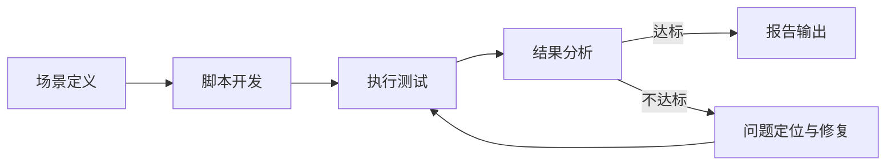

# 性能测试

## 概述

性能测试是验证系统在特定负载下的响应时间、吞吐量和资源利用率是否满足需求的测试活动。主要包括负载测试、压力测试、稳定性测试等类型，目的是在系统上线前发现性能瓶颈，确保系统在预期负载下稳定运行。

## 生命周期



## 典型子任务结构

**按测试类型拆解：**
1. 负载测试：在预期负载下验证系统性能指标是否达标
2. 压力测试：逐步增加负载，找到系统的性能拐点和最大承载能力
3. 稳定性测试：在特定负载下长时间运行，观察内存泄漏、连接泄漏等问题
4. 尖峰测试：模拟流量突发场景，验证系统的弹性能力

**按测试视角拆解：**
1. 接口级性能测试：单个API的响应时间和吞吐量
2. 场景级性能测试：模拟用户操作流程的端到端性能
3. 全链路性能测试：多服务协同场景下的整体性能表现

## 必需角色与职责 (RACI)

| 角色 | 参与方式 | 职责说明 |
|------|----------|----------|
| 测试工程师 | R | 负责场景设计、脚本开发、测试执行和报告编写 |
| 开发工程师 | C | 协助性能问题定位和修复 |
| 技术负责人 | C | 确认性能指标目标，审核测试报告 |
| DevOps工程师 | C | 提供测试环境和监控支持 |

## 输入物清单

| 输入物 | 提供方 | 必需/可选 |
|--------|--------|-----------|
| 性能指标要求（SLA：响应时间/吞吐量等） | 产品经理/技术负责人 | 必需 |
| 系统架构图和调用拓扑 | 架构师 | 必需 |
| 接口定义文档（含请求/响应结构） | 开发工程师 | 必需 |
| 测试环境信息和访问权限 | DevOps工程师 | 必需 |
| 生产环境容量参考（如已有） | SRE工程师 | 可选 |

## 输出物清单

| 输出物 | 接收方 | 完成标准 |
|--------|--------|----------|
| 性能测试脚本（JMeter/Gatling/Locust等） | 测试团队 | 可复现、可参数化 |
| 性能测试报告（含指标对比、瓶颈分析） | 技术负责人 | 结论明确，有优化建议 |
| 瓶颈分析记录（含堆栈/Profile数据） | 开发工程师 | 根因明确，指向具体代码或配置 |

## 质量门禁 (Quality Gates)

1. **响应时间达标**：核心接口P50和P99响应时间满足SLA要求
2. **吞吐量达标**：系统在预期负载下的TPS/QPS达到目标值
3. **资源使用合理**：CPU使用率 < 70%，无内存泄漏趋势，无线程阻塞堆积
4. **报告审核通过**：TechLead对报告数据和结论进行审核确认

## 关联流程

- 默认流程：[[PROC-测试流程]]
- 相关流程：[[PROC-性能优化流程]]

## 常见风险与应对

| 风险 | 概率 | 影响 | 应对策略 |
|------|------|------|----------|
| 测试环境与生产差异大 | 中 | 高 | 尽量使用与生产等比例的环境，记录环境差异以便结果修正 |
| 测试数据不真实导致结果偏差 | 中 | 中 | 使用脱敏的生产数据或接近生产分布的人工数据 |
| 压测工具本身成为瓶颈 | 低 | 中 | 压测工具分布式部署，确保足够的施压能力 |
| 性能指标缺乏明确的SLA | 中 | 中 | 推动产品和架构明确核心接口的性能SLA |
| 压测影响共享环境其他服务 | 中 | 中 | 使用独立测试环境或在业务低峰期执行 |

## Agent 上下文包 (Agent Context Pack)

当AI Agent执行此类工作时，按此清单加载上下文：

```yaml
context_pack:
  work_type: "WT-QA-003"
  required:
    roles:
      - "1.角色体系/质量类/ROLE-测试工程师.md"
      - "1.角色体系/质量类/ROLE-性能测试工程师.md"
    processes:
      - "4.流程引擎/测试类/PROC-测试流程.md"
    checklists:
      - "通用能力层/检查清单/CHK-性能测试检查清单.md"
  optional:
    knowledge:
      - "5.知识沉淀/性能测试场景设计参考.md"
      - "5.知识沉淀/常见性能瓶颈与解决方案.md"
    tools:
      - "通用能力层/工具集/UTIL-性能测试工具手册.md"
      - "通用能力层/工具集/UTIL-APM工具手册.md"
```

### Agent 执行提示

1. 性能测试的第一要务是明确SLA——没有明确目标，测完也无法判断是否通过
2. 先跑一轮基准测试（1并发），建立单用户响应时间基线
3. 逐步加压而非一步到位，观察拐点比观察绝对值更重要
4. 压测时务必开启APM和系统监控，仅有压测工具的吞吐量是不够的
5. 报告中区分服务端耗时和网络耗时，避免混淆问题归属
