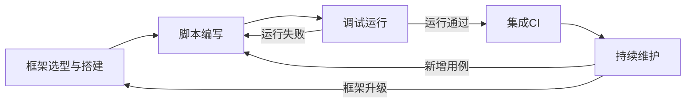

# 自动化测试

## 概述

自动化测试是将重复性的测试活动通过脚本和工具自动执行的工作。它覆盖单元测试、接口测试、UI测试等多个层次，目标是提高测试效率、缩短反馈周期，让人工测试聚焦在探索性和创造性测试上。

## 生命周期



## 典型子任务结构

**按测试层次拆解：**
1. 单元测试：JUnit/pytest等框架，覆盖率目标80%+
2. 接口自动化测试：REST API/消息队列接口测试，覆盖核心业务流程
3. UI自动化测试：Selenium/Cypress/Playwright，覆盖关键用户旅程
4. 契约测试：Pact等，验证服务间接口兼容性

**按自动化策略拆解：**
1. 回归自动化：将高频执行的回归用例集自动化
2. 冒烟自动化：每次构建后快速验证基本功能可用
3. 数据驱动自动化：通过参数化实现多场景覆盖

## 必需角色与职责 (RACI)

| 角色 | 参与方式 | 职责说明 |
|------|----------|----------|
| 测试工程师 | R | 负责自动化框架搭建、脚本编写和维护 |
| 开发工程师 | C | 提供可测试性支持（测试接口/数据工厂等） |
| DevOps工程师 | C | 协助CI流水线集成、测试环境管理 |
| 技术负责人 | I | 知会自动化测试覆盖率和质量 |

## 输入物清单

| 输入物 | 提供方 | 必需/可选 |
|--------|--------|-----------|
| 现有手动测试用例（优选用例集） | 测试工程师 | 必需 |
| 被测系统代码仓库和访问权限 | 开发工程师 | 必需 |
| CI/CD流水线配置信息 | DevOps工程师 | 必需 |
| 测试环境信息（URL/账号/依赖服务） | DevOps工程师 | 必需 |
| 接口文档（API Spec） | 开发工程师 | 必需（接口测试） |

## 输出物清单

| 输出物 | 接收方 | 完成标准 |
|--------|--------|----------|
| 自动化测试脚本代码仓库 | 测试团队 | 代码结构清晰、可维护 |
| 自动化测试框架（含公共库和工具方法） | 测试团队 | 支持参数化、断言、报告生成 |
| CI集成配置（pipeline yml等） | DevOps工程师 | PR自动触发、失败阻断合并 |
| 测试报告（含趋势分析） | 技术负责人 | 成功率和执行时间可视化 |

## 质量门禁 (Quality Gates)

1. **覆盖率达标**：核心业务流程自动化覆盖率达到约定目标
2. **稳定性达标**：自动化脚本持续运行成功率 >= 95%（排除环境问题）
3. **CI集成完成**：PR/Merge时自动触发运行，失败阻断合并
4. **代码审查通过**：自动化测试代码和业务代码同等要求，通过代码审查

## 关联流程

- 默认流程：[[PROC-测试流程]]
- 相关流程：[[PROC-代码审查流程]]

## 常见风险与应对

| 风险 | 概率 | 影响 | 应对策略 |
|------|------|------|----------|
| 自动化脚本维护成本高于收益 | 高 | 高 | 只自动化稳定和高频的用例，避免UI频繁变更场景 |
| 环境不稳定导致假失败 | 中 | 高 | 增加重试机制和环境健康检查，失败分类统计 |
| 自动化用例与实际脱节 | 中 | 中 | 用例与手动用例双向同步，定期回顾废弃无效用例 |
| 脚本只写不维护 | 高 | 高 | 把脚本失败率纳入质量度量，设置自动化用例owner |
| UI元素定位不稳定 | 中 | 中 | 使用语义定位（data-testid），避免依赖样式选择器 |

## Agent 上下文包 (Agent Context Pack)

当AI Agent执行此类工作时，按此清单加载上下文：

```yaml
context_pack:
  work_type: "WT-QA-002"
  required:
    roles:
      - "1.角色体系/质量类/ROLE-测试工程师.md"
      - "1.角色体系/运维类/ROLE-DevOps工程师.md"
    processes:
      - "4.流程引擎/测试类/PROC-测试流程.md"
    checklists:
      - "通用能力层/检查清单/CHK-自动化测试上线检查清单.md"
  optional:
    knowledge:
      - "5.知识沉淀/自动化测试框架选型参考.md"
      - "5.知识沉淀/测试数据管理策略.md"
    tools:
      - "通用能力层/工具集/UTIL-CICD操作手册.md"
      - "通用能力层/工具集/UTIL-测试管理工具手册.md"
```

### Agent 执行提示

1. 不要试图自动化所有用例——选择稳定、高频、重复执行价值高的用例
2. 先搭建框架和1-2个示例脚本，评审通过后批量复制模式
3. 测试脚本也要做代码审查，保持和业务代码同样的质量标准
4. 失败的脚本要第一时间修复，积攒的失败会丧失团队的信任
5. 用好数据驱动（Data-Driven Test），一套脚本覆盖多个数据场景
