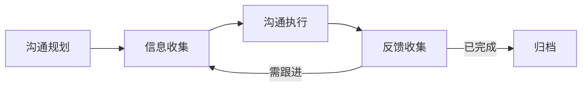

# 干系人沟通

## 概述

干系人沟通是确保项目中所有相关方（业务方、管理层、协作团队、客户等）在正确的时间以正确的方式获得正确信息的管理活动。有效的干系人沟通能防止信息不对称引发的误解、延误和冲突，是项目顺利推进的润滑剂。

## 生命周期



## 典型子任务结构

**按干系人类别拆解：**
1. 向上沟通：向技术总监/管理层汇报项目状态、风险和决策需求
2. 横向沟通：与其他协作团队的接口人同步依赖、接口变更
3. 向下沟通：向团队成员传达目标、优先级变化和反馈
4. 对外沟通：向客户/业务方同步交付进度、变更影响

**按沟通形式拆解：**
1. 定期汇报：周报、月报、迭代Review会议
2. 事件驱动沟通：重大风险升级、紧急变更通知
3. 决策沟通：方案评审、预算申请、资源协调

## 必需角色与职责 (RACI)

| 角色 | 参与方式 | 职责说明 |
|------|----------|----------|
| 项目经理 | R | 负责沟通计划编制、执行和跟踪 |
| 产品经理 | C | 提供业务信息和需求变更的沟通内容 |
| 技术负责人 | I | 获知技术决策和进度信息 |
| 技术总监 | A | 负责关键沟通内容的审核和重大消息的把关 |

## 输入物清单

| 输入物 | 提供方 | 必需/可选 |
|--------|--------|-----------|
| 干系人列表和分析（权力/利益矩阵） | 项目经理 | 必需 |
| 沟通需求矩阵（谁需要什么信息、多频繁） | 项目经理 | 必需 |
| 项目状态数据（进度/风险/问题） | 项目经理/技术负责人 | 必需 |
| 历史沟通记录和反馈 | 项目经理 | 可选 |

## 输出物清单

| 输出物 | 接收方 | 完成标准 |
|--------|--------|----------|
| 沟通计划（含干系人分析、渠道、频率） | 项目团队 | 各方确认沟通模式 |
| 汇报材料（PPT/邮件/仪表盘） | 对应干系人 | 信息准确、简洁、可操作 |
| 会议纪要（含决议和Action Items） | 参会人及关联人 | 会后24小时内发出 |
| 反馈跟踪记录 | 项目经理 | 每条反馈有响应状态 |

## 质量门禁 (Quality Gates)

1. **信息送达率100%**：关键干系人列表中的所有人在预定时间内收到信息
2. **频率与渠道匹配**：沟通频率和渠道与干系人的期望和偏好一致
3. **反馈及时响应**：所有收集到的反馈在2个工作日内给予响应
4. **信息准确无误解**：传递的项目状态数据和决策信息经过核实

## 关联流程

- 默认流程：[[PROC-干系人沟通流程]]
- 相关流程：[[PROC-风险管理流程]]、[[PROC-迭代管理流程]]

## 常见风险与应对

| 风险 | 概率 | 影响 | 应对策略 |
|------|------|------|----------|
| 信息过载导致干系人忽略 | 高 | 中 | 精简信息，用摘要+详情链接，不堆砌数据 |
| 关键干系人遗漏 | 中 | 高 | 项目启动时专门做干系人分析，过程中定期回顾 |
| 报喜不报忧 | 中 | 高 | 建立透明的沟通文化，问题早期暴露比晚期爆发好 |
| 沟通延迟导致决策滞后 | 中 | 中 | 设置沟通SLA，关键决策需求48小时内响应 |
| 跨团队沟通语言不一致 | 中 | 中 | 对非技术干系人避免技术术语，使用业务语言 |

## Agent 上下文包 (Agent Context Pack)

当AI Agent执行此类工作时，按此清单加载上下文：

```yaml
context_pack:
  work_type: "WT-MGMT-004"
  required:
    roles:
      - "1.角色体系/管理类/ROLE-项目经理.md"
      - "1.角色体系/管理类/ROLE-技术总监.md"
    processes:
      - "4.流程引擎/管理类/PROC-干系人沟通流程.md"
    checklists:
      - "通用能力层/检查清单/CHK-干系人沟通检查清单.md"
  optional:
    knowledge:
      - "5.知识沉淀/干系人分析方法.md"
      - "5.知识沉淀/高效汇报技巧.md"
    tools:
      - "通用能力层/工具集/UTIL-项目管理工具手册.md"
```

### Agent 执行提示

1. 先做干系人分析：用权力/利益矩阵（Power/Interest Grid）确定每个人的沟通策略
2. 不同干系人给不同级别的信息：高管要摘要和决策项，执行团队要具体和可操作的
3. 坏消息第一时间主动沟通，附带影响评估和应对方案，不要等对方来问
4. 每次沟通后记录反馈和行动项，不要开了会就忘了
5. 定期收集干系人对沟通效果的反馈，持续改进沟通方式
