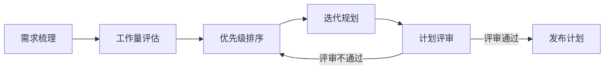

# 迭代计划

## 概述

迭代计划是在每个迭代（Sprint）开始前，团队共同确定未来1-2周内的工作内容和目标的集体活动。核心是将产品Backlog中的需求条目转化为可交付的迭代目标，合理分配工作量，确保团队聚焦于最高价值的工作。

## 生命周期



## 典型子任务结构

**按迭代阶段拆解：**
1. 迭代前准备：产品经理完成Backlog梳理和优先级排序
2. 迭代计划会（Sprint Planning）：
   - Part 1：确定迭代目标（Sprint Goal）
   - Part 2：拆解任务、估算工作量、分配任务
3. 计划确认：团队承诺、发布计划

**按管理维度拆解：**
1. 需求管理：哪些需求纳入、哪些排除、为什么
2. 容量管理：团队可用人天数、休假/培训扣除
3. 风险管理：识别本迭代的技术风险和依赖风险
4. 质量目标：明确本迭代的质量指标（覆盖率/Bug率等）

## 必需角色与职责 (RACI)

| 角色 | 参与方式 | 职责说明 |
|------|----------|----------|
| 项目经理 | R | 负责计划编制、会议组织、进度跟踪 |
| 产品经理 | C | 提供需求优先级和业务价值说明 |
| 技术负责人 | C | 提供技术评估和架构约束 |
| 敏捷教练 | A | 负责迭代流程规范和持续改进指导 |

## 输入物清单

| 输入物 | 提供方 | 必需/可选 |
|--------|--------|-----------|
| 产品Backlog（已排序） | 产品经理 | 必需 |
| 团队历史速率数据（Velocity） | 项目经理 | 必需 |
| 团队成员可用性（休假/培训等） | 团队成员 | 必需 |
| 业务优先级和里程碑 | 产品经理 | 必需 |

## 输出物清单

| 输出物 | 接收方 | 完成标准 |
|--------|--------|----------|
| 迭代计划文档（含迭代目标） | 团队全员 | 目标SMART，任务已分配 |
| Sprint Backlog（已拆解的任务集） | 团队全员 | 每项任务有估算和负责人 |
| 迭代风险登记册 | 项目经理 | 识别关键风险和缓解措施 |

## 质量门禁 (Quality Gates)

1. **迭代目标SMART**：目标具体、可衡量、可实现、与业务相关、有时限
2. **工作量合理**：计划工作量不超过团队历史速率的120%（考虑不确定性缓冲）
3. **团队评审通过**：所有团队成员对计划无异议，承诺达成目标
4. **关键依赖已确认**：对外部团队的依赖已沟通并获得承诺

## 关联流程

- 默认流程：[[PROC-迭代管理流程]]
- 相关流程：无

## 常见风险与应对

| 风险 | 概率 | 影响 | 应对策略 |
|------|------|------|----------|
| 需求颗粒度过粗无法估算 | 中 | 中 | 计划会前要求产品经理完成需求拆分，大需求拆为可估算的粒度 |
| 过度承诺导致无法完成 | 高 | 高 | 参考历史速率数据，预留20%缓冲应对突发情况 |
| 紧急需求打乱计划 | 中 | 高 | 在容量中预留应急缓冲，高优插入时明确置换的内容 |
| 关键人员突然请假 | 低 | 中 | 关键任务至少有2人了解上下文，减少单点依赖 |
| 外部依赖延期 | 中 | 中 | 提前确认外部团队的交付时间，设置提前量 |

## Agent 上下文包 (Agent Context Pack)

当AI Agent执行此类工作时，按此清单加载上下文：

```yaml
context_pack:
  work_type: "WT-MGMT-001"
  required:
    roles:
      - "1.角色体系/管理类/ROLE-项目经理.md"
      - "1.角色体系/管理类/ROLE-产品经理.md"
      - "1.角色体系/管理类/ROLE-敏捷教练.md"
    processes:
      - "4.流程引擎/管理类/PROC-迭代管理流程.md"
    checklists:
      - "通用能力层/检查清单/CHK-迭代计划检查清单.md"
  optional:
    knowledge:
      - "5.知识沉淀/敏捷估算方法.md"
      - "5.知识沉淀/迭代计划会主持指南.md"
    tools:
      - "通用能力层/工具集/UTIL-项目管理工具手册.md"
```

### Agent 执行提示

1. 计划会前产品经理务必完成Backlog梳理并排好优先级，否则会议效率极低
2. 使用Yesterday's Weather模式——用近3个迭代的平均速率作为容量参考
3. 每个任务粒度控制在1天以内，超过1天的任务需要进一步拆分
4. 不要只关注开发任务，测试、文档、评审等都要纳入计划
5. 明确告知团队「计划是承诺而非预测」，允许在迭代中根据实际情况调整
