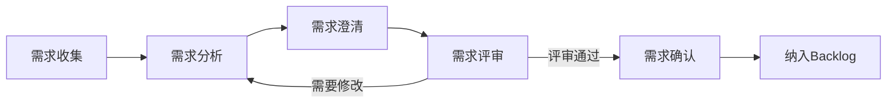

# 需求分析

## 概述

需求分析是将业务需求、用户反馈、市场调研等信息转化为结构化的、可执行的产品需求文档（PRD）的过程。核心是准确理解用户的真实问题，定义清晰的功能边界和验收标准，为后续的设计和开发提供准确的输入。

## 生命周期



## 典型子任务结构

**按需求来源拆解：**
1. 业务驱动需求：来自业务方、管理层提出的战略需求
2. 用户驱动需求：来自用户反馈、工单、NPS调研
3. 技术驱动需求：技术升级、架构演进带来的需求
4. 合规驱动需求：法律法规、安全审计要求

**按分析深度拆解：**
1. 用户故事：As a... I want... So that... 格式的功能描述
2. 用户故事地图：可视化完整用户旅程
3. 验收标准（AC）：Given-When-Then格式的可测试条件
4. 原型/线框图：低保真交互流程

## 必需角色与职责 (RACI)

| 角色 | 参与方式 | 职责说明 |
|------|----------|----------|
| 产品经理 | R | 负责需求收集、分析、文档编写和评审组织 |
| 技术负责人 | C | 评估技术可行性、提供实现成本估算 |
| 开发工程师 | C | 提供实现视角的反馈、评估技术约束 |
| 项目经理 | A | 负责审批需求、把控项目范围 |

## 输入物清单

| 输入物 | 提供方 | 必需/可选 |
|--------|--------|-----------|
| 业务需求提案/用户反馈 | 业务方/用户 | 必需 |
| 市场调研/竞品分析数据 | 产品经理 | 可选 |
| 用户行为分析数据 | 数据分析师 | 可选 |
| 技术约束和现有系统能力 | 技术负责人 | 必需 |

## 输出物清单

| 输出物 | 接收方 | 完成标准 |
|--------|--------|----------|
| PRD/需求文档 | 开发团队/测试团队 | 内容完整、无歧义、可执行 |
| 用户故事地图（复杂功能时） | 团队全员 | 覆盖完整用户旅程 |
| 验收标准（AC） | 测试工程师 | 每条AC可测试、可验证 |
| 需求优先级排序 | 项目经理 | 基于价值和紧急度排序 |

## 质量门禁 (Quality Gates)

1. **需求表述无歧义**：PRD中的功能描述清晰，不同角色理解一致
2. **验收标准可测试**：每条AC有明确的Given-When-Then条件，能被测试验证
3. **评审通过**：技术和产品双方评审通过，无悬而未决的争议
4. **非功能性需求已明确**：性能指标、安全要求、浏览器兼容性等已定义

## 关联流程

- 默认流程：[[PROC-需求管理流程]]
- 相关流程：[[PROC-迭代管理流程]]、[[PROC-需求到上线]]

## 常见风险与应对

| 风险 | 概率 | 影响 | 应对策略 |
|------|------|------|----------|
| 需求调研不充分遗漏关键场景 | 中 | 高 | 多角色访谈（用户、运营、技术），不只听单一来源 |
| PRD过于简略无法指导开发 | 中 | 高 | 使用PRD模板，强制包含场景、边界、异常处理 |
| 需求评审流于形式 | 中 | 中 | 提前1天发文档，评审会限定时间讨论争议，非通读 |
| 验收标准主观模糊 | 中 | 中 | 强制使用Given-When-Then格式，能量化的指标一定量化 |
| 需求频繁变更 | 高 | 高 | 建立需求变更流程，变更需评估对进度和成本的影响 |

## Agent 上下文包 (Agent Context Pack)

当AI Agent执行此类工作时，按此清单加载上下文：

```yaml
context_pack:
  work_type: "WT-MGMT-002"
  required:
    roles:
      - "1.角色体系/管理类/ROLE-产品经理.md"
      - "1.角色体系/管理类/ROLE-项目经理.md"
      - "1.角色体系/架构类/ROLE-技术负责人.md"
    processes:
      - "4.流程引擎/管理类/PROC-需求管理流程.md"
    checklists:
      - "通用能力层/检查清单/CHK-PRD审查检查清单.md"
  optional:
    knowledge:
      - "5.知识沉淀/需求分析方法论.md"
      - "5.知识沉淀/用户故事编写指南.md"
    tools:
      - "通用能力层/工具集/UTIL-原型工具手册.md"
```

### Agent 执行提示

1. 需求分析的起点是「用户遇到了什么问题」，而不是「用户想要什么功能」
2. 每个功能的PRD必须包含：背景、用户场景、功能描述、异常处理、验收标准
3. 区分Must-have和Nice-to-have，帮助开发理解优先级
4. 在PRD中明确写出「不做什么」，比「要做什么」更能防止范围蔓延
5. 需求评审前和TechLead单独过一遍，先解决技术争议再全员评审
