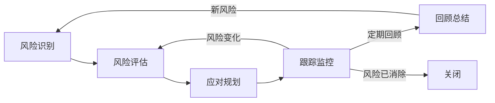

# 风险管理

## 概述

风险管理是系统地识别、评估、应对和监控项目中潜在风险的持续活动。目标是在风险变为问题之前主动干预，降低负面影响，提高项目成功率。风险管理不是一次性的活动，而是贯穿项目全生命周期的持续性实践。

## 生命周期



## 典型子任务结构

**按风险类别拆解：**
1. 技术风险：技术方案不成熟、性能瓶颈、集成复杂度
2. 进度风险：关键路径延期、外部依赖阻塞、人员变动
3. 资源风险：人力不足、预算削减、环境不可用
4. 业务风险：需求方向错误、市场变化、合规政策变化
5. 质量风险：测试覆盖不足、技术债累积、安全漏洞

**按时间频率拆解：**
1. 迭代风险检查（每周）：迭代内的短期风险识别和跟踪
2. 里程碑评审（每季度）：项目级别的重大风险评估
3. 事件驱动（即时）：重大变更触发紧急风险评估

## 必需角色与职责 (RACI)

| 角色 | 参与方式 | 职责说明 |
|------|----------|----------|
| 项目经理 | R | 负责风险识别组织、登记册维护、跟踪监控 |
| 技术负责人 | C | 提供技术风险评估和应对建议 |
| 产品经理 | C | 提供业务风险评估和优先级判断 |
| 技术总监 | A | 负责重大风险决策审批，资源协调 |

## 输入物清单

| 输入物 | 提供方 | 必需/可选 |
|--------|--------|-----------|
| 项目计划/迭代计划 | 项目经理 | 必需 |
| 技术方案文档 | 技术负责人 | 必需 |
| 团队状态报告（人员/士气/技能） | 项目经理 | 必需 |
| 外部依赖清单和SLA | 技术负责人 | 必需 |
| 历史风险记录和复盘结论 | 项目经理 | 可选 |

## 输出物清单

| 输出物 | 接收方 | 完成标准 |
|--------|--------|----------|
| 风险登记册 | 项目团队 | 每条风险有描述、概率、影响、等级、应对、负责人 |
| 风险评估矩阵 | 技术总监 | 高优先级风险一目了然 |
| 风险应对计划 | 相关责任人 | 缓解措施具体可执行，有触发条件 |
| 风险周报 | 技术总监 | 本周风险状态变化和关键行动项 |

## 质量门禁 (Quality Gates)

1. **高风险有应对方案**：高概率高影响的风险必须有明确的缓解措施和负责人
2. **登记册定期更新**：风险登记册每个迭代至少更新一次
3. **关键风险已升级**：超出项目团队可控范围的风险及时升级到决策层
4. **风险定义可观察**：每条风险有可观察的触发条件，而非模糊描述

## 关联流程

- 默认流程：[[PROC-风险管理流程]]
- 相关流程：[[PROC-迭代管理流程]]

## 常见风险与应对

| 风险 | 概率 | 影响 | 应对策略 |
|------|------|------|----------|
| 风险识别流于表面 | 中 | 中 | 使用检查清单+头脑风暴+历史复盘三种方式交叉识别 |
| 风险应对措施无人执行 | 高 | 高 | 每条措施分配负责人和DDL，纳入任务系统追踪 |
| 关注技术风险忽略非技术风险 | 中 | 中 | 强制覆盖所有风险类别，不只看技术 |
| 登记册成为「静态文档」 | 高 | 高 | 每次站会过风险登记册，每周风险周报同步变化 |
| 风险评估过于乐观 | 中 | 高 | 使用历史数据校准评估，Delphi法多人独立评估取平均 |

## Agent 上下文包 (Agent Context Pack)

当AI Agent执行此类工作时，按此清单加载上下文：

```yaml
context_pack:
  work_type: "WT-MGMT-003"
  required:
    roles:
      - "1.角色体系/管理类/ROLE-项目经理.md"
      - "1.角色体系/管理类/ROLE-技术总监.md"
    processes:
      - "4.流程引擎/管理类/PROC-风险管理流程.md"
    checklists:
      - "通用能力层/检查清单/CHK-风险识别检查清单.md"
  optional:
    knowledge:
      - "5.知识沉淀/常见项目风险库.md"
      - "5.知识沉淀/风险量化评估方法.md"
    tools:
      - "通用能力层/工具集/UTIL-项目管理工具手册.md"
```

### Agent 执行提示

1. 风险描述要用「如果...导致...」的if-then因果句式，清晰表达触发和影响
2. 用概率-影响矩阵评估优先级，重点关注右上角（高概率高影响）的风险
3. 应对策略分四类：规避（Avoid）、转移（Transfer）、缓解（Mitigate）、接受（Accept）
4. 每一个缓解措施都要回答：谁、在什么时候、做什么
5. 风险不是「坏东西」——好的风险管理让团队更有信心做出大胆决策
