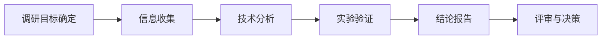

# 技术调研

## 概述

技术调研是针对特定的技术问题或方向，通过系统性收集信息、分析对比、实验验证，最终形成结论和建议的研究活动。技术调研是技术决策的基础输入，要求调研者保持客观性，不预设结论，用数据和事实说话。

## 生命周期



## 典型子任务结构

**按调研深度拆解：**
1. 预研（1小时-半天）：快速了解技术概况，给出初步可行性判断
2. 深度调研（1-3天）：全面分析候选方案，包含实验/POC验证
3. 持续跟踪（长期）：对特定领域保持关注，定期更新知识

**按调研对象拆解：**
1. 开源项目调研：功能特性、社区活跃度、许可证、集成难度
2. 商业产品调研：功能、定价、SLA、厂商支持能力
3. 技术方案调研：不同架构方案的优劣势对比
4. 前沿技术调研：新技术的成熟度、适用场景、学习成本

## 必需角色与职责 (RACI)

| 角色 | 参与方式 | 职责说明 |
|------|----------|----------|
| 系统架构师 | R | 负责调研提纲制定、技术分析、实验验证、报告编写 |
| 技术负责人 | A | 负责调研方向把关、结论审批 |
| 开发工程师 | C | 提供实际使用场景和技术约束反馈 |

## 输入物清单

| 输入物 | 提供方 | 必需/可选 |
|--------|--------|-----------|
| 调研需求/问题描述（要解决什么问题） | 技术负责人/产品经理 | 必需 |
| 技术选型约束（语言/平台/预算等） | 技术负责人 | 必需 |
| 现有技术栈信息和架构约束 | 架构师 | 必需 |
| 调研时间预算 | 技术负责人 | 可选 |

## 输出物清单

| 输出物 | 接收方 | 完成标准 |
|--------|--------|----------|
| 技术调研报告（含对比分析） | 技术负责人 | 结论明确、有数据支撑、包含建议 |
| 可行性结论（推荐/不推荐/有条件推荐） | 技术负责人 | 理由充分、逻辑自洽 |
| Demo代码/实验数据 | 开发团队 | 可复现、有README说明 |

## 质量门禁 (Quality Gates)

1. **方案覆盖完整**：至少调研2个以上候选方案，覆盖主流选项
2. **结论有数据支撑**：关键结论有实验数据或权威资料支撑，非主观判断
3. **报告审核通过**：TechLead对调研结论和方法论进行审核确认
4. **明确给出建议**：报告必须有明确的推荐方案及理由，不模棱两可

## 关联流程

- 默认流程：[[PROC-技术调研流程]]
- 相关流程：[[PROC-技术选型流程]]

## 常见风险与应对

| 风险 | 概率 | 影响 | 应对策略 |
|------|------|------|----------|
| 调研范围不清导致发散 | 中 | 中 | 调研开始前明确调研目标和边界，设定时间盒 |
| 调研深度不足流于表面 | 中 | 高 | 必须包含实验验证环节，至少要搭建Demo跑通核心流程 |
| 调研存在偏见（确认偏误） | 中 | 高 | 使用标准评估矩阵，对每个候选方案同等对待 |
| 调研周期过长 | 中 | 中 | 设定时间盒，到时间出结论即使信息不完备 |
| 调研结论没人看 | 高 | 中 | 组织评审会，调研结论纳入ADR，关键结论分享给全团队 |

## Agent 上下文包 (Agent Context Pack)

当AI Agent执行此类工作时，按此清单加载上下文：

```yaml
context_pack:
  work_type: "WT-RSC-001"
  required:
    roles:
      - "1.角色体系/架构类/ROLE-系统架构师.md"
      - "1.角色体系/架构类/ROLE-技术负责人.md"
    processes:
      - "4.流程引擎/调研类/PROC-技术调研流程.md"
    checklists:
      - "通用能力层/检查清单/CHK-技术调研检查清单.md"
  optional:
    knowledge:
      - "5.知识沉淀/技术调研方法.md"
      - "5.知识沉淀/常用技术栈对比参考.md"
    tools:
      - "通用能力层/工具集/UTIL-信息检索工具手册.md"
```

### Agent 执行提示

1. 调研开始前和需求方对齐：到底要解决什么问题？对调研结论有什么期待？
2. 信息来源优先级：官方文档 > 权威技术博客 > 社区讨论 > AI生成的总结
3. 不止看官网的宣传材料，也要看GitHub Issues、Stack Overflow的踩坑记录
4. 每个候选方案亲自跑一遍Quick Start，验证官方文档的准确性
5. 结论要回答：什么场景下用A、什么场景下用B，而不是一刀切
