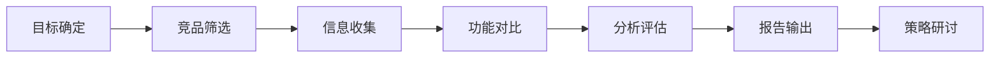

# 竞品分析

## 概述

竞品分析是对市场上与自身产品形成竞争或替代关系的产品进行系统性研究的过程。目的是了解竞争格局、识别对手的优劣势、发现市场机会和威胁，为产品策略和技术方向提供决策依据。

## 生命周期



## 典型子任务结构

**按竞争层次拆解：**
1. 直接竞品：功能相似、目标用户重叠的产品
2. 间接竞品：功能不同但解决相似用户需求的产品
3. 潜在竞品：目前不直接竞争但有进入趋势的产品
4. 替代品：完全不同的解决方案但能达到相同目的

**按分析维度拆解：**
1. 功能维度：功能覆盖度、特色功能、功能深度
2. 体验维度：UI/UX设计、交互流程、学习成本
3. 技术维度：技术架构、性能表现、稳定性、安全性
4. 商业维度：定价策略、市场份额、目标客群、商业模式

## 必需角色与职责 (RACI)

| 角色 | 参与方式 | 职责说明 |
|------|----------|----------|
| 产品经理 | R | 负责竞品筛选、信息收集、功能对比、报告编写 |
| 技术负责人 | C | 提供技术实现层面的对比分析 |
| 系统架构师 | C | 提供技术架构层面的差异分析 |
| 技术总监 | A | 负责分析方向的确定和战略结论的审核 |

## 输入物清单

| 输入物 | 提供方 | 必需/可选 |
|--------|--------|-----------|
| 分析目标和范围（为什么做、关注什么） | 产品经理/技术总监 | 必需 |
| 候选竞品列表 | 产品经理 | 必需 |
| 市场研究报告/行业分析 | 产品经理/市场部 | 可选 |
| 用户反馈和需求调研数据 | 产品经理 | 可选 |
| 产品体验账号（付费竞品时） | 产品经理 | 可选 |

## 输出物清单

| 输出物 | 接收方 | 完成标准 |
|--------|--------|----------|
| 竞品分析报告 | 技术总监/产品团队 | 含功能矩阵、SWOT分析、差异化建议 |
| 功能对比矩阵 | 产品团队 | 详细、可量化、有具体对比项 |
| 战略启示与行动建议 | 技术总监 | 可操作、有优先级排序 |

## 质量门禁 (Quality Gates)

1. **竞品数量充分**：至少分析3个以上竞品，覆盖主要市场玩家
2. **分析维度全面**：覆盖功能、体验、技术、商业四个层面
3. **结论可操作**：不只是罗列竞品功能，要给出可执行的差异化建议
4. **信息客观准确**：信息来源可追溯，不基于主观臆测

## 关联流程

- 默认流程：[[PROC-竞品分析流程]]
- 相关流程：[[PROC-技术选型流程]]、[[PROC-需求管理流程]]

## 常见风险与应对

| 风险 | 概率 | 影响 | 应对策略 |
|------|------|------|----------|
| 信息不完整导致分析偏颇 | 中 | 中 | 多渠道交叉验证（官网、用户评价、试用体验） |
| 只看功能忽略体验和技术 | 中 | 中 | 使用标准化分析模板，强制覆盖多维度的评估 |
| 带着偏见分析竞品 | 中 | 高 | 先列客观事实再评价，明确区分「事实」和「判断」 |
| 分析成果束之高阁 | 高 | 高 | 设立分析成果评审会，结论转化为具体产品策略或技术决策 |
| 竞品数据过时 | 中 | 低 | 标注分析时间和数据来源，关键竞品定期（每季度）更新 |

## Agent 上下文包 (Agent Context Pack)

当AI Agent执行此类工作时，按此清单加载上下文：

```yaml
context_pack:
  work_type: "WT-RSC-002"
  required:
    roles:
      - "1.角色体系/管理类/ROLE-产品经理.md"
      - "1.角色体系/管理类/ROLE-技术总监.md"
    processes:
      - "4.流程引擎/调研类/PROC-竞品分析流程.md"
    checklists:
      - "通用能力层/检查清单/CHK-竞品分析检查清单.md"
  optional:
    knowledge:
      - "5.知识沉淀/竞品分析方法论.md"
      - "5.知识沉淀/产品分析框架参考.md"
    tools:
      - "通用能力层/工具集/UTIL-信息检索工具手册.md"
```

### Agent 执行提示

1. 开始前和决策者对齐：这次分析要回答什么战略问题？
2. 数据来源要多样化：官方渠道（官网/文档）、用户渠道（评价/论坛）、自身体验
3. 用功能矩阵（Feature Matrix）直观展示差异，一眼看出谁强谁弱
4. 不只关注竞品「有什么」，更要分析「为什么这样设计」和「用户真实感受」
5. 报告最后给出3-5条具体的行动建议，按优先级排序
