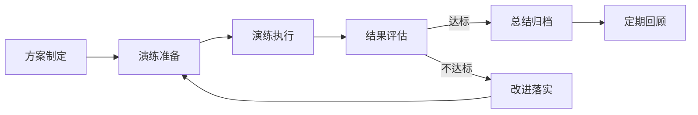

# 灾备演练

## 概述

灾备演练是通过模拟真实的灾难场景（如机房断电、数据损坏、网络中断等），验证灾备体系的可用性和恢复能力。核心目标是确保当真实灾难发生时，团队能够在既定的RTO（恢复时间目标）和RPO（恢复点目标）内完成业务恢复。

## 生命周期



## 典型子任务结构

**按演练类型拆解：**
1. 桌面演练：纸上推演，验证流程和沟通机制
2. 模拟演练：在测试环境模拟故障，验证技术恢复步骤
3. 实战演练：在生产环境局部或全局真实切换，验证端到端能力

**按演练范围拆解：**
1. 单系统演练：单个关键系统（如数据库）的故障恢复
2. 全链路演练：跨系统、跨机房的完整灾难恢复
3. 数据恢复演练：验证备份数据的可恢复性和完整性

## 必需角色与职责 (RACI)

| 角色 | 参与方式 | 职责说明 |
|------|----------|----------|
| SRE工程师 | R | 负责演练方案制定、执行、评估和改进 |
| DevOps工程师 | C | 提供环境支持、协助故障场景构建 |
| 技术负责人 | I | 知会演练计划和结果 |

## 输入物清单

| 输入物 | 提供方 | 必需/可选 |
|--------|--------|-----------|
| 灾备架构文档 | 架构师/SRE | 必需 |
| 业务连续性计划（BCP） | 技术负责人 | 必需 |
| 历史故障/事件记录 | SRE | 可选 |
| 演练范围与目标定义 | 技术负责人 | 必需 |
| 上一次演练报告和改进项 | SRE | 可选 |

## 输出物清单

| 输出物 | 接收方 | 完成标准 |
|--------|--------|----------|
| 演练方案（含场景、步骤、成功标准） | 技术负责人 | 评审通过 |
| 演练执行记录（时间线、操作日志） | SRE团队 | 完整记录每一步耗时和结果 |
| 演练评估报告 | 技术负责人/技术总监 | 包含RTO/RPO达成情况分析 |
| 改进措施清单（含责任人和DDL） | 相关责任人 | 每项可跟踪可验收 |

## 质量门禁 (Quality Gates)

1. **RTO目标达成**：核心业务恢复时间 <= SLA规定的RTO
2. **RPO目标达成**：数据丢失量 <= SLA规定的RPO
3. **改进措施落地**：所有改进项分配责任人和截止日期
4. **无生产事故**：演练过程不对生产环境造成实际影响（实战演练除外）

## 关联流程

- 默认流程：[[PROC-灾备演练流程]]
- 相关流程：No

## 常见风险与应对

| 风险 | 概率 | 影响 | 应对策略 |
|------|------|------|----------|
| 演练影响生产环境 | 中 | 高 | 严格环境隔离，操作窗口提前公告，回滚预案就绪 |
| 演练场景覆盖不足 | 中 | 中 | 基于历史故障和风险评估设计场景，定期轮换场景 |
| 参与人员不足 | 中 | 中 | 提前协调时间，关键角色设置Backup |
| 演练发现的问题未跟进 | 高 | 高 | 改进项纳入任务系统跟踪，下次演练前检查关闭率 |
| RTO/RPO目标设定不合理 | 低 | 中 | 与业务方对齐恢复优先级，区分核心与非核心系统 |

## Agent 上下文包 (Agent Context Pack)

当AI Agent执行此类工作时，按此清单加载上下文：

```yaml
context_pack:
  work_type: "WT-OPS-004"
  required:
    roles:
      - "1.角色体系/运维类/ROLE-SRE工程师.md"
      - "1.角色体系/运维类/ROLE-DevOps工程师.md"
    processes:
      - "4.流程引擎/运维类/PROC-灾备演练流程.md"
    checklists:
      - "通用能力层/检查清单/CHK-灾备演练检查清单.md"
  optional:
    knowledge:
      - "5.知识沉淀/灾备架构设计参考.md"
    tools:
      - "通用能力层/工具集/UTIL-Kubernetes操作手册.md"
      - "通用能力层/工具集/UTIL-数据库备份恢复手册.md"
```

### Agent 执行提示

1. 演练方案必须提前至少1周评审通过，确保所有参与方完全理解
2. 演练前做一次完整的数据备份确认，确保恢复路径可用
3. 演练过程全程录屏或详细记录时间线，用于事后复盘分析
4. 重点关注恢复步骤中的手工操作环节，这些是最容易出错的地方
5. 改进措施不要贪多，每次聚焦2-3个最重要的问题深入解决
