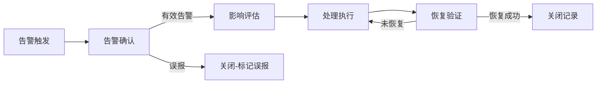

# 监控告警

## 概述

监控告警是运维工作的核心防线，涵盖从告警触发、确认、分析、处理到关闭的完整闭环。目标是快速响应告警事件，准确判断影响范围，高效恢复服务，并通过事后分析持续优化告警规则，减少误报和漏报。

## 生命周期



## 典型子任务结构

**按告警类型拆解：**
1. 基础设施告警：CPU/内存/磁盘/网络等资源告警
2. 应用层告警：错误率、延迟、QPS异常、业务指标偏离
3. 安全告警：异常登录、权限变更、攻击特征匹配
4. 外部依赖告警：第三方服务调用失败率、证书到期

**按处理维度拆解：**
1. 告警响应：第一时间确认告警、通知相关人员
2. 告警分析：结合日志、链路追踪定位根因
3. 告警治理：分析告警趋势，优化阈值、合并重复告警、减少噪音

## 必需角色与职责 (RACI)

| 角色 | 参与方式 | 职责说明 |
|------|----------|----------|
| DevOps工程师 | R | 负责告警响应、初步定位和常规处理 |
| SRE工程师 | A | 负责告警体系整体有效性、告警策略制定 |
| 开发工程师 | I | 被通知应用层告警，必要时介入排查 |
| 技术负责人 | I | 知会重大告警和影响范围 |

## 输入物清单

| 输入物 | 提供方 | 必需/可选 |
|--------|--------|-----------|
| 告警通知（含告警级别、指标、阈值） | 监控系统 | 必需 |
| 实时监控数据和趋势图 | 监控大盘 | 必需 |
| 应用/系统日志 | 日志平台 | 必需 |
| 历史告警处理记录 | 告警管理系统 | 可选 |

## 输出物清单

| 输出物 | 接收方 | 完成标准 |
|--------|--------|----------|
| 告警处理记录 | SRE工程师 | 记录根因、处理步骤、恢复时间 |
| 监控配置变更（阈值调整等） | DevOps工程师 | 变更已生效且生效后无异常 |
| 告警规则优化建议 | SRE工程师 | 可量化降低误报率或提升覆盖率 |

## 质量门禁 (Quality Gates)

1. **告警已确认**：经人工分析确认为有效告警，非误报或噪音
2. **处理过程可审计**：所有处理操作记录在案，包含时间线和执行人
3. **恢复持续性验证**：恢复后持续观察至少15分钟，确认无复发
4. **告警响应SLA达标**：从触发到响应的时间满足SLA要求（P0:5分钟, P1:15分钟）

## 关联流程

- 默认流程：[[PROC-监控告警处理流程]]
- 相关流程：无

## 常见风险与应对

| 风险 | 概率 | 影响 | 应对策略 |
|------|------|------|----------|
| 告警风暴导致遗漏 | 中 | 高 | 告警聚合和降噪策略，核心告警独立通道 |
| 误报过多导致麻木 | 高 | 中 | 定期清理无效告警规则，提高信噪比 |
| 夜间告警无人响应 | 低 | 高 | 建立On-Call轮值机制，告警升级策略 |
| 监控盲区导致漏报 | 中 | 高 | 定期进行监控覆盖度审查，模拟故障演练 |
| 告警处理时间过长 | 中 | 中 | 建立常见告警Runbook，标准化处理步骤 |

## Agent 上下文包 (Agent Context Pack)

当AI Agent执行此类工作时，按此清单加载上下文：

```yaml
context_pack:
  work_type: "WT-OPS-002"
  required:
    roles:
      - "1.角色体系/运维类/ROLE-DevOps工程师.md"
      - "1.角色体系/运维类/ROLE-SRE工程师.md"
      - "1.角色体系/运维类/ROLE-值班工程师.md"
    processes:
      - "4.流程引擎/运维类/PROC-监控告警处理流程.md"
    checklists:
      - "通用能力层/检查清单/CHK-告警响应检查清单.md"
  optional:
    knowledge:
      - "5.知识沉淀/常见告警Runbook.md"
      - "5.知识沉淀/监控指标体系设计.md"
    tools:
      - "通用能力层/工具集/UTIL-Prometheus操作手册.md"
      - "通用能力层/工具集/UTIL-日志查询手册.md"
```

### Agent 执行提示

1. 收到告警先看趋势图，判断是突发尖刺还是持续恶化
2. 结合最近发布记录，检查是否与变更有关
3. 处理前截图保留告警现场，便于事后复盘
4. 确认是误报后更新告警规则，而不是简单关闭走人
5. 重大告警按升级矩阵通知对应级别负责人
