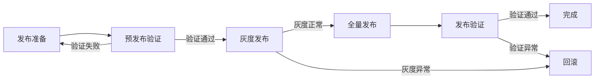

# 部署发布

## 概述

部署发布是将通过测试的代码版本发布到生产环境（或预发布环境）的过程。这是连接开发与运维的关键环节，要求严格遵循发布流程，确保变更安全可控，具备快速回滚能力。

## 生命周期



## 典型子任务结构

**按发布策略拆解：**
1. 灰度发布：先部署到少量实例，观察指标，逐步放量
2. 蓝绿部署：维护两套环境，切换流量完成发布
3. 滚动发布：逐个实例更新，保证服务不中断
4. 金丝雀发布：小比例流量验证新版本，逐步扩大

**按变更范围拆解：**
1. 代码变更发布：应用代码新版本上线
2. 配置变更发布：配置中心的配置项更新
3. 数据库变更发布：DDL/DML脚本执行
4. 基础设施变更：K8s资源配置、网络策略调整

## 必需角色与职责 (RACI)

| 角色 | 参与方式 | 职责说明 |
|------|----------|----------|
| DevOps工程师 | R | 负责发布操作执行、部署流水线管理 |
| SRE工程师 | C | 提供监控指标确认、发布风险评估 |
| 开发工程师 | C | 提供部署包、确认发布内容、线上验证支持 |
| 技术负责人 | I | 知会发布计划与结果 |
| 安全工程师 | I | 知会涉及安全策略变更的发布 |

## 输入物清单

| 输入物 | 提供方 | 必需/可选 |
|--------|--------|-----------|
| 发布申请单/变更单 | 开发工程师/技术负责人 | 必需 |
| 构建产物（镜像/部署包） | CI系统 | 必需 |
| 配置变更清单 | 开发工程师 | 必需 |
| 数据库变更脚本 | 开发工程师 | 可选（有DB变更时必需） |
| 回滚方案 | 开发工程师 | 必需 |

## 输出物清单

| 输出物 | 接收方 | 完成标准 |
|--------|--------|----------|
| 发布记录（时间、版本、执行人） | 团队全员 | 记录完整可追溯 |
| 部署状态报告 | 技术负责人 | 发布成功且核心指标正常 |
| 线上验证结果 | 开发工程师 | 关键业务流程验证通过 |

## 质量门禁 (Quality Gates)

1. **预发布验证通过**：在预发布环境完成冒烟测试，关键流程可用
2. **灰度期间无新增告警**：灰度阶段错误率和延迟在正常范围内
3. **回滚方案就绪**：回滚步骤已确认，且在历史发布中验证过可用性
4. **核心监控指标正常**：发布后5分钟内错误率、延迟、QPS无异常波动

## 关联流程

- 默认流程：[[PROC-部署发布流程]]
- 紧急流程：[[PROC-紧急发布流程]]
- 相关流程：[[PROC-需求到上线]]

## 常见风险与应对

| 风险 | 概率 | 影响 | 应对策略 |
|------|------|------|----------|
| 发布过程失败 | 低 | 高 | 回滚方案前置，操作手册详细，关键步骤双人复核 |
| 配置遗漏 | 中 | 高 | 使用配置变更清单逐项核对，配置差异自动对比 |
| DB脚本执行异常 | 中 | 高 | 先在预发布验证，脚本必须可重复执行（幂等） |
| 缓存/会话数据不兼容 | 中 | 中 | 评估对用户影响，必要时提前通知用户重新登录 |
| 灰度比例设置不当 | 低 | 中 | 从5%开始逐步放量，每个阶段观察至少5分钟 |

## Agent 上下文包 (Agent Context Pack)

当AI Agent执行此类工作时，按此清单加载上下文：

```yaml
context_pack:
  work_type: "WT-OPS-001"
  required:
    roles:
      - "1.角色体系/运维类/ROLE-DevOps工程师.md"
      - "1.角色体系/运维类/ROLE-SRE工程师.md"
    processes:
      - "4.流程引擎/运维类/PROC-部署发布流程.md"
      - "4.流程引擎/运维类/PROC-紧急发布流程.md"
    checklists:
      - "通用能力层/检查清单/CHK-上线前检查清单.md"
  optional:
    knowledge:
      - "5.知识沉淀/发布策略与回滚实践.md"
    tools:
      - "通用能力层/工具集/UTIL-CICD操作手册.md"
      - "通用能力层/工具集/UTIL-Kubernetes操作手册.md"
```

### Agent 执行提示

1. 发布前确认当前不是封网期，不影响用户体验高峰时段
2. 严格遵守发布窗口时间，不在非窗口期进行生产变更
3. 每次发布必须全程有人值守，不可无人值守自动发布
4. 灰度放量时盯着监控大盘，一旦异常立即暂停并评估
5. 发布完成后在团队群发送发布通知，包含版本号和关键变更
