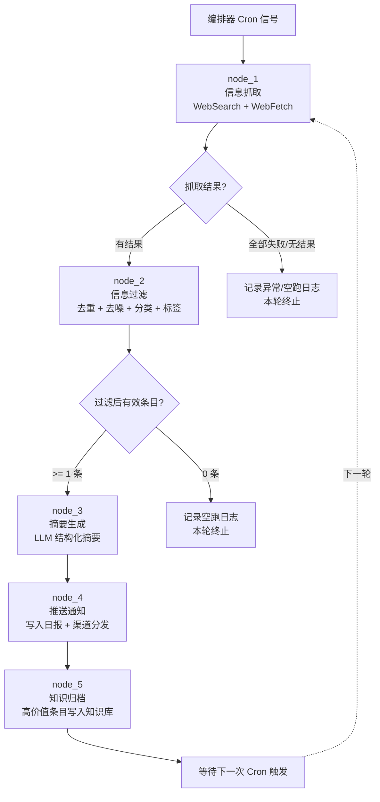
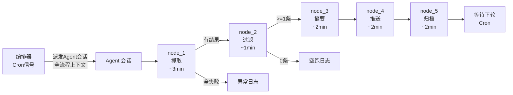

# PROC-信息收集与推送

## 1. 流程概述

### 1.1 流程目的

信息收集与推送流程是一个**全自动闭环信息管理流程**，旨在解决 IT 研发团队面临的"信息过载但有效信息不足"问题。通过定时自动抓取行业动态、技术趋势、安全漏洞和竞品信息，经智能过滤和摘要生成后，定向推送给相关角色，并将高价值信息沉淀为团队知识资产。

### 1.2 触发条件

| 触发要素 | 说明 |
|----------|------|
| **触发模式** | Cron 定时触发（由 Agent 编排器的调度器发出启动信号） |
| **触发频率** | 日频（Daily）：每天 08:00，抓取过去 24h 增量，写入当日日报 |
| | 周频（Weekly）：每周一 08:00，抓取过去一周汇聚，写入当周周报 |
| | 事件触发（On-demand）：竞品大事件、重大安全漏洞、法规变更时人工触发 |
| **前置条件** | 信息源配置文件存在且格式正确 |
| | 关键词矩阵已按角色/领域维度维护 |
| | 日报/周报目录结构按[[命名规范]]存在 |
| | 标签体系已定义完备 |

### 1.3 适用场景

- 每日技术动态简报：整理前一日行业新闻、开源项目更新、技术博客文章
- 安全漏洞监控：跟踪 CVE 公告、OWASP 更新、厂商安全补丁
- 竞品情报收集：监控竞品产品更新、技术博客、招聘动向
- 技术雷达维护：每周汇总新兴技术趋势，辅助技术决策
- 法规合规跟踪：监控行业法规、数据隐私政策变更

### 1.4 设计原则

本流程是框架中唯一**完全无人类介入的闭环自动化流程**。5 个节点均由 Agent 自治完成，编排器仅负责按 Cron 调度启动、按边条件推进、记录运行日志。仅在连续异常时通过告警机制通知人类管理者。

---

## 2. 流程图

### 2.1 Mermaid 流程图



### 2.2 循环逻辑说明

```
┌─────────────────────────────────────────────────────┐
│                    Loop 控制逻辑                       │
├─────────────────────────────────────────────────────┤
│  1. Cron 信号触发 → 启动 node_1                       │
│  2. 有结果则沿串行路径推进 node_2 → node_3 →           │
│     node_4 → node_5                                   │
│  3. 中间任何节点在检查点被判定为"无有效产               │
│     出"时，记录空跑日志，本轮正常终止                   │
│  4. node_5 完成后返回等待态，等待下一 Cron 周期         │
│  5. 异常不阻塞循环：单条数据失败不影响其他条目           │
│     处理                                               │
└─────────────────────────────────────────────────────┘
```

---

## 3. Agent 编排映射

本流程采用**单会话全流程模式**：一个 Agent 会话加载全部上下文后，在同一会话内按序执行全部 5 个节点。各节点共享数据上下文，通过临时文件传递中间结果。

### 3.1 编排总览

| 节点ID | 节点名称 | Agent 角色 | 上下文包 (required) | 上下文包 (optional) | 完成信号 |
|--------|---------|-----------|-------------------|--------------------|---------|
| node_1 | 信息抓取 | Agent（WebSearch + WebFetch） | 本流程 + 信息源配置文件 + 关键词矩阵 | [[标签体系]] | 原始结果文件创建，`fetch_status: complete` + `items_count: N` |
| node_2 | 信息过滤 | Agent（LLM 分类器） | 本流程 + 原始抓取结果 + [[标签体系]] + [[命名规范]] | 历史去重缓存（近7天URL列表） | 过滤结果文件 `filter_status: complete` + `valid_items: N` |
| node_3 | 摘要生成 | Agent（LLM 摘要引擎） | 本流程 + 过滤结果 + [[ROLE-技术文档工程师]]（摘要质量标准） | — | 摘要文件 `summary_status: complete` + `summarized_items: N` |
| node_4 | 推送通知 | Agent（文件写入 + 渠道推送） | 本流程 + 摘要列表 + [[命名规范]] + 角色-推送映射表 + 日报/周报模板 | ROLE-干系人（待创建）（了解角色偏好） | 日报/周报文件更新时间戳 + 推送回执 `push_status: delivered` |
| node_5 | 知识归档 | Agent（知识库管理器） | 本流程 + 高价值摘要(评分>=70) + [[标签体系]] + tpl-knowledge 模板 + [[5.知识沉淀/AGENT.md]] | [[5.知识沉淀/📚_知识库总览.md]] | 新增知识条目 `type: knowledge` + `status: auto-generated`；MOC 更新时间戳 |

### 3.2 编排时序图



### 3.3 采用单会话全流程模式的原因

1. **数据高度内聚**：5 个节点共享同一批数据上下文，分派多个 Agent 会话增加切换开销而无收益
2. **无需并行加速**：单次执行总耗时约 10 分钟，各节点输出是下一节点的直接输入，自然形成串行依赖
3. **简化编排逻辑**：一个会话内自治执行，编排器无需在多会话间传递状态
4. **降低异常处理复杂度**：单会话模式下的错误恢复更简单直接

---

## 4. 节点详细定义

### 4.1 node_1：信息抓取

| 属性 | 内容 |
|------|------|
| **动作描述** | 读取信息源配置和关键词矩阵，调用 WebSearch 对各 (source x keyword) 组合执行搜索，对搜索结果调用 WebFetch 获取详情页内容。将原始结果写入临时文件，超时或失败的信息源记录到异常日志 |
| **输入** | 信息源配置文件（`.claude/config/info-sources.yaml`）+ 关键词矩阵（按角色/领域分类）+ 本次 Cron 周期参数 |
| **输出** | 原始抓取结果文件：`7.日志与追踪/信息抓取日志/{YYYY-MM-DD}-raw-results.md` |
| **自检清单** | - [ ] 所有配置信息源均已发起请求（含 HTTP 状态码记录） |
| | - [ ] 单个信息源超时 > 5s 时自动跳过并标记异常 |
| | - [ ] 单轮抓取总量不超过 50 条（防过载） |
| | - [ ] 每条结果包含：URL、标题、原始摘要、发布时间、来源标签 |
| | - [ ] 超时/异常信息源已记录到异常日志 |
| **超时** | 3 分钟 |

**Agent 执行指令**：
```
1. 加载信息源配置文件中的 sources 列表和 keywords 映射
2. 对每个 source：
   a. 如果 fetch_method = WebSearch，调用 WebSearch 按关键词搜索
   b. 如果 fetch_method = WebFetch，直接抓取页面
3. 对搜索结果前 3 条调用 WebFetch 获取详情
4. 汇总结果，每条包含：{url, title, raw_summary, published_at, source_label, keyword_used}
5. 写入 7.日志与追踪/信息抓取日志/{YYYY-MM-DD}-raw-results.md
6. frontmatter 设置：fetch_status: complete, items_count: N, cron_cycle: "daily|weekly"
7. 超时/失败的信息源写入异常日志 frontmatter 的 error_sources 字段
```

### 4.2 node_2：信息过滤

| 属性 | 内容 |
|------|------|
| **动作描述** | 读取 node_1 原始结果，执行三步过滤管线：① URL 去重（与近7天历史比对）② 相关性评分（LLM 打分 0-100）③ 标签分类（domain/work 双维度）+ 角色关联。丢弃重复和低分（<30）条目 |
| **输入** | node_1 输出的原始抓取结果文件 + [[标签体系]] + [[命名规范]] + 历史去重缓存 |
| **输出** | 过滤结果文件：`7.日志与追踪/信息抓取日志/{YYYY-MM-DD}-filtered-results.md` |
| **自检清单** | - [ ] URL 级去重完成（与近7天历史 URL 比对，重复的已丢弃并记录数量） |
| | - [ ] 每条保留信息的相关性评分 >= 阈值（默认 30/100） |
| | - [ ] 每条保留信息至少有 2 个标签（domain/ + work/） |
| | - [ ] 每条保留信息关联至少 1 个目标角色（role/） |
| | - [ ] 过滤统计已记录（去重丢弃数、低分丢弃数、最终保留数） |
| **超时** | 1 分钟 |

**Agent 执行指令**：
```
1. 读取 {YYYY-MM-DD}-raw-results.md
2. 去重阶段：
   - 以 URL 为 key，与 7.日志与追踪/信息抓取日志/ 下最近7天的所有 raw-results 和 filtered-results 中的 URL 比对
   - 匹配到的标记为 duplicate，丢弃，计数
3. 评分阶段：
   - 调用 LLM，对每条去重后的信息做相关性评分（0-100）
   - prompt 中包含当前关键词矩阵作为相关性参照
   - 低于阈值（默认30）的丢弃，计数
4. 分类阶段：
   - 根据信息内容匹配标签体系中的 domain/ 标签（技术领域）
   - 根据信息类型匹配 work/ 标签（用途分类）
   - 根据标签推导应该关注的角色 role/ 标签
5. 输出 filtered-results.md，frontmatter：
   - filter_status: complete
   - valid_items: N
   - discarded_duplicates: N
   - discarded_low_relevance: N
```

### 4.3 node_3：摘要生成

| 属性 | 内容 |
|------|------|
| **动作描述** | 对 node_2 输出的每条有效信息，调用 LLM 生成结构化摘要。摘要包含：一句话概述、核心观点（2-3条）、技术/业务影响评估、建议关注角色、可执行行动建议 |
| **输入** | node_2 输出的过滤结果文件 + [[ROLE-技术文档工程师]]（摘要质量标准参考） |
| **输出** | 摘要文件：`7.日志与追踪/信息抓取日志/{YYYY-MM-DD}-summaries.md` |
| **自检清单** | - [ ] 每条摘要"一句话概述"不超过 80 字 |
| | - [ ] 核心观点提取准确，无曲解原文含义 |
| | - [ ] 影响评估有明确的影响等级（高/中/低/无） |
| | - [ ] 建议关注的 [[ROLE-XXX]] 使用 Obsidian wiki 链接格式 |
| | - [ ] 行动建议具体可执行（非"建议关注""值得了解"等空泛描述） |
| | - [ ] LLM 调用异常条目已标记 `summary_error` 并保留原始内容 |
| **超时** | 2 分钟 |

**Agent 执行指令**：
```
1. 读取 {YYYY-MM-DD}-filtered-results.md
2. 对每条 valid item：
   a. 调用 LLM，使用以下 prompt 结构生成摘要：
      你是技术摘要专家。请为以下信息生成结构化摘要：
      [原文标题 + 原始内容]
      输出格式：
      {
        "one_liner": "一句话概述（不超过80字）",
        "key_points": ["观点1（不超过40字）", "观点2", "观点3"],
        "impact_assessment": { "level": "高/中/低/无", "reason": "评估理由" },
        "target_roles": ["[[ROLE-XXX]]", "..."],
        "action_items": ["具体可执行的行动建议1", "..."]
      }
   b. 对 LLM 返回结果做基本校验（字数、角色格式）
3. 汇总写入 summaries.md
   - frontmatter: summary_status: complete, summarized_items: N, error_items: N
   - body: 按角色分组排列的摘要列表
```

### 4.4 node_4：推送通知

| 属性 | 内容 |
|------|------|
| **动作描述** | 读取 node_3 的摘要列表和角色-推送映射配置。按角色标签将摘要路由到对应角色的日报/周报文件，并推送至配置的通讯渠道。更新推送记录文件 |
| **输入** | node_3 的摘要列表 + [[命名规范]]（日报/周报路径规则）+ 角色-推送渠道映射表 + 日报/周报模板 |
| **输出** | 已更新的日报/周报文件 + 推送记录文件：`7.日志与追踪/信息抓取日志/{YYYY-MM-DD}-push-log.md` |
| **自检清单** | - [ ] 日报文件路径格式符合 [[命名规范]]：`7.日志与追踪/日报/{YYYY}/{YYYY-MM-DD}.md` |
| | - [ ] 周报文件路径格式符合 [[命名规范]]：`7.日志与追踪/周报/{YYYY}/WK-{YYYY}-{NN}.md` |
| | - [ ] 写入内容追加到日报"## 信息简报" / 周报"## 本周信息汇总"章节 |
| | - [ ] 推送渠道消息发送成功（有发送确认） |
| | - [ ] 推送失败条目进入重试队列（积压不超过 10 条） |
| **超时** | 2 分钟 |

**Agent 执行指令**：
```
1. 读取 {YYYY-MM-DD}-summaries.md 和角色-推送映射配置
2. 日报模式（daily）：
   a. 检查 7.日志与追踪/日报/{YYYY}/{YYYY-MM-DD}.md 是否存在
   b. 不存在则使用 tpl-daily-log 模板创建
   c. 在 "## 信息简报" 章节下追加当日本轮摘要（按角色分组）
3. 周报模式（weekly）：
   a. 检查 7.日志与追踪/周报/{YYYY}/WK-{YYYY}-{NN}.md 是否存在
   b. 不存在则创建
   c. 在 "## 本周信息汇总" 章节下追加本周汇总摘要
4. 渠道推送：
   a. 根据角色 push_mapping 中的 channels 字段确定推送目标
   b. 执行推送操作（文件写入 + 即时通知频道）
   c. 记录送达状态到 push-log.md
5. 输出 push-log.md：
   - frontmatter: push_status: delivered|partial|failed
   - body: channels, recipients, delivered_count, failed_count, retry_queue
```

### 4.5 node_5：知识归档

| 属性 | 内容 |
|------|------|
| **动作描述** | 从 node_3 摘要列表中筛选相关性评分 >= 70 的高价值条目。按 [[5.知识沉淀/AGENT.md]] 中的归档规则，使用 tpl-knowledge 模板创建知识条目文件，归档到 5.知识沉淀/ 对应子目录。更新知识库索引（MOC 页面） |
| **输入** | node_3 的摘要列表（筛选评分 >= 70）+ [[标签体系]] + tpl-knowledge 模板 + [[5.知识沉淀/AGENT.md]]（归档决策矩阵和模板规范） |
| **输出** | 知识条目文件（`5.知识沉淀/{domain分类}/{YYYY-MM-DD}-{标题简述}.md`）+ 归档报告：`7.日志与追踪/信息抓取日志/{YYYY-MM-DD}-archive-log.md` |
| **自检清单** | - [ ] 仅归档评分 >= 70 的条目（避免污染知识库） |
| | - [ ] 文件命名符合 [[命名规范]] |
| | - [ ] frontmatter 包含完整字段：type: knowledge, domain, topic, maturity: draft, tags, source_url |
| | - [ ] body 包含原始来源链接和抓取时间 |
| | - [ ] maturity 设置为 `draft`（Agent 自动生成，待人工审核升级为 verified/adopted） |
| | - [ ] status 字段设置为 `auto-generated`（区分人工撰写和 Agent 生成） |
| | - [ ] 已更新对应 MOC 页面的索引链接 |
| | - [ ] 重复 URL 不覆盖已有知识文档，合并更新并标注 `updated` 时间戳 |
| **超时** | 2 分钟 |

**Agent 执行指令**：
```
1. 读取 {YYYY-MM-DD}-summaries.md，筛选 relevance_score >= 70 的条目
2. 根据 [[5.知识沉淀/AGENT.md]] 的归档决策矩阵，确定归档位置：
   - 技术动态 → 5.知识沉淀/外部资源/
   - 技术调研/POC 报告 → 5.知识沉淀/技术调研/
   - 安全漏洞/CVE → 5.知识沉淀/技术文档/安全/
3. 对每条高价值摘要，创建知识条目文件：
   a. 使用 tpl-knowledge 模板
   b. frontmatter 填写：
      type: knowledge
      title: "{原标题}"
      domain: "{从 domain/ 标签推导的领域}"
      topic: "{主题归类}"
      maturity: draft
      source_url: "{原始URL}"
      relevance_score: {分数}
      status: auto-generated
      source_task: "PROC-AUTO-001"
      tags: [type/knowledge, domain/{领域}, work/{类型}, auto-generated]
      created: "{YYYY-MM-DD}"
      updated: "{YYYY-MM-DD}"
   c. body 内容：
      ## 一句话概述
      {摘要}
      ## 核心观点
      - {观点1}
      - {观点2}
      ## 影响评估
      - 等级：{高/中/低/无}
      - 说明：{评估理由}
      ## 建议行动
      - {行动建议}
      ## 来源
      - [{原文标题}]({URL}) | 抓取时间：{时间}
      - 关联角色：[[{role}]]
4. 更新知识库 MOC 页面：
   - 在 5.知识沉淀/📚_知识库总览.md 或对应领域子目录的 MOC 中新增链接
5. 输出归档报告 archive-log.md：
   - frontmatter: archive_status: complete, archived_items: N, skipped_duplicates: N
```

---

## 5. 上下文包定义

### 5.1 必选上下文（required）

每个节点执行前必须加载的文档集合：

| 节点 | 必选上下文包 | 说明 |
|------|-------------|------|
| node_1 | 本流程文件 + 信息源配置文件 + 关键词矩阵 | 明确抓取范围和目标 |
| node_2 | 本流程文件 + node_1 输出 + [[标签体系]] + [[命名规范]] + 历史去重缓存 | 过滤标准和标签分类依据 |
| node_3 | 本流程文件 + node_2 输出 + [[ROLE-技术文档工程师]] | 摘要质量和格式标准 |
| node_4 | 本流程文件 + node_3 输出 + [[命名规范]] + 角色-推送映射表 + 日报/周报模板 | 推送目标和文件格式规范 |
| node_5 | 本流程文件 + node_3 输出(评分>=70) + [[标签体系]] + tpl-knowledge 模板 + [[5.知识沉淀/AGENT.md]] | 归档规则和模板规范 |

### 5.2 可选上下文（optional）

可根据信息源类型和当前周期加载：

| 上下文 | 适用场景 | 加载节点 |
|--------|---------|---------|
| [[5.知识沉淀/📚_知识库总览.md]] | 需了解知识库现有结构以判断是否重复归档 | node_5 |
| ROLE-干系人（待创建） | 需了解各角色信息偏好以定制推送内容 | node_4 |
| [[CHK-代码审查检查清单]] | 抓取到的信息涉及代码变更建议 | node_3 |
| [[BP-编码规范]] | 涉及的代码实践建议 | node_3 |
| .claude/config/info-sources.yaml | 信息源和关键词配置 | node_1 |

### 5.3 上下文加载顺序

```
Agent 启动
  → 先读本流程文件（了解全貌和节点定义）
  → 读信息源配置（确定抓取目标）
  → 读标签体系（为 node_2 分类做准备）
  → 读命名规范（为 node_4/node_5 文件路径做准备）
  → 读知识沉淀 AGENT.md（为 node_5 归档做准备）
  → 开始执行 node_1
```

---

## 6. 输出规范

### 6.1 各节点验收标准

| 节点 | 验收项 | 验收标准 | 不通过处理 |
|------|--------|---------|-----------|
| node_1 | 抓取完整性 | 配置的信息源 100% 已发起请求（含超时跳过） | 超时源记入异常日志，下轮重试 |
| node_1 | 数据格式 | 每条记录包含 url/title/raw_summary/published_at/source_label 五字段 | 字段缺失条目丢弃 |
| node_1 | 数量控制 | 单轮抓取不超过 50 条 | 超量时按发布时间截断 |
| node_2 | 去重准确性 | URL 匹配率 100%（对近7天所有历史 URL） | — |
| node_2 | 标签覆盖率 | 每条保留信息 >= 2 个标签 + >= 1 个角色 | 不足的补标或丢弃 |
| node_2 | 评分一致性 | 同类信息评分偏差不超过 20 分 | 连续偏差超标时检查 prompt |
| node_3 | 摘要字数 | 一句话概述 <= 80 字 | 超长摘要重新请求 LLM |
| node_3 | 行动建议质量 | 每条行动建议必须具体可执行 | 空泛建议重新生成 |
| node_3 | 错误率 | 单轮 LLM 错误率 <= 30% | 超过时触发告警 |
| node_4 | 文件路径 | 日报/周报文件路径严格符合 [[命名规范]] | — |
| node_4 | 推送送达 | 推送渠道有确认回执 | 无回执条目进入重试队列 |
| node_4 | 积压控制 | 推送重试队列积压 <= 10 条 | 超过时触发告警 |
| node_5 | 评分门槛 | 仅归档评分 >= 70 的条目 | — |
| node_5 | 命名规范 | 知识条目文件名符合 [[命名规范]] | — |
| node_5 | frontmatter 完整性 | type/domain/topic/maturity/tags/source_url/status 七个字段 | 缺失字段补填后方可归档 |
| node_5 | 去重 | 同一 source_url 不重复创建知识文档 | 已有则合并更新 |
| node_5 | MOC 同步 | 知识库 MOC 索引页面已更新链接 | — |

### 6.2 中间文件命名规范

| 节点 | 文件路径 | frontmatter 关键字段 |
|------|---------|---------------------|
| node_1 | `7.日志与追踪/信息抓取日志/{YYYY-MM-DD}-raw-results.md` | `fetch_status: complete\|partial\|failed`, `items_count`, `cron_cycle` |
| node_2 | `7.日志与追踪/信息抓取日志/{YYYY-MM-DD}-filtered-results.md` | `filter_status: complete`, `valid_items`, `discarded_duplicates`, `discarded_low_relevance` |
| node_3 | `7.日志与追踪/信息抓取日志/{YYYY-MM-DD}-summaries.md` | `summary_status: complete\|partial`, `summarized_items`, `error_items` |
| node_4 | `7.日志与追踪/信息抓取日志/{YYYY-MM-DD}-push-log.md` | `push_status: delivered\|partial\|failed`, `channels`, `delivered_count`, `failed_count` |
| node_5 | `7.日志与追踪/信息抓取日志/{YYYY-MM-DD}-archive-log.md` | `archive_status: complete`, `archived_items`, `skipped_duplicates` |

---

## 7. 异常处理

### 7.1 异常分类与处理策略

| 异常类别 | 异常场景 | 严重级别 | 处理策略 | 升级条件 |
|----------|----------|:--------:|----------|----------|
| 网络层 | 全部信息源超时/不可达 | P1 | 记录异常日志，跳过本轮；下次 Cron 自动重试 | 连续 3 轮全部失败 → 向编排管理者日报插入告警 |
| 网络层 | 部分信息源超时 | P3 | 跳过超时源，用可用源的抓取结果继续执行 | 同一信息源连续 5 轮超时 → 标记为可能失效，向管理者提醒 |
| 数据层 | 抓取结果异常（空页面、格式变化、反爬） | P3 | 对该源标记 `parse_error`，跳过本轮 | 连续 3 轮同一源 parse_error → 通知管理者检查信息源配置 |
| 数据层 | 过滤后无有效条目（全部去重或低分） | P3 | 记录空跑日志，本轮正常终止 | 连续 5 轮空跑 → 周报中提醒审视关键词矩阵 |
| 处理层 | LLM 摘要生成错误或超时 | P2 | 对该条标记 `summary_error`，保留原始内容写入；LLM 返回超时则重试 1 次 | 单轮错误率 > 30% → 告警通知管理者检查 LLM API |
| 处理层 | 摘要质量过低（连续多条空泛行动建议） | P3 | 记录质量告警标记，不影响流程推进 | 连续 3 轮质量告警 → 检查摘要 prompt 是否退化 |
| 存储层 | 日报/周报目录不存在 | P3 | 首次运行时自动创建完整目录结构（按 [[命名规范]]） | 自动创建也失败 → 告警（可能权限不足） |
| 存储层 | 知识库目录写入失败 | P1 | 记录失败日志，文件暂存于临时目录 | 连续 3 轮写入失败 → 告警（磁盘满或权限问题） |
| 存储层 | 知识库 URL 重复（同一来源再次归档） | Info | 不创建新文件，更新已有文件的 `updated` 字段并补充内容 | 无需介入 |
| 推送层 | 推送渠道不可达 | P2 | 记录失败日志，写入重试队列，下次 Cron 附带重试 | 消息积压超过 10 条 → 告警通知检查渠道配置和权限 |

### 7.2 异常恢复机制

```
┌─────────────────────────────────────────────┐
│              异常恢复流程                      │
├─────────────────────────────────────────────┤
│  1. 节点执行异常                              │
│     ├── 可恢复异常（单条数据级别）               │
│     │   └── 标记错误条目 → 跳过 → 继续处理下一条  │
│     ├── 可恢复异常（信息源级别）                 │
│     │   └── 标记异常源 → 跳过 → 使用其他源继续    │
│     └── 不可恢复异常（系统级）                   │
│         └── 记录异常 → 优雅终止本轮 → 等待下轮重试 │
│                                               │
│  2. 重试策略                                    │
│     ├── LLM 调用：最多重试 1 次（间隔 2s）        │
│     ├── 信息源抓取：不重试（跳过，下轮 Cron 自然重试）│
│     ├── 文件写入：不重试（记录异常，下轮重试）      │
│     └── 推送失败：写入重试队列，下轮附带重试       │
│                                               │
│  3. 降级策略                                    │
│     ├── LLM 不可用时：跳过摘要生成，保留原始内容推送 │
│     ├── 推送渠道不可用时：仅写入日报/周报文件      │
│     └── 知识库不可写时：暂存到临时目录，下轮归档    │
└─────────────────────────────────────────────┘
```

### 7.3 告警触发规则

| 告警ID | 触发条件 | 告警内容 | 通知对象 |
|--------|---------|---------|---------|
| ALERT-INFO-001 | 连续 3 轮全部信息源失败 | "信息收集流程连续3轮全部信息源不可达，请检查网络和配置" | Agent 编排管理者 |
| ALERT-INFO-002 | 单轮 LLM 错误率 > 30% | "LLM 摘要生成错误率超过30%，请检查 LLM API 可用性" | Agent 编排管理者 |
| ALERT-INFO-003 | 推送消息积压 > 10 条 | "信息推送重试队列积压超过10条，请检查推送渠道配置" | Agent 编排管理者 |
| ALERT-INFO-004 | 连续 3 轮知识库写入失败 | "知识库写入连续失败3轮，请检查磁盘空间和目录权限" | Agent 编排管理者 |
| ALERT-INFO-005 | 连续 5 轮空跑 | "信息收集流程连续5轮无有效产出，请审视关键词矩阵和信息源配置" | Agent 编排管理者 + 周报提醒 |

---

## 8. Cron 配置建议

### 8.1 推荐执行频率

| 执行模式 | Cron 表达式 | 执行时间 | 信息窗口 | 适用信息类型 | 预计耗时 |
|----------|------------|----------|---------|-------------|:--------:|
| **日频（Daily）** | `0 8 * * 1-5` | 工作日 08:00 | 过去 24 小时 | 安全漏洞、紧急更新、技术新闻 | 5-10min |
| **日频（Daily-全周）** | `0 8 * * *` | 每天 08:00 | 过去 24 小时 | 同上（含周末） | 5-10min |
| **周频（Weekly）** | `0 8 * * 1` | 每周一 08:00 | 过去 7 天 | 行业趋势、竞品动态、深度技术文章 | 10-15min |
| **事件触发** | 无固定 | 人工触发 | 不限 | 竞品重大发布、0-day 漏洞、法规变更 | 5-10min |

### 8.2 配置参数建议

```yaml
# Cron 调度配置示例（.claude/config/info-collection-cron.yaml）
cron:
  daily:
    schedule: "0 8 * * 1-5"        # 工作日早8点
    info_window: "24h"              # 抓取过去24小时
    max_items: 50                   # 单轮最多50条
    keywords: ["安全漏洞", "CVE", "紧急更新", "Breaking Changes"]

  weekly:
    schedule: "0 8 * * 1"          # 周一早8点
    info_window: "7d"               # 抓取过去7天
    max_items: 80                   # 单轮最多80条
    keywords: ["行业趋势", "技术选型", "架构演进", "竞品动态", "新框架发布"]

  on_demand:
    schedule: null                  # 无定时，人工触发
    max_items: 100
    keywords: []                    # 触发时指定

# 并发控制
concurrency:
  max_parallel_sources: 5           # 同时抓取的信息源数
  request_delay_ms: 500             # 请求间隔（防限流）

# 重试配置
retry:
  llm_max_retries: 1                # LLM 调用最大重试
  llm_retry_delay_sec: 2            # LLM 重试间隔
  push_max_retries: 3               # 推送最大重试（跨多轮 Cron）
```

### 8.3 频率选择指南

| 信息源类型 | 推荐频率 | 原因 |
|-----------|:--------:|------|
| 安全漏洞公告（CVE、NVD） | 日频 | 时效性极高，延迟 24h 可能已造成影响 |
| 主流框架 Release（React、Spring 等） | 日频 | 大版本变更需快速评估影响 |
| 技术博客 RSS | 周频 | 内容深度 > 时效性，周汇总足够 |
| 竞品动态 | 周频 | 变化周期较长，日频噪音大 |
| 行业法规政策 | 事件触发 | 发布不规律，定时轮询效率低 |
| GitHub Trending | 日频 | 时效性中等，日聚合可发现早期趋势 |
| 技术会议/征文 | 周频 | 提前量充足 |
| 云厂商更新（AWS、Azure） | 周频 | 更新密集但大部分为常规维护 |

---

## 9. 与知识沉淀的联动

### 9.1 归档规则对齐

本流程的 node_5 严格遵循 [[5.知识沉淀/AGENT.md]] 中定义的归档规范：

| [[5.知识沉淀/AGENT.md]] 规则 | 本流程对应实现 |
|------------------------------|---------------|
| **创建知识文档的判断标准**（第5节） | node_5 筛选评分 >= 70 才有资格归档，低分信息不污染知识库 |
| **归档决策矩阵**（第6节） | WT-信息收集 类型的任务产出归档到 `外部资源/` 或 `技术调研/`，按信息内容分类 |
| **tpl-knowledge 模板**（第4节） | node_5 创建知识条目时使用 `tpl-knowledge` 模板，frontmatter 字段完整 |
| **知识成熟度（maturity）**（第4节） | 新条目默认 `maturity: draft`，由 Agent 创建。经人工审核验证后可升级为 `verified` 或 `adopted` |
| **`status: auto-generated` 标记**（第6节） | 所有 node_5 产出的知识条目均带 `status: auto-generated`，与人工撰写的条目明确区分 |

### 9.2 归档目录映射

| 信息类型 | 归档目录 | domain/ 标签 |
|---------|---------|-------------|
| 行业趋势报告、技术博客、外部参考 | `5.知识沉淀/外部资源/` | 根据内容确定 domain/ 标签 |
| 技术对比、POC 验证、新兴技术评估 | `5.知识沉淀/技术调研/` | 根据技术领域确定 |
| 安全漏洞详情、CVE 分析 | `5.知识沉淀/技术文档/安全/` | domain/security |
| 云基础设施更新、平台变更 | `5.知识沉淀/技术文档/基础设施/` | domain/infrastructure |
| 编码实践、架构模式参考 | `5.知识沉淀/最佳实践/` | 需 maturity: draft，人工审核后升级 |

### 9.3 知识生命周期

```
Agent 自动创建（maturity: draft, status: auto-generated）
    │
    ▼
人工审核
    ├── 有价值 → maturity: verified（验证通过，可供参考）
    │             │
    │             ▼
    │           团队采纳 → maturity: adopted（成为标准参考）
    │
    ├── 无价值 → 删除或合并
    │
    └── 信息过时 → maturity: deprecated（标注废弃原因和替代参考）
```

### 9.4 MOC 同步规则

node_5 完成归档后，必须更新以下 MOC 索引页面：

| MOC 页面 | 更新方式 | 触发条件 |
|---------|---------|---------|
| `5.知识沉淀/📚_知识库总览.md` | 在对应分类表格中新增行 | 每次归档 |
| `5.知识沉淀/外部资源/{领域子目录}/` 的索引 | 新增条目链接 | 归档到该子目录时 |
| `0.导航系统/📑_知识索引.md` | 新增链接（如涉及新领域） | 首次归档到新领域时 |

### 9.5 与 WT-信息收集 的闭环

```
PROC-AUTO-001 流程执行（本轮）
    │
    ├── node_5 归档知识条目 → 5.知识沉淀/
    │
    ▼
下一轮 Cron 触发
    │
    ├── node_2 过滤时参考已归档的 URL 去重
    │   （借助去重缓存和知识库中已有的 source_url）
    │
    ├── node_3 摘要生成时参考已有知识
    │   （同主题条目的摘要可作为上下文增强）
    │
    └── node_5 避免重复归档
        （对比已有知识条目的 source_url 字段）
```

---

## 10. 关联工作类型与子流程

### 10.1 关联工作类型

- **[[WT-信息收集]]** — 本流程对应的工作类型定义
- [[WT-技术调研]] — 抓取到的高价值技术信息可作为技术调研的输入素材
- [[WT-风险管理]] — 抓取的安全漏洞和法规变更信息可触发风险登记

### 10.2 关联配置与依赖

- 信息源配置文件：`.claude/config/info-sources.yaml`
- Cron 调度配置：`.claude/config/info-collection-cron.yaml`
- 关键词矩阵：在信息源配置中按 `keywords:` 字段维护
- 角色-推送映射表：`8.配置与元数据/` 或信息源配置中维护

### 10.3 依赖的框架模块

| 模块 | 用途 | 依赖强度 |
|------|------|:--------:|
| [[8.配置与元数据/标签体系]] | node_2 分类、node_5 归档 | 强依赖 |
| [[8.配置与元数据/命名规范]] | node_4 日报/周报路径、node_5 知识文件命名 | 强依赖 |
| [[5.知识沉淀/AGENT.md]] | node_5 归档规则和模板 | 强依赖 |
| [[1.角色体系/ROLE-技术文档工程师]] | node_3 摘要质量标准 | 中依赖 |
| [[通用能力层/检查清单/]] | 各节点自检清单 | 弱依赖 |
| `tpl-knowledge` 模板 | node_5 创建知识条目 | 强依赖 |
| `tpl-daily-log` / `tpl-weekly-log` 模板 | node_4 创建日报/周报 | 中依赖 |

---

## 版本历史

| 版本 | 日期 | 变更说明 |
|------|------|---------|
| 1.0 | 2026-05-24 | 初始版本，定义 5 节点 loop 流程，包含完整的 Agent 编排映射、上下文包、异常处理和 Cron 配置 |
