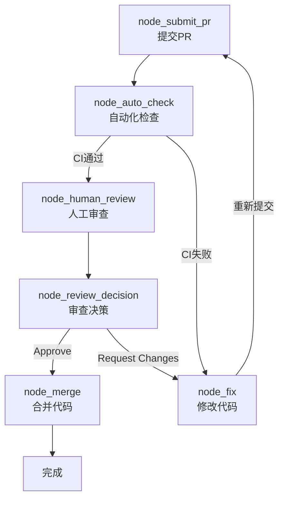
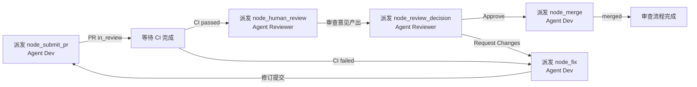

# PROC-代码审查流程

## 流程概述

定义 Pull Request 从提交到合并的标准化审查步骤。通过自动化检查 + 人工审查的双重把关机制，确保每一次代码变更在正确性、安全性、可维护性和架构一致性上达到团队标准。本流程是 [[PROC-需求到上线]] 中 `node_code_review` 节点的子流程。

## 触发条件

- **触发者**：[[ROLE-后端开发工程师]] 或 [[ROLE-前端开发工程师]]
- **触发事件**：开发完成编码和自测后，创建 Pull Request
- **前置条件**：
  - 代码已通过本地自测（单元测试通过）
  - PR 描述完整（改动概要、测试情况、影响范围）
  - CI 流水线已配置且正常运行

## 流程图

## 节点详细说明

| 节点ID | 角色 | 动作 | 输入 | 输出 | 检查清单 | 超时 |
|--------|------|------|------|------|----------|------|
| node_submit_pr | [[ROLE-后端开发工程师]] / [[ROLE-前端开发工程师]] | 创建PR、编写描述 | 功能代码、关联Ticket | Pull Request | PR描述完整性 | 30min |
| node_auto_check | CI/CD 系统 | 自动编译/测试/扫描 | PR分支代码 | CI检查结果 | 编译+测试+安全 | 15min |
| node_human_review | [[ROLE-代码审核员]] | 五维人工审查 | PR、需求文档、编码规范 | 审查意见列表 | CHK-代码审查检查清单 | 2h |
| node_review_decision | [[ROLE-代码审核员]] | 综合判断给出结论 | 自动化+人工审查结果 | Approve/Changes/Comment | 安全类问题已Block | 15min |
| node_fix | [[ROLE-后端开发工程师]] / [[ROLE-前端开发工程师]] | 逐条修改并回复 | 审查意见列表 | 修订代码+审查回复 | 逐条对应修改 | 4h |
| node_merge | [[ROLE-后端开发工程师]] / [[ROLE-前端开发工程师]] | 合并PR到主干 | Approved PR | 主干代码更新 | CI最新通过 | 10min |

## 条件边说明

| 来源 | 目标 | 条件 |
|------|------|------|
| node_auto_check | node_human_review | CI 全部通过：编译成功、Lint 无报错、单元测试全绿、安全扫描无高危 |
| node_auto_check | node_fix | CI 任一环节失败，开发须修复后重新触发 CI |
| node_review_decision | node_merge | 审查结论为 Approve，不存在未解决的 Block 级问题 |
| node_review_decision | node_fix | 审查结论为 Request Changes，存在必须修改后重新审查的问题 |
| node_fix | node_submit_pr | 所有审查意见已处理（修改或给出合理解释），自测通过 |

## 审查维度与判断标准

| 维度 | 审查要点 | Block 级标准 |
|------|----------|-------------|
| 逻辑正确性 | 业务逻辑是否正确、边界条件是否处理、异常路径是否覆盖 | 逻辑错误会导致线上故障 |
| 安全性 | SQL注入、XSS、权限绕过、敏感信息泄露 | 任何安全漏洞 |
| 性能 | N+1查询、内存泄漏、不合理的同步阻塞 | 可预见的性能瓶颈影响用户体验 |
| 可维护性 | 命名清晰度、函数长度、模块划分合理性、注释质量 | 代码结构严重混乱导致不可维护 |
| 代码风格 | 格式规范、命名约定 | 不做 Block，仅建议优化 |

## 异常处理

| 异常场景 | 处理策略 | 升级路径 |
|----------|----------|----------|
| 审查超时（>1 天未处理） | 开发在团队频道提醒审核员，或指定替代审核员 | 开发 → 技术负责人 |
| CI 流水线异常/不可用 | 通知 DevOps 修复，同时在本地手动执行等价检查（编译+测试） | 开发 → DevOps |
| 审查意见争议 | 双方讨论无果时，由技术负责人做最终裁决 | 审核员/开发 → 技术负责人 |
| PR 修改超过 3 轮仍未通过 | 技术负责人介入，评估是否需要 Pair Programming 或重新设计方案 | 审核员 → 技术负责人 |

## 关联工作类型

- 主要关联：[[WT-新功能开发]]、[[WT-Bug修复]]、[[WT-代码重构]]
- 父流程：[[PROC-需求到上线]]（本流程作为其 node_code_review 的子流程）
- 关联紧急流程：[[PROC-紧急修复流程]]（采用简化的审查步骤）

## Agent 编排映射

本流程的每个节点可作为一个独立的 Agent 任务派发。主会话（编排器）负责按边 (Edge) 顺序检测完成信号并推进。

| 节点ID | 节点名称 | Agent 角色 | 上下文包 (required) | 完成信号 |
|--------|---------|-----------|-------------------|---------|
| node_submit_pr | 提交PR | [[ROLE-DEV-002]] 或 [[ROLE-DEV-001]] | 本流程 + [[ROLE-DEV-002]]/[[ROLE-DEV-001]] + 关联技术方案文档 | PR 创建，前端任务 Ticket `status: in_review` |
| node_auto_check | 自动化检查 | CI/CD 系统（非 Agent 派发） | CI 流水线配置 | CI 运行结果 `status: passed` |
| node_human_review | 人工审查 | [[ROLE-QA-002]] | 本流程 + [[ROLE-QA-002]] + CHK-代码审查检查清单 + 关联技术方案 | 审查意见列表产出 |
| node_review_decision | 审查决策 | [[ROLE-QA-002]] | 本流程 + [[ROLE-QA-002]] + 自动化检查结果 + 人工审查意见 | PR `review_status: approved` 或 `review_status: changes_requested` |
| node_fix | 修改代码 | [[ROLE-DEV-002]] 或 [[ROLE-DEV-001]] | 本流程 + 审查意见列表 + 原技术方案 | 修订 PR 提交，审查评论逐条回复完成 |
| node_merge | 合并代码 | [[ROLE-DEV-002]] 或 [[ROLE-DEV-001]] | 本流程 + Approved PR | PR `merged: true`，目标分支已更新 |

### 编排时序

### 人类介入点

| 节点 | 介入原因 | 介入方式 |
|------|---------|---------|
| node_review_decision | 疑难审查案例（涉及领域知识、安全级别判断）需要人类审核员确认 | 人类代码审核员对 Agent 审查意见进行复核确认 |
| node_human_review | 审查涉及业务逻辑正确性时需人类判断 | 人类代码审核员在 Agent 预审基础上做最终判断 |
