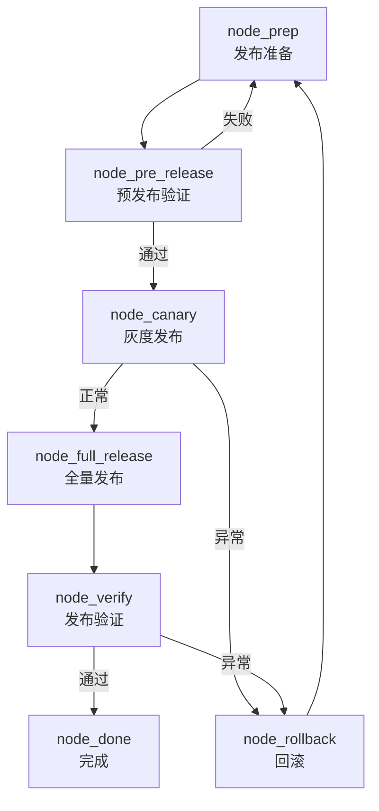
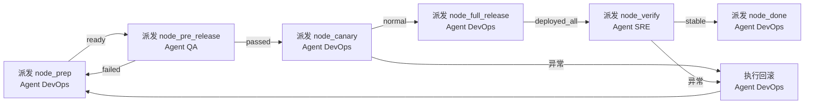

# PROC-发布流程

## 流程概述

定义从预发布验证到全量上线的标准化发布步骤。采用灰度发布策略，通过预发布验证 → 灰度放量 → 全量部署的三段式递进，结合实时监控观测，确保变更安全可控。本流程是 [[PROC-需求到上线]] 中 `node_release` 节点的子流程。

## 触发条件

- **触发者**：[[ROLE-技术负责人]] 或 [[ROLE-DevOps工程师]]
- **触发事件**：验收通过，发布申请单已审批，确认发布窗口
- **前置条件**：
  - 发布申请单已获技术负责人审批
  - 部署包/镜像已通过 CI 构建和测试
  - 配置变更清单和数据库 Migration 脚本已就绪
  - 回滚方案已评审通过
  - 当前在允许的发布窗口内

## 流程图

## 节点详细说明

| 节点ID | 角色 | 动作 | 输入 | 输出 | 检查清单 | 超时 |
|--------|------|------|------|------|----------|------|
| node_prep | [[ROLE-DevOps工程师]] | 核验发布材料 | 发布申请单、部署包、配置清单 | 发布准备确认单 | CHK-上线前检查清单 | 30min |
| node_pre_release | [[ROLE-测试工程师]] / [[ROLE-DevOps工程师]] | 预发布部署+冒烟测试 | 预发布环境、部署包、冒烟用例 | 预发布验证报告 | 核心流程可用 | 30min |
| node_canary | [[ROLE-DevOps工程师]] | 灰度部署+监控 | 生产环境配置、灰度策略 | 灰度发布状态报告 | 无新增P0/P1告警 | 30min |
| node_full_release | [[ROLE-DevOps工程师]] | 全量部署 | 灰度通过通知、全量策略 | 全量部署完成 | 健康检查通过 | 15min |
| node_verify | [[ROLE-SRE工程师]] | 发布后监控观测 | 监控大盘、告警、业务指标 | 发布验证报告 | 指标恢复基线 | 15min |
| node_done | [[ROLE-DevOps工程师]] | 发布记录归档 | 验证报告、过程记录 | 发布记录、团队通知 | 记录完整可追溯 | 10min |

## 条件边说明

| 来源 | 目标 | 条件 |
|------|------|------|
| node_pre_release | node_canary | 冒烟测试通过，核心业务流程在预发布环境运行正常 |
| node_pre_release | node_prep | 预发布验证失败：部署失败、冒烟测试不通过、环境配置不一致 |
| node_canary | node_full_release | 灰度实例运行正常：错误率无异常波动、延迟无显著恶化、无新增 P0/P1 告警 |
| node_canary | node_rollback | 灰度实例出现异常：错误率飙升（超过基线200%）、新增 P0/P1 告警 |
| node_verify | node_done | 全量发布后 ≥15 分钟核心指标稳定在正常范围 |
| node_verify | node_rollback | 全量发布后核心指标异常，须回滚 |

## 回滚节点说明

`node_rollback` 为辅助节点，负责：
1. 停止灰度/全量发布流程
2. 执行回滚方案（回退到上一个稳定版本）
3. 验证回滚后服务恢复正常
4. 通知相关方（技术负责人、产品经理、开发团队）
5. 记录回滚原因和时间线
6. 回滚完成后回到 `node_prep` 重新评估发布条件

## 异常处理

| 异常场景 | 处理策略 | 升级路径 |
|----------|----------|----------|
| 预发布环境不可用 | 拉 DevOps 排查，调整为直接灰度小比例验证（需技术负责人特批） | DevOps → 技术负责人 |
| 灰度放量过程中发现异常 | 立即停止放量、回滚灰度实例、排查原因 | DevOps → SRE → 技术负责人 |
| 全量发布后指标异常 | 执行完整回滚方案，恢复至上一稳定版本 | DevOps → 技术负责人 |
| 数据库 Migration 失败 | 执行 Migration 回滚脚本，数据恢复至变更前状态 | DevOps → 技术负责人 → DBA |
| 发布窗口超时 | 暂停未完成部分，在下一个发布窗口继续或回滚 | DevOps → 技术负责人 |

## 关联工作类型

- 主要关联：[[WT-部署发布]]
- 父流程：[[PROC-需求到上线]]（本流程作为其 node_release 的子流程）
- 紧急时使用：[[PROC-紧急修复流程]] 中的紧急发布节点

## Agent 编排映射

本流程的每个节点可作为一个独立的 Agent 任务派发。主会话（编排器）负责按边 (Edge) 顺序检测完成信号并推进。

| 节点ID | 节点名称 | Agent 角色 | 上下文包 (required) | 完成信号 |
|--------|---------|-----------|-------------------|---------|
| node_prep | 发布准备 | [[ROLE-OPS-001]] | 本流程 + [[ROLE-OPS-001]] + [[WT-OPS-001]] + CHK-上线前检查清单 + 发布申请单 | 发布准备确认单 frontmatter `status: ready` |
| node_pre_release | 预发布验证 | [[ROLE-QA-001]] | 本流程 + [[ROLE-QA-001]] + CHK-上线前检查清单 + 冒烟测试用例 | 预发布验证报告 `status: passed` |
| node_canary | 灰度发布 | [[ROLE-OPS-001]] | 本流程 + [[ROLE-OPS-001]] + [[WT-OPS-001]] + 灰度策略配置 | 灰度状态报告 `error_rate: normal` |
| node_full_release | 全量发布 | [[ROLE-OPS-001]] | 本流程 + [[ROLE-OPS-001]] + [[WT-OPS-001]] | 部署日志 `status: deployed_all` |
| node_verify | 发布验证 | [[ROLE-OPS-002]] | 本流程 + [[ROLE-OPS-002]] + Prometheus/Grafana 监控配置 | 验证报告 `status: stable` |
| node_done | 发布完成 | [[ROLE-OPS-001]] | 本流程 + 发布过程记录 + 验证报告 | 发布记录 `status: released` |

### 编排时序

### 人类介入点

| 节点 | 介入原因 | 介入方式 |
|------|---------|---------|
| node_canary | 生产环境操作风险高，灰度放量决策需人类判断 | 人类 DevOps 工程师在灰度放量时值守，根据监控数据决定放量或回滚 |
| node_full_release | 全量发布是关键操作，需双人复核 | 人类 DevOps 工程师执行全量部署，Agent 辅助监控和检查清单核对 |
| node_verify | 线上指标异常判断需经验和上下文 | 人类 SRE 工程师评估监控数据，确认是否继续或回滚 |
