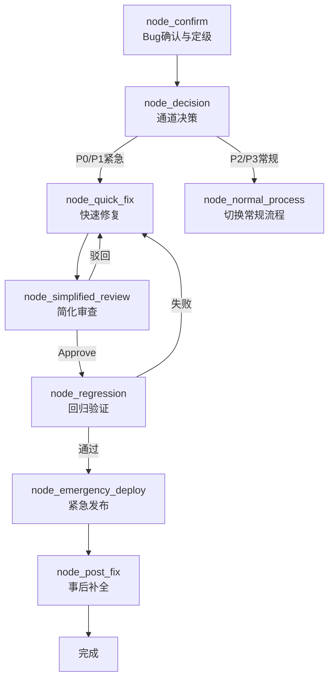
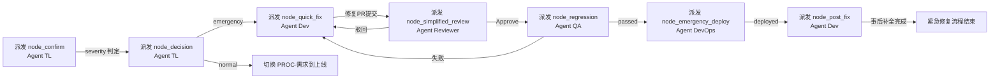

# PROC-紧急修复流程

## 流程概述

针对生产环境 P0/P1 级 Bug 的加速修复通道。通过简化审查步骤、压缩验证周期和紧急发布机制，以牺牲部分流程完整性的代价换取修复速度。核心原则：**止损优先，事后补全**。紧急修复上线后必须补全常规流程中被跳过的步骤（单元测试补充、文档更新、完整 Code Review、根因记录）。

## 触发条件

- **触发者**：[[ROLE-技术负责人]] 或 [[ROLE-SRE工程师]]
- **触发事件**：生产环境发现影响核心业务的 Bug
- **前置条件**：
  - Bug 已被确认真实存在且影响核心业务
  - 严重级别判定为 P0（核心业务完全不可用）或 P1（核心功能降级）
  - 技术负责人已批准走紧急通道

## Bug 严重级别定义

| 级别 | 判定标准 | 是否走紧急通道 | 响应 SLA |
|------|----------|---------------|----------|
| P0 | 核心业务完全不可用，全体用户受影响 | 强制走紧急通道 | 15 分钟内组建修复小组 |
| P1 | 核心功能降级，部分用户受影响，或无有效规避方案 | 经 TL 评估后可选紧急通道 | 30 分钟内开始修复 |
| P2 | 非核心功能异常，少量用户受影响，有规避方案 | 走常规流程 | 纳入当前或下个迭代 |
| P3 | 不影响使用的体验问题或偶发 Bug | 走常规流程 | 纳入 Backlog 排期 |

## 流程图

## 节点详细说明

| 节点ID | 角色 | 动作 | 输入 | 输出 | 检查清单 | 超时 |
|--------|------|------|------|------|----------|------|
| node_confirm | [[ROLE-技术负责人]] | Bug确认与定级 | Bug报告、告警、监控数据 | Bug确认单（含级别和影响面） | 级别判定准确 | 15min |
| node_decision | [[ROLE-技术负责人]] | 通道决策 | Bug确认单 | 通道决策 | 满足触发条件 | 10min |
| node_quick_fix | [[ROLE-后端开发工程师]] / [[ROLE-前端开发工程师]] | 最小化修复 | Bug确认单、日志、代码 | 修复代码+修复说明 | 最小化、根因修复 | 2h |
| node_simplified_review | [[ROLE-代码审核员]] | 加速审查 | 修复PR、Bug确认单 | 审查结论 | 正确性+安全性 | 30min |
| node_regression | [[ROLE-测试工程师]] | 快速回归 | 修复部署、复现步骤、回归用例 | 回归验证报告 | 修复确认+核心回归 | 1h |
| node_emergency_deploy | [[ROLE-DevOps工程师]] | 紧急发布 | 修复代码、紧急审批 | 生产修复已部署 | 健康检查通过 | 30min |
| node_post_fix | [[ROLE-后端开发工程师]] / [[ROLE-前端开发工程师]] | 事后补全 | 修复代码、修复说明 | 补充测试+文档+根因记录 | 补全常规流程 | 2天 |

## 条件边说明

| 来源 | 目标 | 条件 |
|------|------|------|
| node_decision | node_quick_fix | P0 强制紧急；P1 经 TL 评估影响面后决定走紧急通道 |
| node_decision | node_normal_process | P2/P3 级 Bug 或 P1 不适合紧急修复 |
| node_simplified_review | node_regression | 审查 Approve，修复正确且无明显安全风险 |
| node_simplified_review | node_quick_fix | 审查 Request Changes，修复方案有缺陷或引入风险 |
| node_regression | node_emergency_deploy | 修复确认生效，核心回归用例通过 |
| node_regression | node_quick_fix | 修复未生效或回归发现新问题 |
| node_emergency_deploy | node_post_fix | 紧急发布成功后触发事后补全任务 |

## 简化审查 vs 常规审查对比

| 维度 | 常规审查 (PROC-DEV-002) | 简化审查 (本流程) |
|------|------------------------|-------------------|
| 审查人员 | 代码审核员（可指定 2 人） | 代码审核员 1 人即可 |
| 自动检查 | 全部 CI 检查 | 仅编译 + 安全扫描 |
| 审查维度 | 全五维度 | 重点正确性 + 安全性 |
| 代码风格 | 必须符合规范 | 可放宽，事后补全 |
| 超时 | 2 小时 | 30 分钟 |
| 驳回后 | 常规修改重提 | 加速修改重审 |

## 事后补全清单 (node_post_fix)

紧急修复上线后，开发工程师必须在 **2 天内** 完成以下补全工作：

1. **单元测试补充**：为修复代码编写完整的单元测试，覆盖率不低于 80%
2. **完整 Code Review**：提交补充测试和代码优化后，走完整的 [[PROC-代码审查流程]]
3. **文档更新**：更新 API 文档、部署说明和技术方案中受影响的章节
4. **根因分析记录**：编写正式的 Bug 根因分析文档，记录到知识库 `5.知识沉淀/`
5. **监控告警评估**：评估是否需要新增或调整监控告警规则以提前发现同类问题
6. **复盘记录**：P0 级 Bug 需组织事后复盘，输出改进 Action Items

## 异常处理

| 异常场景 | 处理策略 | 升级路径 |
|----------|----------|----------|
| 根因不能在 1 小时内定位 | 先实施应急止血方案（降级/限流/切换）恢复服务，再深挖根因 | 技术负责人 → 系统架构师 |
| 修复方案有争议 | 技术负责人快速裁决，优先止损，争议事后复盘 | 技术负责人 |
| 修复涉及数据库变更 | 数据库脚本须在测试环境验证后方可执行，不可直操生产库 | DevOps → DBA |
| 紧急发布后指标未恢复 | 立即回滚至上一稳定版本，重新分析问题 | DevOps → 技术负责人 |
| 事后补全超时 2 天 | 技术负责人跟踪催办，超期记录为技术债 | 技术负责人 |

## 关联工作类型

- 主要关联：[[WT-Bug修复]]（紧急场景）
- 引用的常规流程：
  - [[PROC-需求到上线]]（P2/P3 走常规）
  - [[PROC-代码审查流程]]（事后补全中的完整审查）
  - [[PROC-发布流程]]（常规发布参考，紧急时压缩）

## Agent 编排映射

本流程的每个节点可作为一个独立的 Agent 任务派发。紧急流程的 Agent 任务优先级应设置为最高，超时约束严格。

| 节点ID | 节点名称 | Agent 角色 | 上下文包 (required) | 完成信号 |
|--------|---------|-----------|-------------------|---------|
| node_confirm | Bug确认与定级 | [[ROLE-ARCH-001]] | 本流程 + [[ROLE-ARCH-001]] + Bug 报告/告警信息 + 监控数据 | Bug 确认单 frontmatter `severity: P0/P1/P2/P3` |
| node_decision | 通道决策 | [[ROLE-ARCH-001]] | 本流程 + [[ROLE-ARCH-001]] + Bug 确认单 + 严重级别定义表 | 决策记录 frontmatter `channel: emergency` 或 `channel: normal` |
| node_quick_fix | 快速修复 | [[ROLE-DEV-002]] 或 [[ROLE-DEV-001]] | 本流程 + [[ROLE-DEV-002]]/[[ROLE-DEV-001]] + [[WT-DEV-002]] + 错误日志 | 修复 PR 创建，修复说明完成 |
| node_simplified_review | 简化审查 | [[ROLE-QA-002]] | 本流程 + [[ROLE-QA-002]] + CHK-代码审查检查清单（简化维度） | PR `review_status: approved` |
| node_regression | 回归验证 | [[ROLE-QA-001]] | 本流程 + [[ROLE-QA-001]] + Bug 复现步骤 + 核心回归用例 | 回归验证报告 `status: passed` |
| node_emergency_deploy | 紧急发布 | [[ROLE-OPS-001]] | 本流程 + [[ROLE-OPS-001]] + [[WT-OPS-001]] + 紧急发布审批 | 紧急发布记录 `status: deployed` |
| node_post_fix | 事后补全 | [[ROLE-DEV-002]] 或 [[ROLE-DEV-001]] | 本流程 + [[ROLE-DEV-002]]/[[ROLE-DEV-001]] + [[PROC-代码审查流程]] | 补充测试 + 文档 + 根因记录产出 |

### 编排时序

### 人类介入点

| 节点 | 介入原因 | 介入方式 |
|------|---------|---------|
| node_confirm | Bug 定级需要业务理解和对用户影响的真实评估 | 人类技术负责人根据监控数据和用户反馈最终定级 |
| node_decision | 紧急通道决策涉及风险权衡，Agent 无法独立决定 | 人类技术负责人评估修复风险后决定是否走紧急通道 |
| node_emergency_deploy | 生产环境发布操作必须人类值守，Agent 辅助检查 | 人类 DevOps 工程师执行发布，Agent 辅助监控和检查清单 |
| node_simplified_review | 紧急修复代码审查需人类快速判断安全性 | 人类代码审核员 30 分钟内完成加速审查 |
