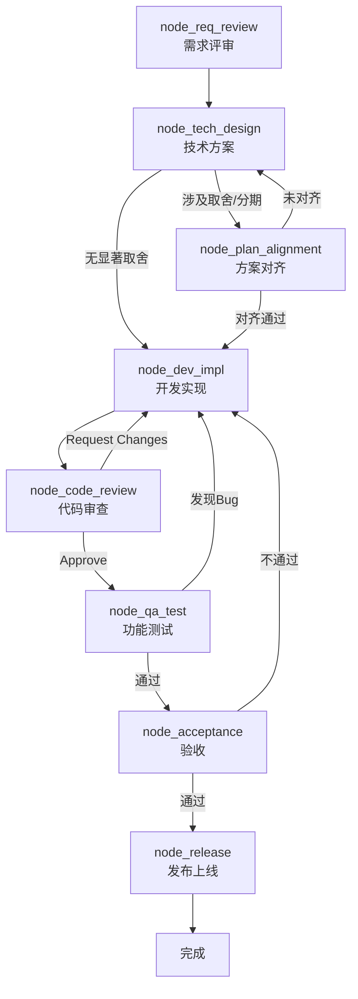
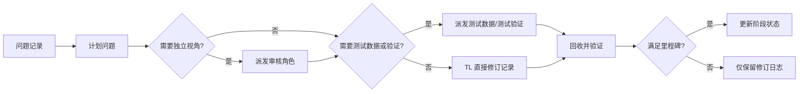
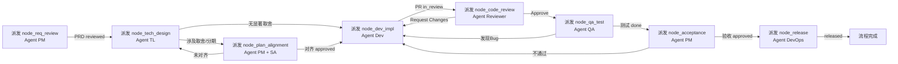

# PROC-需求到上线

## 流程概述

最完整的软件开发生命周期（SDLC）流程，覆盖从产品需求评审到生产环境发布上线的全部环节。本流程串联了产品、架构、研发、质量、运维五类角色，通过 8 个节点协作完成一个新功能的端到端交付。

## 触发条件

- **触发者**：[[ROLE-产品经理]] 或 [[ROLE-技术负责人]]
- **触发事件**：PRD 评审通过，技术负责人完成任务拆解并指派开发工程师
- **前置条件**：
  - PRD 已通过需求评审，验收标准明确可量化
  - 技术负责人已完成技术方案设计并拆解任务
  - 开发环境、CI/CD 流水线就绪

## 流程图

## 节点详细说明

| 节点ID | 角色 | 动作 | 输入 | 输出 | 检查清单 | 超时 |
|--------|------|------|------|------|----------|------|
| node_req_review | [[ROLE-产品经理]] | 主持需求评审 | PRD、用户故事、交互原型 | 评审通过的PRD、会议纪要 | 验收标准可量化 | 4h |
| node_tech_design | [[ROLE-技术负责人]] | 编写技术方案 | PRD、架构约束、原型图（如有） | 技术方案、任务拆解、ADR | 覆盖所有需求点 | 2天 |
| node_plan_alignment | [[ROLE-产品经理]] + [[ROLE-系统架构师]] | 方案对齐（条件触发） | TL技术方案、人类原型图、开发初版原型图 | 方案对齐纪要、范围边界确认 | v1覆盖核心场景、扩展点合理 | 4h |
| node_dev_impl | [[ROLE-后端开发工程师]] / [[ROLE-前端开发工程师]] | 编码实现 | 技术方案、API文档 | 功能代码、单元测试、PR | 覆盖率>=80% | 3-10天 |
| node_code_review | [[ROLE-代码审核员]] | 代码审查 | PR、需求/技术文档 | Review结论 | CHK-代码审查检查清单 | 1天 |
| node_qa_test | [[ROLE-测试工程师]] | 功能测试 | 部署包、PRD | 测试用例、测试报告 | CHK-上线前检查清单 | 2-5天 |
| node_acceptance | [[ROLE-产品经理]] | 验收测试 | 预发布环境、PRD | 验收报告 | 逐条验收标准核对 | 1天 |
| node_release | [[ROLE-DevOps工程师]] | 发布上线 | 发布申请单、部署包 | 发布记录、线上验证 | CHK-上线前检查清单 | 2h |

## 条件边说明

| 来源 | 目标 | 条件 |
|------|------|------|
| node_tech_design | node_plan_alignment | 方案涉及跨迭代范围取舍、分期策略或为未来模块预留扩展点 |
| node_tech_design | node_dev_impl | 方案不涉及显著取舍，可直接进入开发 |
| node_plan_alignment | node_dev_impl | 对齐通过，产品经理和系统架构师确认方案 |
| node_plan_alignment | node_tech_design | 未对齐，TL 需根据评审意见调整方案后重新提交 |
| node_code_review | node_qa_test | 审查结论为 Approve，代码质量达标 |
| node_code_review | node_dev_impl | 审查结论为 Request Changes，开发须修改后重新提交审查 |
| node_qa_test | node_acceptance | 所有测试用例通过，P0/P1 Bug 全部关闭 |
| node_qa_test | node_dev_impl | 发现 P0/P1 级别未关闭 Bug，阻塞提测 |
| node_acceptance | node_release | 产品经理确认所有验收标准通过 |
| node_acceptance | node_dev_impl | 验收标准未满足，退回开发 |

## 异常处理

| 异常场景 | 处理策略 | 升级路径 |
|----------|----------|----------|
| 方案对齐未达一致（拉锯 > 3 轮） | 升级为三方（产品/架构/TL）会议决策，必要时拉入技术总监做最终仲裁 | 技术负责人 → 技术总监 |
| 开发阻塞超过 2 天 | 技术负责人介入，评估是否需要调整任务分配或简化方案 | 技术负责人 → 项目经理 |
| 代码审查反复驳回（>3 次） | 技术负责人与审核员讨论是否需要调整方案或增加 Pair Programming | 技术负责人 |
| 测试发现大量 Bug（>10） | 评估是否返工技术方案，暂停迭代交付承诺 | 技术负责人 → 产品经理 |
| 验收阻塞超过 1 天 | 产品经理与开发快速同步决策，问题转为 Follow-up Ticket | 产品经理 → 技术负责人 |
| 发布失败 | 立即执行回滚方案，DevOps 记录失败原因并通知相关方 | DevOps → 技术负责人 |

## TL 问题控制循环

在复杂交付中，TL 会持续遇到“小修、小计划调整、补充测试数据、要求新视角审核”等事项。这些事项属于主流程内的控制循环，不等同于主流程节点完成。

### 四类高频事项

| 事项 | TL 动作 | 默认派发角色 | 进度影响 |
|------|---------|--------------|----------|
| 问题记录 | TL 直接记录现象、影响范围、来源 | 无；根因不明时派发开发/SRE | 不推进 |
| 计划问题 | TL 调整阶段、依赖、验收口径 | 重大范围变更需产品/架构确认 | 仅在验收标准改变并确认后推进 |
| 新视角审核 | TL 发起独立审核 | 代码审核员或系统架构师 | 审核通过后可解除质量阻塞 |
| 测试数据以待验证 | TL 明确数据目标和验证目标 | 后端开发工程师或测试工程师 | 数据生成不等于功能通过，验证通过才推进 |

### 记录规则

1. TL/asNormal 直接修订写入任务文件「TL 直接修订记录」。
2. TL 发起或拒绝派发写入「TL 派发决策记录」。
3. `task_nature: integration_revision` 的修订默认不勾选主阶段 checklist。
4. 只有满足以下任一条件，修订才可推进阶段状态：明确满足验收标准、解除阻塞、通过独立审核、通过测试验证。
5. TL 不能用自己的直接修订替代独立审核；需要“新视角”的事项必须派发。

## 关联工作类型

- 主要工作类型：[[WT-新功能开发]]
- 相关子流程：
  - [[PROC-代码审查流程]]（作为 node_code_review 的子流程嵌套）
  - [[PROC-发布流程]]（作为 node_release 的子流程嵌套）

## Agent 编排映射

本流程的每个节点可作为一个独立的 Agent 任务派发。主会话（编排器）负责按边 (Edge) 顺序检测完成信号并推进。

| 节点ID | 节点名称 | Agent 角色 | 上下文包 (required) | 完成信号 |
|--------|---------|-----------|-------------------|---------|
| node_req_review | 需求评审 | [[ROLE-MGMT-001]] | 本流程 + [[ROLE-MGMT-001]] + PRD 文档 | PRD frontmatter `status: reviewed` |
| node_tech_design | 技术方案 | [[ROLE-ARCH-001]] | 本流程 + [[ROLE-ARCH-001]] + [[WT-DEV-001]] + PRD | 技术方案文档 frontmatter `status: approved` |
| node_plan_alignment | 方案对齐 | [[ROLE-MGMT-001]] + [[ROLE-ARCH-002]] | 本流程 + [[ROLE-MGMT-001]] + [[ROLE-ARCH-002]] + TL技术方案 + 人类原型图 + 开发初版原型图 | 方案对齐纪要写入 `产物工件/TASK-YYYY-NNN/`，frontmatter `status: approved` |
| node_dev_impl | 开发实现 | [[ROLE-DEV-002]] 或 [[ROLE-DEV-001]] | 本流程 + [[ROLE-DEV-002]]/[[ROLE-DEV-001]] + [[WT-DEV-001]] + 技术方案 | PR 创建，关联任务 Ticket `status: in_review` |
| node_code_review | 代码审查 | [[ROLE-QA-002]] | 本流程 + [[ROLE-QA-002]] + [[PROC-代码审查流程]] + CHK-代码审查检查清单 | PR `review_status: approved` |
| node_qa_test | 功能测试 | [[ROLE-QA-001]] | 本流程 + [[ROLE-QA-001]] + [[WT-DEV-001]] + CHK-上线前检查清单 | 测试报告 frontmatter `status: done` |
| node_acceptance | 验收 | [[ROLE-MGMT-001]] | 本流程 + [[ROLE-MGMT-001]] + PRD（验收标准） + 测试报告 | 验收报告 frontmatter `status: approved` |
| node_release | 发布上线 | [[ROLE-OPS-001]] | 本流程 + [[ROLE-OPS-001]] + [[PROC-发布流程]] + [[WT-OPS-001]] + CHK-上线前检查清单 | 发布记录 frontmatter `status: released` |

### TL 自治派发补充映射

以下派发不改变主流程图节点，只作为 TL 在交付过程中的自治控制动作：

| 触发场景 | 推荐角色 | 上下文包 | 完成信号 |
|----------|----------|----------|----------|
| 方案或代码需要新视角审核 | [[ROLE-QA-002]] 或 [[ROLE-ARCH-002]] | 任务文件 + 相关产物 + diff/代码路径 + 审核范围 | 审核报告写入 `产物工件/TASK-YYYY-NNN/` 或任务记录标记已回收 |
| 需要构造测试数据 | [[ROLE-DEV-002]] | DDL/表结构 + 业务状态规则 + 验证目标 + 输出 SQL 路径 | 测试数据脚本写入 `产物工件/TASK-YYYY-NNN/` |
| 需要验证测试数据或功能链路 | [[ROLE-QA-001]] | 测试数据 + 功能入口 + 验收标准 + 环境说明 | 测试报告或验证记录写入任务文件 |
| 根因不明的问题记录 | [[ROLE-DEV-002]] / [[ROLE-SRE工程师]] | 问题现象 + 日志/报错 + 最近变更 + 复现步骤 | 根因和修复建议写入任务文件或产物工件 |

### 编排时序

### 人类介入点

| 节点                  | 介入原因                             | 介入方式                                              |
| ------------------- | -------------------------------- | ------------------------------------------------- |
| node_req_review     | 需求理解需要业务背景和隐性知识                  | 人类产品经理主持评审会议，Agent 可辅助纪要整理                        |
| node_tech_design    | 架构决策涉及组织约束和技术债务判断                | 人类技术负责人审批技术方案，Agent 可辅助文档撰写                       |
| node_plan_alignment | 范围取舍涉及业务价值判断和隐性知识，技术预留涉及跨系统的架构远见 | 人类产品经理和系统架构师联合评审，原型图提供者列席提供上下文，Agent 可辅助方案对比和纪要整理 |
| node_release        | 生产环境操作风险高，需现场值守                  | 人类 DevOps 工程师执行发布操作，Agent 可辅助检查清单核对               |
