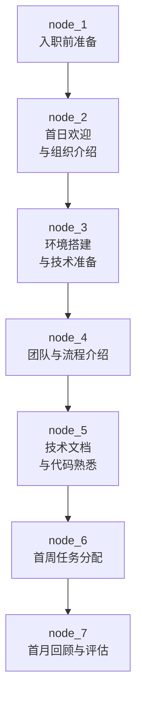
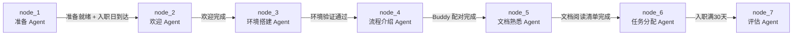

# PROC-Onboarding 流程

## 流程概述

Onboarding 流程定义新成员从入职前准备到首月评估完成的完整旅程。通过结构化、分阶段的引导，确保新人快速融入团队文化、掌握技术环境、建立有效协作关系，并在一个月内完成从"观察者"到"贡献者"的转变。

## 触发条件

- **触发者**：项目经理（主导）、技术负责人（技术侧协同）
- **触发事件**：HR 系统发送新员工入职通知，明确入职日期和岗位信息
- **前置条件**：
  - 新员工 Offer 已签署、入职日期已确认
  - 岗位 JD 和所属团队已确定
  - IT 设备和基础设施资源已预留

## 流程图

## 节点详细说明

| 节点ID | 角色 | 动作 | 输入 | 输出 | 检查清单 | 超时 |
|--------|------|------|------|------|----------|------|
| node_1 | [[ROLE-项目经理]] | 协调 IT/HR 准备设备、开通全量账号权限、编制首周欢迎计划 | 入职通知 + 岗位描述 | 准备检查清单 + 欢迎包 | 设备+账号+欢迎邮件全部就绪 | 入职前 3 工作日 |
| node_2 | [[ROLE-技术总监]] | 新人首日欢迎，传达公司使命、技术战略与组织文化 | 公司/技术战略介绍材料 | 欢迎记录 | 关键信息已传达，新人已建立初步认知 | 首日 2h |
| node_3 | [[ROLE-技术负责人]] | 指导搭建本地开发环境，跑通项目，验证代码提交权限 | 环境配置文档 + 代码仓库 + CI/CD | 就绪的开发环境 + 首个 Green Build | IDE/运行时/依赖就绪 + 能提交代码 + 能访问 CI/CD | 首日 3h |
| node_4 | [[ROLE-敏捷教练]] | 介绍团队协作模式、敏捷仪式、沟通渠道，指定 Buddy | 团队工作协议 + 敏捷仪式日历 | 融入记要 + Buddy 配对 | 仪式节奏已了解 + 沟通工具已加入 + Buddy 已对接 | 第 1-2 天 1h |
| node_5 | [[ROLE-技术文档工程师]] + [[ROLE-技术负责人]] | 提供技术文档索引，分配阅读任务，组织架构导览 | 文档站点 + 架构文档 + API 文档 | 文档阅读清单 + 阅读笔记 | 文档已可访问 + 架构已初识 + 问题已记录 | 第 2-3 天 4h |
| node_6 | [[ROLE-技术负责人]] | 分配首个任务（Good First Issue），设定完成标准和 Pair 伙伴 | 项目 Backlog + 新人技能评估 | 已分配的首个任务 | 难度匹配新人 + 完成标准明确 + Pair 就位 | 第 2 天 0.5h |
| node_7 | [[ROLE-项目经理]] + [[ROLE-技术负责人]] | 收集三方反馈，评估融入效果，输出总结与改进建议 | 自评 + Buddy 反馈 + TL 评价 + 任务完成数据 | Onboarding 评估报告 | 三方反馈齐备 + 任务完成率 >= 80% + 抽查通过 | 第 30 天 1h |

## 条件边说明

| 来源 | 目标 | 条件 |
|------|------|------|
| node_1 | node_2 | 入职日到达，所有准备检查项状态为"已完成" |
| node_2 | node_3 | 首日欢迎介绍完成（新人到场参与） |
| node_3 | node_4 | IDE + 运行时 + 依赖全部安装成功；代码仓库 clone 并可通过本地编译/运行；CI/CD 面板可访问 |
| node_4 | node_5 | 团队流程介绍完毕；Buddy 配对双方已确认 |
| node_5 | node_6 | 技术文档索引导航完毕；核心模块代码 Walkthrough 完成 |
| node_6 | node_7 | 入职满 30 天触发首月评估 |

## 异常处理

- **设备/账号未就绪**：node_1 超时未完成，项目经理升级给 IT/HR 管理者，同时准备纸质替代方案（手册、临时访问路径）。
- **环境搭建受阻**：node_3 遇到环境兼容性问题（OS/版本差异），技术负责人介入排查或提供云端开发环境（Codespace/GitPod）作为应急方案。
- **新人能力不匹配**：node_5/node_6 发现新人技能与岗位要求存在 gap，技术负责人和项目经理协商制定加速培训计划或调整岗位。
- **Buddy 不可用**：node_4 原定 Buddy 请假或项目过忙，敏捷教练需在 1 天内指定替代 Buddy。
- **首月评估不通过**：node_7 判定融入度或技能匹配不足，项目经理发起试用期延长或 PIP（绩效改进计划），记录在评估报告中。

## 关联工作类型

- [[WT-迭代计划]] — 新人首周计划与迭代日历的对齐
- [[WT-干系人沟通]] — Buddy 配对沟通、首月评估反馈收集
- [[WT-技术调研]] — 若新人需要调研特定技术栈作为学习路径的一部分

---

## Agent 编排映射

本流程的每个节点可作为一个独立的 Agent 任务派发。Onboarding 流程周期性高（每次新员工入职即触发），适合 Agent 半自动化执行——Agent 负责生成文档、发送通知和跟踪状态，关键决策和面对面互动仍由人类完成。

| 节点ID | 节点名称 | Agent 角色 | 上下文包 (required) | 完成信号 |
|--------|---------|-----------|-------------------|---------|
| node_1 | 入职前准备 | [[ROLE-项目经理]] | 本流程 + [[ROLE-项目经理]] + [[WT-干系人沟通]] + 入职通知文件 | Onboarding 准备检查清单文件 frontmatter `status: ready` |
| node_2 | 首日欢迎与组织介绍 | [[ROLE-技术总监]] | 本流程 + [[ROLE-技术总监]] + 组织架构文档 | 欢迎记录文件创建，frontmatter `status: done` |
| node_3 | 环境搭建与技术准备 | [[ROLE-技术负责人]] | 本流程 + [[ROLE-技术负责人]] + 环境配置文档 + 代码仓库 README | 环境验证报告文件 frontmatter `environment: verified` |
| node_4 | 团队与流程介绍 | [[ROLE-敏捷教练]] | 本流程 + [[ROLE-敏捷教练]] + [[WT-迭代计划]] + 团队工作协议 | 融入记要文件 frontmatter `status: done`；Buddy 配对记录创建 |
| node_5 | 技术文档与代码熟悉 | [[ROLE-技术文档工程师]] + [[ROLE-技术负责人]] | 本流程 + [[ROLE-技术文档工程师]] + [[ROLE-技术负责人]] + 项目架构文档 + API 文档 | 文档阅读清单文件 frontmatter `status: reviewed` |
| node_6 | 首周任务分配 | [[ROLE-技术负责人]] | 本流程 + [[ROLE-技术负责人]] + 项目 Backlog（Good First Issue）+ 新人技能评估 | 任务文件 frontmatter `status: assigned` + `assignee: 新人` |
| node_7 | 首月回顾与评估 | [[ROLE-项目经理]] + [[ROLE-技术负责人]] | 本流程 + [[ROLE-项目经理]] + [[ROLE-技术负责人]] + 新人自评 + Buddy 反馈 + 首月任务完成数据 | 评估报告文件 frontmatter `status: done`；`probation_result: pass/review/extension` |

### 编排时序

### 人类介入点

| 节点 | 介入原因 | 介入方式 |
|------|---------|---------|
| node_1 | Agent 只能生成准备清单和欢迎包文档模板，无法完成实际的设备采购、账号开通等物理/系统操作 | 人类项目经理根据 Agent 生成的清单协调 IT/HR 完成实物和设备操作 |
| node_2 | 首次欢迎需要真人互动——握手、寒暄、团队午餐等社交活动无法由 Agent 替代 | Agent 只准备欢迎材料（PPT/文档/日程），由人类技术总监进行面对面的欢迎和介绍 |
| node_3 | 环境搭建遇到具体报错时需要真人排查，Agent 仅能提供文档和常规步骤 | Agent 生成环境配置指南，人类 TL 在现场或远程指导新人排错 |
| node_4 | Buddy 配对需要根据双方性格和兴趣进行匹配，Agent 只能基于技能标签推荐 | Agent 推荐 Buddy 候选列表，人类敏捷教练做最终配对决策 |
| node_7 | 评估需要综合定性反馈（自评文段、Buddy 评语），Agent 只能对可量化指标（任务完成率）自动分析 | Agent 汇总数据和生成评估报告草稿，人类 PM/TL 补充定性评价并做最终结论 |
