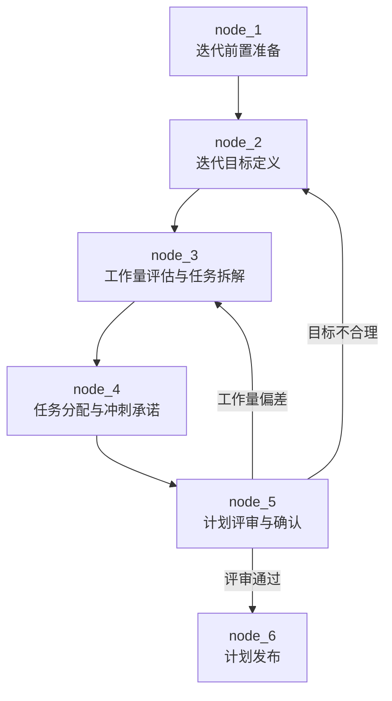
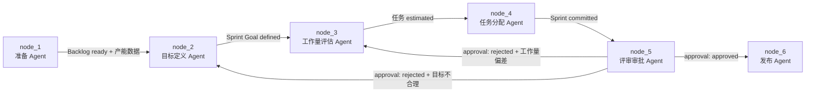

# PROC-迭代规划流程

## 流程概述

迭代规划流程定义了从迭代前置准备到计划发布的全生命周期。该流程在每个迭代（Sprint）开始前执行一次，核心目标是将产品 Backlog 中已排序的需求条目转化为可承诺的 Sprint Backlog，确保团队在迭代周期内聚焦于最高价值的工作交付。

## 触发条件

- **触发者**：项目经理（主导）、产品经理（协同）
- **触发事件**：上一迭代进入收尾阶段 / 新迭代计划启动日期到达（通常为上一迭代最后两天）
- **前置条件**：
  - 产品 Product Backlog 已按优先级排序，且至少覆盖后续 2 个迭代的 Ready 需求
  - 近 3 个迭代的团队速率数据已汇总
  - 团队成员下个迭代的可用性信息已收集（休假、培训、其他项目占用）

## 流程图

## 节点详细说明

| 节点ID | 角色 | 动作 | 输入 | 输出 | 检查清单 | 超时 |
|--------|------|------|------|------|----------|------|
| node_1 | [[ROLE-产品经理]] + [[ROLE-项目经理]] | 回溯 Backlog 梳理与产能分析。PM 确保 Backlog 顶部有足够 Ready 需求；PjM 收集团队历史速率和可用性 | 产品 Backlog + 团队速率数据 + 成员可用性 | 已排序 Backlog + 产能评估报告 | Backlog 充足 + 速率数据基准有效 + 成员缺勤已扣除 | 4h |
| node_2 | [[ROLE-产品经理]] + [[ROLE-项目经理]] + [[ROLE-敏捷教练]] | 迭代计划会 Part 1，定义 Sprint Goal，筛选候选需求 | 排序 Backlog + 业务优先级 + 产能数据 | Sprint Goal 声明 + 候选需求池 | Goal SMART + 需求与 Goal 强关联 + 总量不超 120% 产能 | 1h |
| node_3 | [[ROLE-技术负责人]] + [[ROLE-产品经理]] | 技术复杂度评估，需求拆解为可实现子任务，Story Point 估算 | 候选需求池 + 技术约束 + 调研结论 | 子任务列表 + SP 估算 | 单任务 <=1天 + AC 明确 + 不确定项已标注 | 1.5h |
| node_4 | [[ROLE-项目经理]] + [[ROLE-敏捷教练]] | 迭代计划会 Part 2，任务分配，建立承诺，制定迭代日历 | 子任务列表 + Sprint Goal + 成员可用性 | Sprint Backlog + 迭代日历 | 任务全员分配 + 关键任务有 Backup + 会议已预占 | 1h |
| node_5 | [[ROLE-技术总监]] + 全员 | 团队评审迭代计划，识别风险和依赖，技术总监审批 | Sprint Backlog + 迭代目标 + 风险登记册 | 审批结论 | 全员无异议 + 关键依赖已确认 + 风险有缓解方案 | 0.5h |
| node_6 | [[ROLE-项目经理]] | 发布最终迭代计划至项目管理系统，通知干系人 | 审批通过的 Sprint Backlog + 目标 | 已激活的 Sprint + 干系人通知 | Sprint 已创建生效 + 通知已发出 + 计划已归档 | 0.5h |

## 条件边说明

| 来源 | 目标 | 条件 |
|------|------|------|
| node_5 | node_6 | 团队评审全票通过（无人持异议）且技术总监审批通过 |
| node_5 | node_3 | 评审发现工作量估算偏差超 20%，需重新评估和拆解任务 |
| node_5 | node_2 | 评审发现 Sprint Goal 在给定产能下不可达成或有误，需重新定义目标 |

## 异常处理

- **Backlog 就绪度不足**：若 node_1 发现 Ready 需求不够覆盖 2 个迭代，产品经理须在计划会前完成 Backlog 补充梳理，流程暂停等待。
- **关键人员不可用**：node_4 分配时若发现关键任务缺少负责人，触发项目经理协调资源或调整范围。
- **外部依赖未确认**：node_5 发现外部团队的交付承诺未落地，标记为阻塞项，升级给 [[ROLE-技术总监]] 推动确认，确认前不发布计划。
- **超时**：node_2 + node_4（计划会Part 1+2）合并时间不超过 2 小时，超时则转为异步决策机制（Slack 投票/在线文档评审）。

## 关联工作类型

- [[WT-迭代计划]] — 本流程对应的核心工作类型
- [[WT-需求分析]] — 迭代前置阶段的需求梳理输入
- [[WT-风险管理]] — 迭代计划评审中的风险识别
- [[WT-技术调研]] — 工作量评估时涉及新技术的场景

---

## Agent 编排映射

本流程的每个节点可作为一个独立的 Agent 任务派发。主会话（编排器）负责按边 (Edge) 顺序检测完成信号并推进。

| 节点ID | 节点名称 | Agent 角色 | 上下文包 (required) | 完成信号 |
|--------|---------|-----------|-------------------|---------|
| node_1 | 迭代前置准备 | [[ROLE-产品经理]] / [[ROLE-项目经理]] | 本流程 + [[ROLE-产品经理]] + [[ROLE-项目经理]] + [[WT-迭代计划]] + [[WT-需求分析]] | Backlog 排序文件 frontmatter `status: ready`；产能报告文件创建 |
| node_2 | 迭代目标定义 | [[ROLE-产品经理]] + [[ROLE-敏捷教练]] | 本流程 + [[ROLE-产品经理]] + [[ROLE-敏捷教练]] + [[ROLE-项目经理]] + [[WT-迭代计划]] | Sprint Goal 文件 frontmatter `status: defined` |
| node_3 | 工作量评估与任务拆解 | [[ROLE-技术负责人]] | 本流程 + [[ROLE-技术负责人]] + [[ROLE-产品经理]] + [[WT-迭代计划]] + 候选需求池文件 | 子任务列表文件 frontmatter `status: estimated` |
| node_4 | 任务分配与冲刺承诺 | [[ROLE-项目经理]] + [[ROLE-敏捷教练]] | 本流程 + [[ROLE-项目经理]] + [[ROLE-敏捷教练]] + [[WT-迭代计划]] + 子任务列表文件 | Sprint Backlog 文件 frontmatter `status: committed` |
| node_5 | 计划评审与确认 | [[ROLE-技术总监]] | 本流程 + [[ROLE-技术总监]] + [[ROLE-技术负责人]] + Sprint Backlog 文件 + [[WT-风险管理]] | 审批结论文件 frontmatter `approval: approved` 或 `approval: rejected` |
| node_6 | 计划发布 | [[ROLE-项目经理]] | 本流程 + [[ROLE-项目经理]] + [[WT-干系人沟通]] + 审批通过文件 | Sprint Backlog 文件 frontmatter `status: active`；通知记录文件创建 |

### 编排时序

### 人类介入点

| 节点 | 介入原因 | 介入方式 |
|------|---------|---------|
| node_2 | Sprint Goal 的定义需要团队共识，Agent 只能起草建议 | 人类团队在计划会中对 Agent 起草的 Goal 草案进行讨论和确认 |
| node_4 | 任务分配涉及团队成员的意愿和工作负载平衡，Agent 只能基于数据推荐 | 人类在计划会中调整 Agent 推荐的分配方案 |
| node_5 | 技术总监的审批需要人的判断力和对业务上下文的全局理解 | 技术总监在评审会上做出最终决策，Agent 只提供评审检查清单完成度的报告 |
