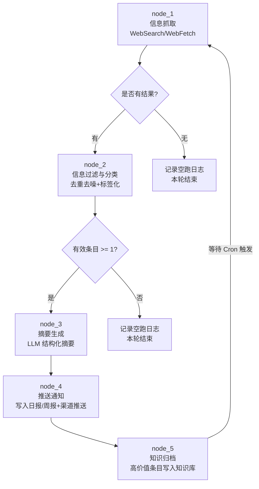
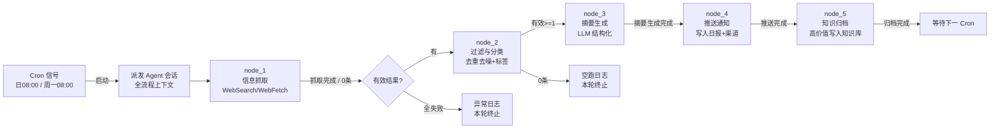

# PROC-信息收集与推送

## 流程概述

信息收集与推送流程是本框架中**最体现 Agent 自主能力**的完全自动化流程。它以循环 (loop) 模式运行，Agent 无需任何人类介入即可完成从信息抓取、智能过滤、摘要生成、定向推送到知识归档的完整链路。该流程旨在解决团队"信息过载但有效信息不足"的痛点，通过对行业动态、技术趋势和竞品信息的自动化采集与分发，让每个角色在正确的时间获得正确的信息，辅助决策并沉淀团队知识资产。

## 触发条件

- **触发者**：Agent 编排器（主会话定时调度）
- **触发事件**：Cron 定时信号，支持以下触发频率配置：
  - 日频（Daily）：每天 08:00，抓取过去 24 小时增量信息，写入当日日报
  - 周频（Weekly）：每周一 08:00，抓取过去一周汇聚信息，写入当周周报
  - 事件触发（On-demand）：重要事件（竞品发布会、重大安全漏洞、法规变更）即时触发
- **前置条件**：
  - 信息源配置清单和关键词矩阵已维护在配置文件中
  - 信息过滤阈值和标签映射规则已定义
  - 日报/周报目录结构已按[[命名规范]]创建

## 流程图



## 节点详细说明

| 节点ID | 角色 | 动作 | 输入 | 输出 | 检查清单 | 超时 |
|--------|------|------|------|------|----------|------|
| node_1 | Agent（WebSearch/WebFetch） | 定时启动 WebSearch 和 WebFetch，对配置的每个信息源+关键词组合执行搜索和内容抓取 | 信息源配置 + 关键词矩阵 + Cron 调度 | 原始抓取结果集 | 全量请求已发出；超时源已标记；不超 50 条 | 3min |
| node_2 | Agent（分类器） | 对抓取结果做去重（URL 匹配）、去噪（低相关过滤）、标签分类（domain/work 双维度），关联目标角色 | 原始结果集 + [[标签体系]] | 分类过滤结果集 | 去重完成；评分 >=30 保留；人均 >=2 标签 | 1min |
| node_3 | Agent（LLM 摘要） | 对每条有效信息调用 LLM 生成结构化摘要：一句话概述 + 核心观点 + 影响评估 + 行动建议 | 分类过滤结果集 | 结构化摘要列表 | 每篇 <=80 字；观点准确；行动建议可执行 | 2min |
| node_4 | Agent（推送器） | 按角色标签将摘要路由到对应日报/周报文件，同时推送至通讯渠道 | 摘要列表 + 日报/周报模板 + 渠道映射 | 已更新文件 + 推送记录 | 路径格式合规；推送有回执确认 | 2min |
| node_5 | Agent（归档器） | 将评分 >=70 的高价值摘要转为知识条目，写入知识库，更新索引页 | 高价值摘要 + 知识库目录 + [[标签体系]] | 知识条目文件 + 索引更新 | 命名合规；frontmatter 完整；MOC 链接已更新 | 2min |

## 条件边说明

| 来源 | 目标 | 条件 |
|------|------|------|
| node_1 | node_2 | 本轮抓取有返回结果（不要求非空， 0 条结果也视为正常完成并记录） |
| node_1 | END_LOOP | 抓取过程发生异常且重试耗尽（所有信息源均超时/失败）—— 记录异常日志后本轮终止 |
| node_2 | node_3 | 过滤后有效条目数 >= 1 |
| node_2 | END_LOOP | 过滤后无有效条目（全被去重或评分过低）—— 记录空跑日志，本轮正常结束 |
| node_3 | node_4 | 至少生成 1 条有效摘要（LLM 调用无异常） |
| node_4 | node_5 | 日报/周报文件写入成功且推送有确认回执 |
| node_5 | node_1 | 等待下一轮 Cron 信号触发，间隔由调度配置决定（日频/周频） |

## 循环逻辑说明

本流程为 **loop** 类型，其核心循环机制：

1. **定时驱动**：主会话中的 Cron 调度器在预设时间点（如每天 08:00）触发流程，启动 `node_1`。
2. **有内容则推进**：有有效信息时沿串行路径执行完 `node_2 → node_3 → node_4 → node_5`，然后回到等待状态。
3. **无内容则空跑**：若某轮抓取无新内容或全被过滤，流程在 `node_2` 后直接结束，记录空跑日志，不影响下一个 Cron 周期的启动。
4. **异常自愈**：若某节点异常（如 LLM 调用超时、文件写入失败），流程记录异常日志后跳过该条目继续处理下一条，不阻塞整体循环。

## 异常处理

| 异常场景 | 处理策略 | 升级条件 |
|----------|----------|----------|
| 所有信息源超时/不可达 | 记录异常日志，跳过本轮；下次 Cron 自动重试 | 连续 3 轮全部失败时，向 Agent 编排管理者的日报中插入告警 |
| LLM 摘要生成出错 | 对该条目标记 `summary_error`，保留原始内容写入，下轮可尝试重生成 | 单轮错误率 > 30% 时告警 |
| 日报/周报目录缺失 | 首次运行时自动创建目录结构（按[[命名规范]]），后续不再触发 | 自动创建也失败时告警 |
| 推送渠道不可达 | 记录失败日志，写入重试队列，下次 Cron 时重新推送 | 消息积压超过 10 条时告警 |
| 知识库写入冲突 | 同一 URL 已存在时合并更新（不覆盖人工编辑的内容），用 `updated` 时间戳标注 | 无需人工介入 |

## 配置结构

流程的行为由以下配置文件驱动，Agent 执行前加载：

```yaml
# 信息源配置示例（.claude/config/info-sources.yaml）
sources:
  tech_blogs:
    - name: "React Blog"
      url: "https://react.dev/blog"
      fetch_method: WebFetch
      schedule: daily
    - name: "AWS What's New"
      url: "https://aws.amazon.com/new/"
      fetch_method: WebFetch
      schedule: weekly
  security:
    - name: "CVE Recent"
      url: "https://cve.mitre.org/cve/search_cve_list.html"
      fetch_method: WebFetch
      schedule: daily
    - name: "OWASP News"
      url: "https://owasp.org/news/"
      fetch_method: WebFetch
      schedule: weekly

# 关键词矩阵
keywords:
  frontend: ["React 19", "Next.js", "TypeScript 5", "CSS Container Queries"]
  backend: ["Java 21", "Spring Boot 3", "Go 1.23", "Rust"]
  infrastructure: ["Kubernetes 1.31", "Terraform", "AWS", "Docker"]
  security: ["CVE", "零日漏洞", "OWASP Top 10"]
  ai: ["LLM", "RAG", "Agent", "Claude API"]

# 过滤阈值
filter:
  min_relevance_score: 30    # 0-100，低于此分丢弃
  max_items_per_round: 50    # 单轮最多处理条数
  dedup_window_days: 7       # 去重回溯天数

# 角色-推送映射
push_mapping:
  "role/tech-lead":          # 技术负责人
    channels: ["日报", "周报"]
    min_score: 50
  "role/architect":          # 系统架构师
    channels: ["周报"]
    min_score: 60
  "role/security":           # 安全工程师
    channels: ["日报", "周报", "即时通知"]
    min_score: 40
  "role/pm":                 # 产品经理
    channels: ["周报"]
    min_score: 50
    domain_filter: ["竞品动态", "行业趋势"]
  "role/devops":             # DevOps工程师
    channels: ["日报", "周报"]
    min_score: 50
```

## 关联工作类型

- [[WT-技术调研]] — 抓取到的技术信息可作为技术调研的输入素材
- [[WT-干系人沟通]] — 推送日报/周报本身是一种干系人沟通行为
- [[WT-风险管理]] — 抓取到的安全漏洞和法规变更信息可触发风险登记

---

## Agent 编排映射

本流程是框架中唯一一个**完全无人类介入**的闭环自动化流程。所有 5 个节点均由 Agent 自主完成，编排器仅负责：
1. 按 Cron 调度启动流程
2. 按边条件检测各节点完成信号并推进
3. 记录运行日志和异常告警

每次流程启动，编排器向一个 Agent 会话派发全流程上下文，Agent 会话内自治执行全部 5 个节点，完成后进入等待状态。

### 全流程 Agent 派发模式

由于本流程各节点高度内聚（共享同一批数据上下文），采用 **单会话全流程模式**——一个 Agent 会话加载全部上下文后，依次执行所有节点：

```
编排器启动 Cron 信号 → 派发一个 Agent 会话（加载全流程上下文） → Agent 自治执行 node_1~node_5 → 输出运行报告 → 等待下一个 Cron
```

### 节点-Agent 映射

| 节点ID | 节点名称 | Agent 角色 | 上下文包 (required) | 完成信号 |
|--------|---------|-----------|-------------------|---------|
| node_1 | 信息抓取 | Agent（WebSearch + WebFetch） | 本流程 + 信息源配置文件 + 关键词矩阵 + [[标签体系]] | 原始抓取结果临时文件创建，frontmatter `fetch_status: complete` + `items_count: N` |
| node_2 | 信息过滤与分类 | Agent（LLM 分类器） | 本流程 + 原始抓取结果 + [[标签体系]] + [[命名规范]] | 过滤结果文件 frontmatter `filter_status: complete` + `valid_items: N` |
| node_3 | 摘要生成 | Agent（LLM 摘要引擎） | 本流程 + 过滤结果 + [[ROLE-技术文档工程师]]（摘要质量标准） | 摘要文件 frontmatter `summary_status: complete` + `summarized_items: N` |
| node_4 | 推送通知 | Agent（文件写入器） | 本流程 + 摘要列表 + [[命名规范]] + 角色-推送映射表 | 日报/周报文件已更新（检查对应日期文件的修改时间戳）；推送回执文件 `push_status: delivered` |
| node_5 | 知识归档 | Agent（知识库管理器） | 本流程 + 高价值摘要 + [[标签体系]] + 知识库 MOC 文件 + [[ROLE-技术文档工程师]] | 新增知识条目文件的 frontmatter `type: knowledge` + `status: auto-generated`；MOC 文件修改时间戳更新 |

### 编排时序



### 人类介入点

**本流程设计为完全无人介入的自动化闭环。** 在以下少数异常情况下，编排器才会通过告警机制通知人类管理者：

| 节点 | 介入原因 | 介入方式 |
|------|---------|---------|
| node_1 | 连续 3 轮全部信息源超时/失败（可能网络策略变更或信息源下线） | Agent 编排器在管理者日报中插入告警条目，人类管理者检查网络连通性和信息源配置 |
| node_3 | 单轮 LLM 摘要生成错误率 > 30%（可能是 LLM 服务异常或提示词失效） | 编排器告警，人类检查 LLM API 可用性和摘要提示词是否需要调整 |
| node_4 | 推送消息积压超 10 条未成功（渠道不可达或权限变更） | 编排器告警，人类检查推送渠道配置和权限令牌有效性 |
| node_5 | 知识库文件写入连续失败 3 轮（磁盘满、权限不足等系统级问题） | 编排器告警，人类检查文件系统状态和目录权限 |
| 全局 | 流程连续 5 轮在 node_1 后即空跑终止（关键词可能已过时或无新信息） | 编排器在周报中提醒管理者审视和更新关键词矩阵 |

### Agent 执行细节

#### node_1：信息抓取 — Agent 执行指令

```
1. 读取信息源配置文件和关键词矩阵
2. 对每个 (source × keyword) 组合，调用 WebSearch 工具执行搜索
3. 对搜索结果前 3 条（或配置的深度），调用 WebFetch 获取详情页内容
4. 将结果写入临时文件 `7.日志与追踪/信息抓取日志/{YYYY-MM-DD}-raw-results.md`
   - frontmatter: fetch_status=complete, items_count=N, fetch_time, cron_cycle
   - body: 每条结果包含 URL、标题、原始摘要、发布时间、来源标签
5. 对超时/错误的信息源记录到异常日志
```

#### node_2：信息过滤与分类 — Agent 执行指令

```
1. 读取 node_1 输出的原始结果文件
2. 去重：以 URL 为 key，与过去 7 天的抓取日志比对，重复的丢弃
3. 去噪：调用 LLM 对每条信息做相关性评分（0-100），低于阈值的丢弃
4. 分类：对保留的每条信息，根据内容匹配标签体系中的 domain/ 和 work/ 标签（至少 2 个）
5. 关联角色：根据标签匹配应推送给哪些角色（role/ 标签）
6. 将过滤结果写入 `7.日志与追踪/信息抓取日志/{YYYY-MM-DD}-filtered-results.md`
   - frontmatter: filter_status=complete, valid_items=N, discarded_duplicates=N, discarded_low_relevance=N
```

#### node_3：摘要生成 — Agent 执行指令

```
1. 读取 node_2 输出的过滤结果文件
2. 对每条信息，调用 LLM 生成结构化摘要：
   - 一句话概述（不超过 80 字）
   - 核心观点（2-3 条 bullet point，每条不超过 40 字）
   - 技术/业务影响评估（如适用，影响等级：高/中/低/无）
   - 建议关注的 [[ROLE-XXX]]（用 Obsidian wiki 链接格式）
   - 建议行动（如"建议评估迁移至该版本"、"通知安全团队评估影响"等）
3. 输出文件 `7.日志与追踪/信息抓取日志/{YYYY-MM-DD}-summaries.md`
   - frontmatter: summary_status=complete, summarized_items=N
```

#### node_4：推送通知 — Agent 执行指令

```
1. 读取 node_3 的摘要列表和角色-推送映射配置
2. 日报模式：写入 `7.日志与追踪/日报/{YYYY}/{YYYY-MM-DD}.md`
   - 在日报文件的 "## 信息简报" 章节追加本日摘要
   - 如果日报文件不存在，使用 tpl-daily-log 模板创建
3. 周报模式：写入 `7.日志与追踪/周报/{YYYY}/WK-{YYYY}-{NN}.md`
   - 在周报文件的 "## 本周信息汇总" 章节追加摘要
   - 如果周报文件不存在，创建
4. 推送记录写入 `7.日志与追踪/信息抓取日志/{YYYY-MM-DD}-push-log.md`
   - frontmatter: push_status=delivered, channels=["日报", "周报"], recipients=[role list]
```

#### node_5：知识归档 — Agent 执行指令

```
1. 读取 node_3 的摘要列表，筛选 relevance_score >= 70 的条目
2. 对每条高价值摘要，创建知识条目文件 `5.知识沉淀/{domain分类}/{YYYY-MM-DD}-{标题简述}.md`：
   - frontmatter:
     type: knowledge
     title: {原标题}
     source: {原始URL}
     domain: {domain标签}
     relevance_score: {分数}
     status: auto-generated
     tags: [type/knowledge, domain/xxx, work/xxx, auto-generated]
     created: {日期}
     updated: {日期}
   - body:
     ## 一句话概述
     {摘要}
     ## 核心观点
     - {观点1}
     - {观点2}
     ## 影响评估
     {评估内容}
     ## 建议行动
     {行动建议}
     ## 来源
     [{原文标题}]({URL}) | 抓取时间: {时间}
3. 更新知识库 MOC 页面（如 `5.知识沉淀/🗺️_知识地图.md`），在对应分类下新增链接
4. 输出归档报告 `7.日志与追踪/信息抓取日志/{YYYY-MM-DD}-archive-log.md`
```

### 关键设计决策

1. **单会话全流程模式 vs 多会话分派模式**：选择单会话模式是因为 5 个节点共享同一批数据上下文，文件级的数据传递已足够，分派多个 Agent 会话反而增加编排复杂度而无收益。每个节点的输出文件天然构成下一个节点的输入信号。

2. **完全自动化 vs 半自动化**：所有节点由 Agent 自治完成。如果某个角色希望审阅推送内容，可以通过配置在该角色的推送映射中设置 `manual_review: true`，但默认关闭。

3. **日报 vs 周报双轨**：日报抓取高频高时效信息（安全漏洞、紧急更新），周报汇聚深度分析内容（行业趋势、竞品动态），通过不同的 Cron 调度和关键词权重实现差异化。

4. **知识归档的阈值设计**：relevance_score >= 70 才归档，避免知识库被低质量信息污染。同时 `status: auto-generated` 明确区分 Agent 自动生成和人工撰写的知识条目，方便日后人工审核和编辑。
