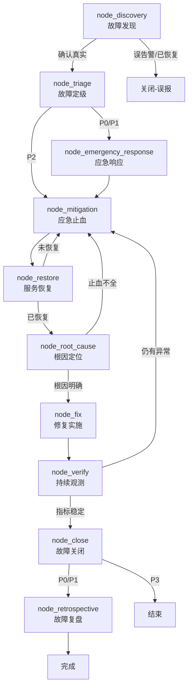
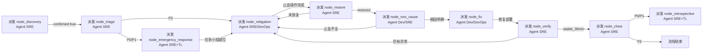

# PROC-故障响应流程

## 流程概述

定义从监控告警触发到故障关闭和复盘的完整应急响应流程。核心原则：**止损优先于根因定位**（先恢复服务再找根因）、**Blameless 复盘**（聚焦系统改进而非追究责任）。本流程根据故障严重级别（P0-P3）提供差异化响应路径，P0/P1 故障走应急指挥通道，P2 常规处理，P3 轻量关闭。

## 触发条件

- **触发者**：[[ROLE-SRE工程师]]、值班工程师或监控系统自动触发
- **触发事件**：
  - 监控告警触发（Prometheus Alertmanager / PagerDuty）
  - 用户/客服报障工单
  - 自动化巡检发现异常
- **前置条件**：
  - 监控告警体系已配置并正常运行
  - 值班工程师轮值表已排定
  - 故障 Runbook 已维护

## 故障严重级别定义

| 级别 | 判定标准 | 响应SLA | 是否启动应急指挥 | 是否要求复盘 |
|------|----------|---------|-----------------|-------------|
| P0 | 核心业务完全不可用，全量用户受影响 | 5分钟响应、15分钟组建小组 | 是，强制启动 | 是，3个工作日内 |
| P1 | 核心功能降级，部分用户受影响（>10%） | 15分钟响应、30分钟组建小组 | 是，评估后启动 | 是，5个工作日内 |
| P2 | 非核心功能异常，少量用户受影响（<10%） | 30分钟响应 | 否 | 建议复盘 |
| P3 | 轻微问题或体验瑕疵，基本不影响使用 | 2小时响应 | 否 | 不要求 |

## 流程图

## 节点详细说明

| 节点ID | 角色 | 动作 | 输入 | 输出 | 检查清单 | 超时 |
|--------|------|------|------|------|----------|------|
| node_discovery | [[ROLE-SRE工程师]] | 故障确认 | 告警通知、监控大盘、用户反馈 | 故障确认单 | 确认真实性 | 5min |
| node_triage | [[ROLE-SRE工程师]] | 故障定级 | 故障确认单 | 故障定级单 | P0/P1/P2/P3 | 10min |
| node_emergency_response | [[ROLE-SRE工程师]] + [[ROLE-技术负责人]] | 启动应急指挥 | 故障定级单(P0/P1) | 应急小组+沟通渠道 | 指挥官+渠道就位 | 15-30min |
| node_mitigation | [[ROLE-SRE工程师]] / [[ROLE-DevOps工程师]] | 应急止血 | 故障现象、变更记录、Runbook | 应急操作记录 | 回滚方案已确认 | 30min |
| node_restore | [[ROLE-SRE工程师]] | 服务恢复确认 | 监控大盘、业务指标 | 恢复确认单 | 指标回基线 | 10min |
| node_root_cause | [[ROLE-后端开发工程师]] / [[ROLE-SRE工程师]] | 根因分析 | 日志、链路追踪、变更记录 | 根因分析记录(含5Whys) | 定位到具体模块/代码 | 2h |
| node_fix | [[ROLE-后端开发工程师]] / [[ROLE-DevOps工程师]] | 修复实施 | 根因分析、代码/配置 | 修复代码+部署记录 | 根因修复+回归通过 | 4h |
| node_verify | [[ROLE-SRE工程师]] | 持续观测 | 监控大盘、告警、指标 | 观测报告(≥30min) | 指标持续稳定 | 30min |
| node_close | [[ROLE-SRE工程师]] | 故障关闭 | 完整时间线+操作记录 | 故障工单关闭 | 记录完整 | 15min |
| node_retrospective | [[ROLE-SRE工程师]] + [[ROLE-技术负责人]] | 故障复盘 | 故障记录、根因分析 | 复盘报告+Action Items | Blameless 聚焦改进 | 3-5工作日 |

## 条件边说明

| 来源 | 目标 | 条件 |
|------|------|------|
| node_discovery | node_triage | 故障确认真实存在，非误告警或已自动恢复 |
| node_discovery | __END__ | 误告警（指标波动但业务正常）或故障已自动恢复 |
| node_triage | node_emergency_response | P0（强制）或 P1（评估后）——核心业务受损需应急指挥 |
| node_triage | node_mitigation | P2 故障，不启动应急指挥，直接执行止血 |
| node_restore | node_root_cause | 服务已确认恢复：错误率、延迟、QPS 均回基线 |
| node_restore | node_mitigation | 服务未恢复或仅部分恢复，继续调整止血策略 |
| node_root_cause | node_fix | 根因已定位到可修复的级别（代码/配置/组件） |
| node_root_cause | node_mitigation | 根因分析发现止血方案不完整，需先完善止血 |
| node_verify | node_close | ≥30 分钟持续观测，核心指标稳定在基线范围内 |
| node_verify | node_mitigation | 修复后仍有异常波动或复发迹象 |
| node_close | node_retrospective | P0/P1 强制复盘（P2 建议复盘） |
| node_close | __END__ | P3 故障或经评估不需要复盘的 P2 故障 |

## 应急指挥角色说明

P0/P1 故障启动应急指挥后，各角色分工如下：

| 角色 | 职责 | 担任者 |
|------|------|--------|
| 故障指挥官 (Incident Commander) | 统一指挥、关键决策、对外沟通、指定发言人 | [[ROLE-技术负责人]] |
| 运维执行 (Operations Lead) | 执行止血操作、监控指标、操作记录 | [[ROLE-SRE工程师]] 或 [[ROLE-DevOps工程师]] |
| 技术排查 (Subject Matter Expert) | 深度排查根因、提供修复方案 | [[ROLE-后端开发工程师]] 或相关模块负责人 |
| 对外发言人 (Communications Lead) | 统一对外发通告、同步进展给管理层和业务方 | 由故障指挥官指定 |

## 异常处理

| 异常场景 | 处理策略 | 升级路径 |
|----------|----------|----------|
| 多个故障同时发生 | 按 P0 > P1 > P2 优先级排定处理顺序，必要时启动多个应急小组 | SRE → 技术总监 |
| 止血操作导致二次故障 | 立即停止当前操作，评估回滚，记录二次故障时间线 | SRE → 技术负责人 |
| 根因超过 2 小时无法定位 | 以临时止血方案维持服务，根因分析转入事后排查，不阻塞服务恢复 | 技术负责人 → 系统架构师 |
| 应急期间通信混乱 | 故障指挥官重申唯一发言人制度，关停非专用渠道的讨论 | 故障指挥官 |
| 修复涉及数据修正 | 数据修复操作须在测试环境验证、备份确认后方可执行，不可逆操作双人确认 | DevOps → DBA |

## 关联工作类型

- 主要关联：[[WT-故障响应]]
- 修复阶段可引用的流程：
  - [[PROC-紧急修复流程]]（故障引发的 Bug 修复走紧急通道）
  - [[PROC-发布流程]]（修复后的常规发布）
- 关联文档：CHK-故障响应检查清单、常见故障 Runbook

## Agent 编排映射

本流程的每个节点可作为一个独立的 Agent 任务派发。P0/P1 故障对时效性要求极高，Agent 任务超时设置应严格。

| 节点ID | 节点名称 | Agent 角色 | 上下文包 (required) | 完成信号 |
|--------|---------|-----------|-------------------|---------|
| node_discovery | 故障发现 | [[ROLE-OPS-002]] | 本流程 + [[ROLE-OPS-002]] + [[WT-INC-001]] + 告警通知 + 监控大盘 | 故障确认单 frontmatter `confirmed: true` |
| node_triage | 故障定级 | [[ROLE-OPS-002]] | 本流程 + [[ROLE-OPS-002]] + 故障确认单 + 严重级别定义表 | 故障定级单 frontmatter `severity: P0/P1/P2/P3` |
| node_emergency_response | 应急响应 | [[ROLE-OPS-002]] + [[ROLE-ARCH-001]] | 本流程 + [[ROLE-OPS-002]] + [[ROLE-ARCH-001]] + 故障定级单(P0/P1) | 应急小组通知已发送、沟通渠道已建立 |
| node_mitigation | 应急止血 | [[ROLE-OPS-002]] 或 [[ROLE-OPS-001]] | 本流程 + [[ROLE-OPS-002]]/[[ROLE-OPS-001]] + 故障 Runbook + 最近变更记录 | 应急操作记录（含时间线和操作结果） |
| node_restore | 服务恢复 | [[ROLE-OPS-002]] | 本流程 + [[ROLE-OPS-002]] + 监控大盘 + 核心指标基线 | 恢复确认单 `status: restored` |
| node_root_cause | 根因定位 | [[ROLE-DEV-002]] 或 [[ROLE-OPS-002]] | 本流程 + 对应角色定义 + 日志/链路追踪 + 最近变更记录 | 根因分析记录（含 5 Whys） |
| node_fix | 修复实施 | [[ROLE-DEV-002]] 或 [[ROLE-OPS-001]] | 本流程 + [[ROLE-DEV-002]]/[[ROLE-OPS-001]] + [[PROC-紧急修复流程]](如需) + 根因分析 | 修复代码/配置已部署，回归验证通过 |
| node_verify | 持续观测 | [[ROLE-OPS-002]] | 本流程 + [[ROLE-OPS-002]] + 监控大盘 | 观测报告 `status: stable_30min` |
| node_close | 故障关闭 | [[ROLE-OPS-002]] | 本流程 + 完整时间线 + 关键操作记录 | 故障工单 `status: resolved` |
| node_retrospective | 故障复盘 | [[ROLE-OPS-002]] + [[ROLE-ARCH-001]] | 本流程 + [[ROLE-OPS-002]] + [[ROLE-ARCH-001]] + 故障处理记录 + 根因分析 | 复盘报告（含 Action Items，每项有责任人+截止日期） |

### 编排时序

### 人类介入点

| 节点 | 介入原因 | 介入方式 |
|------|---------|---------|
| node_triage | 故障定级需要根据业务上下文判断真实影响面 | 人类 SRE 工程师根据监控和用户反馈最终定级 |
| node_emergency_response | 应急指挥需要人类领导力和即时决策能力 | 人类技术负责人担任故障指挥官，Agent 辅助信息整理和沟通模板 |
| node_mitigation | 生产环境应急操作风险极高，需经验和判断 | 人类 SRE/DevOps 工程师执行止血操作，Agent 辅助 Runbook 检索和操作建议 |
| node_retrospective | 复盘需要多方协作和建设性讨论，Agent 无法替代 | 人类 SRE 主持复盘会议，Agent 辅助时间线整理和 Action Items 追踪 |
