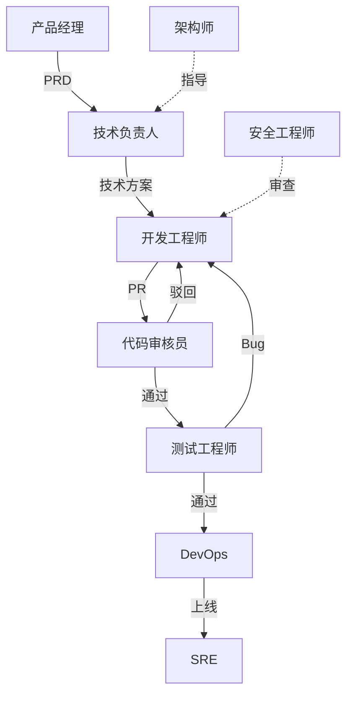

# 角色体系

## 概述

角色体系是框架的核心基础。它定义了 IT 研发部门中每个角色的：
- **职责边界**：该角色负责什么、不负责什么
- **输入输出**：从谁接收什么、向谁交付什么
- **协作关系**：上下游角色、同级协作者
- **能力要求**：完成职责所需的技能和工具

角色系统的设计遵循 LangGraph 的 Graph/Node/Edge 思想：
- **Node = 角色**：独立的职能单元，有自己的 State
- **Edge = 协作关系**：角色间的信息/产物传递路径
- **Subgraph = 流程实例**：多个角色的有序协作

## 角色分类

| 分类 | 包含角色 | 核心职责 |
|------|----------|----------|
| **模式指令** | as/with 系列指令（`/asTL`、`/withPlan` 等） | 控制主会话行为模式与增强约束 |
| **研发类** | 前端/后端/移动端/数据工程师 | 代码实现、技术方案执行 |
| **架构类** | 技术负责人/系统架构师/安全架构师 | 技术决策、系统设计、标准制定 |
| **质量类** | 测试工程师/代码审核员/性能测试工程师 | 质量保障、缺陷发现 |
| **运维类** | DevOps/SRE/值班工程师 | 部署发布、稳定性保障、故障响应 |
| **管理类** | 产品经理/项目经理/敏捷教练/技术总监 | 需求定义、进度管理、团队建设 |
| **支撑类** | 技术文档工程师/UX设计师 | 文档、用户体验、辅助能力 |

> **模式指令**是 `角色体系/` 的子模块，详见 [`模式指令/🎛️_指令总览.md`](模式指令/🎛️_指令总览.md)。

## 协作关系



详细协作图见：[[角色协作图.canvas]]

## 角色列表

```dataview
TABLE WITHOUT ID
  file.link AS "角色",
  category AS "分类",
  level AS "级别",
  status AS "状态"
FROM "1.角色体系"
WHERE type = "role" AND status != "deprecated"
SORT category ASC, file.name ASC
```

## 如何使用

1. **选角色**：根据工作类型从 [[2.工作体系/工作-能力矩阵|工作-能力矩阵]] 确认需要哪些角色
2. **查定义**：在角色文档中查看该角色的详细定义（输入/输出/工具/检查清单）
3. **跑流程**：将角色代入 [[4.流程引擎/🔄_流程总览|流程引擎]] 的具体流程节点中
